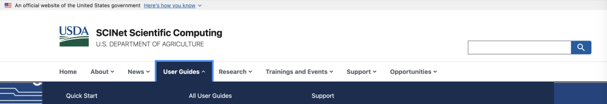
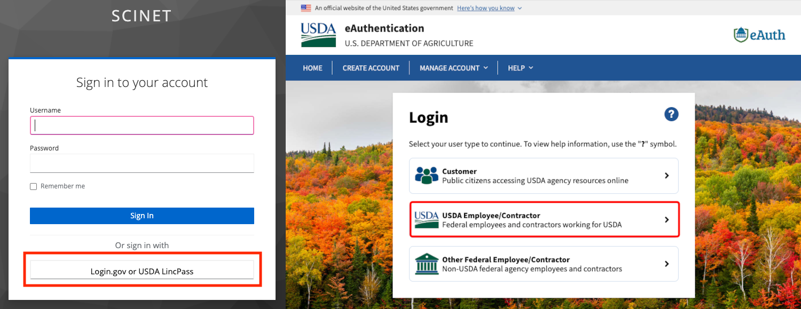
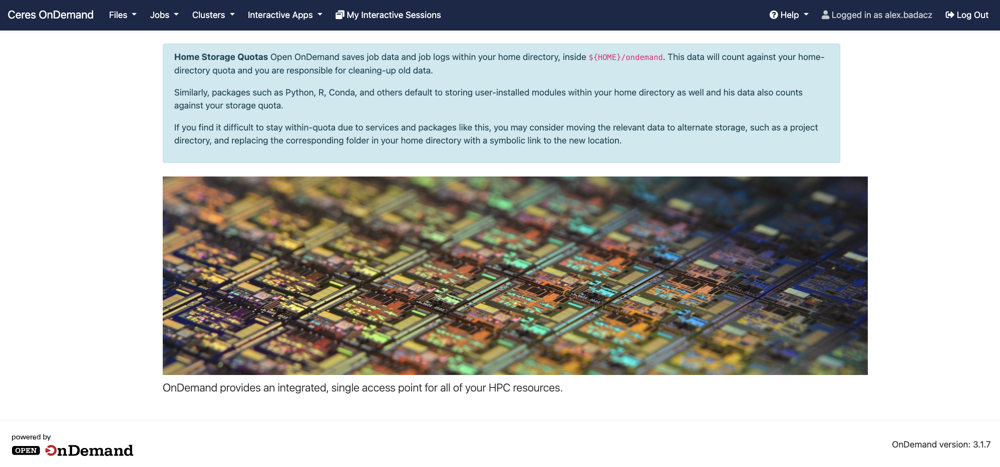
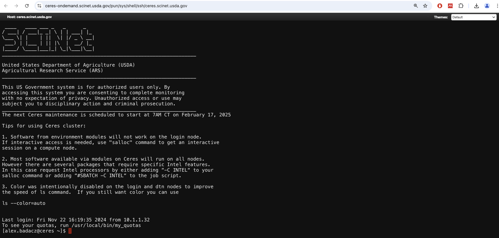
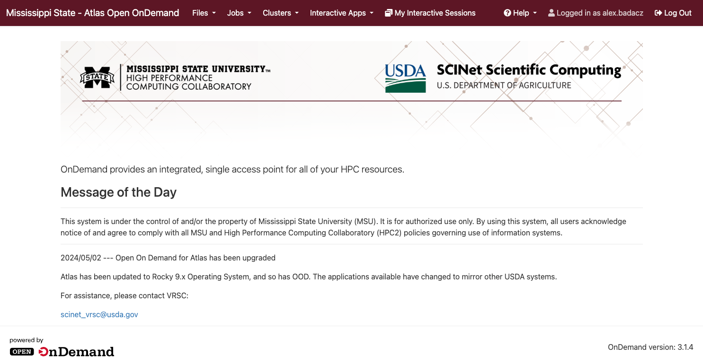
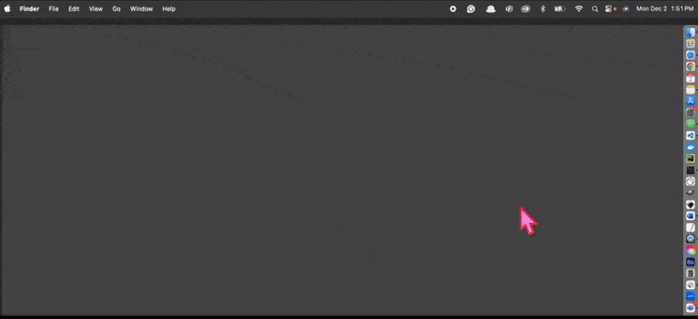

---

title: Accessing the CLI on the SCINet HPC
description: "Starting the cluster’s command line (shell window) with OOD in a web browser or SSH in a terminal."
type: interactive tutorial
order: 2
tags: [command line, SCINet HPC, OOD, SSH]
packages: 
level: 
author: Aleksandra Badaczewska

---


## Overview

This interactive tutorial focuses on guiding you through the process of accessing the command line interface (CLI) on the SCINet High-Performance Computing (HPC) systems. 
The lesson introduces the essential steps required to connect to the HPC environment on Atlas and Ceres computing clustres securely and efficiently. By understanding 
how to access the CLI, you will take your first steps toward effectively utilizing the SCINet HPC infrastructure for your research and computational needs. <br>
*This tutorial is designed for newcomers transitioning from graphical user interfaces (GUIs) to the command line interface (CLI).*

<div id="info-alerts-1" class="highlighted highlighted--info ">
<div class="highlighted__body" markdown="1">
<h4 class="highlighted__heading">Main Objectives</h4>
* Learn the methods and tools required to access the CLI on the SCINet HPC systems.
* Understand authentication protocols and secure connection methods.
* Demonstrate the CLI environments available on Atlas and Ceres computing clusters.
</div>
</div>

<div id="success-alerts-1" class="highlighted highlighted--success ">
<div class="highlighted__body" markdown="1">
<h4 class="highlighted__heading">Goals</h4>
<p>By the end of this tutorial, you will:</p>
* Successfully establish a secure connection to the selected SCINet HPC cluster using <br>OOD service (website) or SSH protocol (terminal).
* Gain the confidence to transition from using a GUI to leveraging the CLI effectively.
* Acquire knowledge of the CLI environments available on the SCINet HPC systems (Atlas, Ceres).
</div>
</div>


### Tutorial scope

This tutorial demostrates practical steps for accessing the command line interface (CLI) of SCINet HPC clusters (Atlas and Ceres) through Open OnDemand (OOD) and Secure Shell (SSH).

<div class="usa-accordion">


<div id="scope-concepts" class="accordion_content" markdown="1">
* **Command Line Interface (CLI):** A text-based method to interact with computing systems, critical for using HPC.
* **Accessing HPC Systems:** Methods for connecting to SCINet HPC infrastructure and accessing the CLI.
  * **Secure connections:** Using SSH (Secure Shell) for authenticated, encrypted command line access.
  * **Browser-based access:** Using Open OnDemand for web-based CLI functionality.
</div>

 
<div id="scope-tools" class="accordion_content" markdown="1">
* **Open OnDemand (OOD):** A browser-based platform to access CLI functionality on HPC systems.
* **SSH (Secure Shell):** A secure connection protocol for direct CLI access from local machines in terminal window.
* Supported local tools for SSH access:
  * **Windows:** PuTTY, Windows Terminal, WSL
  * **macOS:** built-in Terminal
  * **Linux:** built-in Terminal
</div>

 
<div id="scope-apps" class="accordion_content" markdown="1">    
* **Web-based access:** Logging in and interacting with HPC CLI through Open OnDemand on any device. **(recommended)**
* **Accessing HPC CLI:** Establishing secure connections via SSH from a local machine in terminal window.
* **Getting started with HPC systems:** Becoming comfortable with the interface to support future computational workflows.
</div>
</div>


----

## Accessing SCINet HPC


<div id="info-alerts-0" class="highlighted highlighted--info ">
<div class="highlighted__body" markdown="1">
<h4 class="highlighted__heading">What is SCINet HPC?</h4>
The HPC infrastructure as part of the <a href="https://scinet.usda.gov/" target="_blank">SCINet initiative</a> consists of two <a href="https://scinet.usda.gov/guides/resources/#scinet-computing-resources/" target="_blank">computing clusters</a> (**Atlas** and **Ceres**) and <a href="https://scinet.usda.gov/guides/data/storage#juno-archive-storage" target="_blank">archive storage</a>  (**Juno**).
The **computing clusters** provide a robust environment equipped with a broad range of <a href="https://scinet.usda.gov/guides/start#software" target="_blank">pre-installed tools and software packages</a>,  
supporting diverse computational needs. These tools can be accessed and executed efficiently through the Command Line Interface (CLI). 
This powerful infrastructure enables USDA researchers and collaborators to perform advanced computational tasks with ease and efficiency. <br>
*<em>Users who are new to the HPC environment may benefit from the <a href="https://www.youtube.com/watch?v=d7oKSL4aitw" target="_blank">SCINet/Ceres onboarding video</a>.</em>
</div>
</div>


### What do you need to access Atlas or Ceres?

Before you get started actively using the SCINet resources, follow these steps:

<div class="usa-accordion">

 
<div id="access-scinet-1" class="accordion_content" markdown="1">
The SCINet account is required to get an access to the SCINet HPC clusters and specialized content of the SCINet resources, 
such as <a href="https://scinet.usda.gov/training/free-online-training" target="_blank">trainings</a>, <a href="https://scinet.usda.gov/events/scinet-corner#scinet-corner" target="_blank">SCINet Corner recordings</a> or <a href="https://scinet.usda.gov/training/learningpath#scinet-forum" target="_blank">SCINet Forum</a>.
<br><br>
**To obtain a SCINet account**, a SCINet Account Request must be submitted:
* **A.** for ARS-affiliated users:<a href="https://scinet.usda.gov/about/signup#ars-employees" target="_blank"> SCINet Account Request</a>
* **B.** for non-ARS users:<a href="https://scinet.usda.gov/about/signup#non-ars-employees" target="_blank"> Non-ARS SCINet Account Request</a>

*<em>The approval process depends on the affiliation of the requester.</em>
</div>

 
<div id="access-scinet-2" class="accordion_content" markdown="1"> 
<a href="https://scinet.usda.gov/guides/data/storage#project-directories" target="_blank">Project directories</a> are usually associated with ARS Research Projects. 
While it’s possible to run simulations on Ceres or Atlas using only <code>home</code> directories and <a href="https://scinet.usda.gov/guides/data/storage#large-short-term-storage" target="_blank">Large Short-term Storage</a> 
in <code>/90daydata/shared</code>, it is recommended to <a href="https://forms.office.com/g/wD9rYarVyn" target="_blank">request a project directory</a>. 

<div id="note-alerts-1" class="highlighted highlighted--tip ">
<div class="highlighted__body" markdown="1">
**Registered SCINet users without project directories can still access the CLI.** However, submitting computing jobs is restricted to using 
a temporary <code>sandbox</code> <a href="https://scinet.usda.gov/guides/resources/CeresAtlasDifferences#slurm-account" target="_blank">slurm account</a> 
for testing and basic usage. To run jobs on compute nodes of either cluster, the jobs need to be associated with a slurm account. 
For users that have access to one or more project directories, their slurm accounts have same names as the project directories.
</div>
</div>
</div>


<div id="access-scinet-3" class="accordion_content" markdown="1">
Reading the SCINet Policy before you get started using the SCINet resources is important for several reasons. 
In particular, the SCINet policy is concise and contain important information about how the resource may be used, 
including any restrictions or limitations on use. This can help you understand what you can and cannot do with the resource. 
<br><br>
In particular, you can learn about:
<table markdown="1">
<tr>
<td><a href="https://scinet.usda.gov/about/policies#accounts" target="_blank">accounts</a></td>
<td><a href="https://scinet.usda.gov/about/policies#software" target="_blank">storage</a></td>
<td><a href="https://scinet.usda.gov/about/policies#job-queues" target="_blank">job queues</a></td>
<td><a href="https://scinet.usda.gov/about/policies#software" target="_blank">software</a></td>
<td><a href="https://scinet.usda.gov/about/policies#data-management" target="_blank">data management</a></td>
</tr>
</table>
</div>

 
<div id="access-scinet-4" class="accordion_content">

<div class="usa-accordion">

 
<div id="cli-usage-1" class="accordion_content" markdown="1">    
It is generally a good idea to browse the Frequently Asked Questions (<a href="https://scinet.usda.gov/support/faq#faqs" target="_blank">SCINet FAQ</a>) section first because it can save you time and effort. 
The FAQ section is designed to provide answers to common questions that users may have about the SCINet service.

<div id="note-alerts-1" class="highlighted highlighted--tip ">
<div class="highlighted__body" markdown="1">
By browsing the FAQ section, you may be able to **quickly find the answer to your question** without having 
to contact SCINet support team or search through other parts of the website. Overall, browsing the FAQ section can be a useful first step 
in getting the information you need and can help you save time and effort in the process.
</div>
</div>
</div>


<div id="cli-usage-2" class="accordion_content" markdown="1">
Reading <a href="https://scinet.usda.gov/guides/" target="_blank">User Guides</a> can be a good starting point to get an overview on how to use the SCINet services. 
You can easily find the links to the User Guides in the top dropdown menu on the <a href="https://scinet.usda.gov/" target="_blank">SCINet website</a>.
<p align="center"></p>
</div>

 
<div id="cli-usage-3" class="accordion_content" markdown="1">    
If your question is not on the FAQs list or the answer in the guide is not comprehensive, <b>contact the VRSC support team</b>. 
Email is a good way to contact SCINet support team for information or direct help. 
<li><b style="color: deeppink; font-size: 20px;">scinet_vrsc@usda.gov</b></li>
<ul>
<li>use it for questions or feedback about the website, SCINet newsletter or to contribute content</li>
<li>to get technical assistance with your SCINet account</li>
<li>to get broad HPC support from the <a href="https://scinet.usda.gov/about/vrsc#the-scinet-virtual-research-support-core" target="_blank">Virtual Research Support Core</a> (VRSC)</li>
*<em>Learn more about <a href="https://scinet.usda.gov/support/contact#how-and-when-to-contact-the-vrsc" target="_blank">How and When to Contact the VRSC?</a></em>
</ul>
</div>

 
<div id="cli-usage-4" class="accordion_content" markdown="1">    
Finally, contact other SCINet users on the <a href="https://forum.scinet.usda.gov/login" target="_blank">SCINet Forum</a> to get a quick response to your question.
<p align="center"></p>

<div id="note-alerts-1" class="highlighted highlighted--tip ">
<div class="highlighted__body" markdown="1">
The forum is actively monitored by community members who are willing to help others, so you may be able to get an answer to your question in a short amount of time. 
Another benefit is that you can get a variety of perspectives on your question. By asking your question on a forum, you can get input from multiple people 
who may have different experiences and expertise. Finally, the SCINet forum can be a good resource for learning more about a particular topic. 
By reading through previous discussions and questions on the forum, you may be able to learn more about the issue and get ideas for your own questions.
</div>
</div>
</div>
</div>
</div>
</div>


### Welcome message <br> *cluster rules & quick updates*

The welcome message is a text displayed immediately in the terminal window upon logging into an HPC cluster and appears with each new shell session. 
It typically includes key information such as system status, upcoming maintenance schedules, usage policies and available software modules or resources. 


Serving as an essential guide, **welcome message** helps first-time users explore the rules & tips, while keeping regular users informed about important updates, 
such as scheduled downtimes or new features. Additionally, it often provides guidelines and best practices for efficient and responsible cluster usage, 
ensuring fair resource allocation and optimal performance for all users. 

<div id="note-alerts-1" class="highlighted highlighted--tip ">
<div class="highlighted__body" markdown="1">
The welcome message may change over time, so it's best to check it briefly at each login to stay updated.
</div></div>


## **Web-based access to HPC CLI**

SCINet provides several <a href="https://scinet.usda.gov/guides/access/#web-based-access-to-scinet" target="_blank">web-based interfaces</a> 
for interacting with its computing clusters, each serving distinct purposes. These interfaces allow users to utilize graphical tools, manage workflows and access specialized features. 
In particular, <a href="https://galaxy.scinet.usda.gov/" target="_blank">Galaxy on Ceres</a> supports graphical data analysis workflows 
and <a href="https://www.globus.org/" target="_blank">Globus GUI</a> facilitates efficient file transfers.

Among SCINet web-based user interfaces, the <a href="https://scinet.usda.gov/guides/use/open-ondemand#open-ondemand-interface" target="_blank">Open OnDemand (OOD) services</a> for Ceres and Atlas offer the ability to directly launch a Unix shell for a selected cluster, enabling you to <b>access the cluster's CLI in a web browser</b>. 

<div id="note-alerts-1" class="highlighted highlighted--note ">
<div class="highlighted__body" markdown="1">
Open OnDemand (OOD) is a web-based interface that provides users with convenient access to high-performance computing (HPC) resources, 
including graphical tools, file management and direct CLI access, through a web browser. 
The key benefit for SCINet users is that they can use any web browser, including browsers on a mobile phone, to access both clusters.
* **Ceres OOD:** <a href="http://ceres-ood.scinet.usda.gov/" target="_blank">http://ceres-ood.scinet.usda.gov/</a>
* **Atlas OOD:** <a href="https://atlas-ood.hpc.msstate.edu/" target="_blank">https://atlas-ood.hpc.msstate.edu/</a>
</div>
</div>

<div id="warning-alerts-0" class="highlighted highlighted--warning ">
<div class="highlighted__body" markdown="1">
<h4 class="highlighted__heading">SCINet login</h4>
For the most accurate and up-to-date instructions on logging into each cluster via OOD services, please refer to the <a href="https://scinet.usda.gov/guides/access/web-based-login#accessing-web-based-interfaces" target="_blank">SCINet website/User Guides/<b>Accessing Web-Based Interfaces</b></a>.
</div>
</div>

----

### Access Ceres CLI via OOD

Follow these steps for accessing command line interface on Ceres via Open onDemand interface in web browser.

**1.** Open a web browser and navigate to the URL for the <a href="http://ceres-ood.scinet.usda.gov/" target="_blank">Atlas OOD service</a>. *Click on a link or copy-paste the URL.*

<h4 style="color: deeppink; margin-left: 10px;"># URL to Ceres OOD: <span style="color: #005ea2; padding-left: 20px; font-size: 1.34rem;">http://ceres-ood.scinet.usda.gov/</span></h4>


**2.** Log in using your user SCINet credentials. *Follow the instructions for <a href="https://scinet.usda.gov/guides/access/web-based-login#accessing-web-based-interfaces" target="_blank"><b>Accessing Web-Based Interfaces</b></a>*

- You will be presented with the USDA eAuthentication login page.



- Select the login option that is appropriate for you.
- *Please see the detailed instructions for <a href="https://scinet.usda.gov/guides/access/web-based-login#accessing-web-based-interfaces" target="_blank">logging on to SCINet web-based interfaces</a>.* *(if you have a `LincPass`/`AltLinc`)*
- *Please see the detailed instructions for <a href="https://scinet.usda.gov/guides/access/login/alt-login#non-usda-users---logingov" target="_blank">logging on to SCINet using Login.gov</a>.* *(sponsored, non-USDA SCINet users)*
- *Please see the detailed instructions for <a href="https://scinet.usda.gov/guides/access/login/alt-login#usda-users-without-a-lincpassaltlinc" target="_blank">alternative Login guide</a>.*

After successful authentication, you will automatically be redirected to Open OnDemand web interface for Ceres cluster.



<div id="question-alerts-1" class="highlighted highlighted--question ">
<div class="highlighted__body" markdown="1">
<h4 class="highlighted__heading">Learn more</h4>
To get the most out of the Open OnDemand interface, explore the dedicated <a href="https://scinet.usda.gov/guides/use/open-ondemand#using-ood" target="_blank">User Guides → Using OOD</a> 
available on the SCINet website. These guides provide more details on available GUI tools, job scheduling and interactive applications like Jupyter or RStudio.
</div>
</div>

**3.** In the OOD interface, locate the <b>Clusters</b> tab in the top menu bar and select <b>Shell Access</b>.


**4.** A new browser tab will open with a terminal emulator, providing a Unix shell loaded and starting in your home directory by default.



You can use this CLI just like a terminal on your local machine, with all standard bash commands functioning. Just note that you are now on a cluster, giving you direct access to all pre-installed modules and tools available on the system.


#### Tips for using Ceres CLI

1. Software from environment modules will NOT work on the **login** node.
2. If interactive access is needed, use `salloc` command to get an **interactive session on a compute** node.
```
salloc -N1 -n2 -t 2:00:00 -A <your_slurm_account>
```
3. Most sortware available via modules on Ceres will run on all nodes.
- However there are several packages that require specific Intel features. In this case request Intel processors by either adding 
`-C INTEL` to your `salloc` command or adding `#SBATCH -C INTEL` to the job script.  
4. Color was intentionally disabled on the **login** and **dtn** nodes to improve the speed of `ls` command.
If you still want color you can use `ls --color=auto`

<div class="usa-accordion">

 
<div id="ceres-cli-usage-1" class="accordion_content" markdown="1">    
<em>Displays the full path of your current directory.</em><br>
```
pwd
```
</div>


<div id="ceres-cli-usage-2" class="accordion_content" markdown="1">
<em>All projects are located at <b>/project</b> . This command lists all available projects.</em><br>
```
ls /project
```
</div>

 
<div id="ceres-cli-usage-3" class="accordion_content" markdown="1">    
<em>Takes you directly to your home directory.</em><br>
```
cd ~
```
</div>

 
<div id="ceres-cli-usage-4" class="accordion_content" markdown="1">    
<em>Displays a list of all modules available on the cluster, for example available <code>python</code> versions.</em><br>
```
module avail python
```
</div>

 
<div id="ceres-cli-usage-5" class="accordion_content" markdown="1">    
<em>Loads a specific pre-installed module for use.</em><br>
```
module load <module-name>
```
</div>

 
<div id="ceres-cli-usage-6" class="accordion_content" markdown="1">    
<em>Group <a href="https://scinet.usda.gov/guides/data/quotas#storage-quotas" target="_blank">quaotas</a> control the amount of data stored are enabled on both home and project directories.</em><br>
```
/usr/local/bin/my_quotas
```
</div>

</div>


----

### Access Atlas CLI via OOD

Follow these steps for accessing command line interface on Atlas via Open onDemand interface in web browser.

**1.** Open a web browser and navigate to the URL for the <a href="https://atlas-ood.hpc.msstate.edu/" target="_blank">Ceres OOD service</a>. *Click on a link or copy-paste the URL.*

<h4 style="color: deeppink; margin-left: 10px;"># URL to Atlas OOD: <span style="color: #005ea2; padding-left: 20px; font-size: 1.34rem;">https://atlas-ood.hpc.msstate.edu/</span></h4>


**2.** Log in using your user SCINet credentials. *Follow the instructions for <a href="https://scinet.usda.gov/guides/access/web-based-login#accessing-web-based-interfaces" target="_blank"><b>Accessing Web-Based Interfaces</b></a>*

- You will be presented with the USDA eAuthentication login page.


- Select the login option that is appropriate for you.
- *Please see the detailed instructions for <a href="https://scinet.usda.gov/guides/access/web-based-login#accessing-web-based-interfaces" target="_blank">logging on to SCINet web-based interfaces</a>.* *(if you have a `LincPass`/`AltLinc`)*
- *Please see the detailed instructions for <a href="https://scinet.usda.gov/guides/access/login/alt-login#non-usda-users---logingov" target="_blank">logging on to SCINet using Login.gov</a>.* *(sponsored, non-USDA SCINet users)*
- *Please see the detailed instructions for <a href="https://scinet.usda.gov/guides/access/login/alt-login#usda-users-without-a-lincpassaltlinc" target="_blank">alternative Login guide</a>.*

After successful authentication, you will automatically be redirected to Open OnDemand web interface for Ceres cluster.



<div id="question-alerts-1" class="highlighted highlighted--question ">
<div class="highlighted__body" markdown="1">
<h4 class="highlighted__heading">Learn more</h4>
To get the most out of the Open OnDemand interface, explore the dedicated <a href="https://scinet.usda.gov/guides/use/open-ondemand#using-ood" target="_blank">User Guides → Using OOD</a> 
available on the SCINet website. These guides provide more details on available GUI tools, job scheduling and interactive applications like Jupyter or RStudio.
</div>
</div>

**3.** In the OOD interface, locate the <b>Clusters</b> tab in the top menu bar and select <b>Shell Access</b>.


**4.** A new browser tab will open with a terminal emulator, providing a Unix shell loaded and starting in your home directory by default.


You can use this CLI just like a terminal on your local machine, with all standard bash commands functioning. Just note that you are now on a cluster, giving you direct access to all pre-installed modules and tools available on the system.

#### Tips for using Atlas CLI

<div class="usa-accordion">

 
<div id="atlas-cli-1" class="accordion_content" markdown="1">    
<em>Displays the full path of your current directory.</em><br>
```
pwd
```
</div>


<div id="atlas-cli-2" class="accordion_content" markdown="1">
<em>All projects are located at <b>/project</b> . This command lists all available projects.</em><br>
```
ls /project
```
</div>

 
<div id="atlas-cli-3" class="accordion_content" markdown="1">    
<em>Takes you directly to your home directory.</em><br>
```
cd ~
```
</div>

 
<div id="atlas-cli-4" class="accordion_content" markdown="1">    
<em>Displays a list of all modules available on the cluster, for example available <code>python</code> versions.</em><br>
```
module avail python
```
</div>

 
<div id="atlas-cli-5" class="accordion_content" markdown="1">    
<em>Loads a specific pre-installed module for use.</em><br>
```
module load <module-name>
```
</div>

 
<div id="atlas-cli-6" class="accordion_content" markdown="1">    
<em>Each user has a home folder with a 10GB <a href="https://www.hpc.msstate.edu/computing/atlas/" target="_blank">quaota</a>.</em><br>
```
quota -s
```
<em>The default storage space for each project under <code>/project</code> on Atlas is 1 TB.</em><br>
```
/apps/bin/reportFSUsage -p proj1,proj2,proj3
```
</div>

</div>


## Command-line access to HPC CLI

SCINet offers SSH access to <a href="https://scinet.usda.gov/about/compute#scinet-high-performance-computer-systems" target="_blank">both HPC clusters</a>, 
allowing you to securely connect from the command line interface (CLI) on your local machine directly to the cluster's command line interface 
for seamless remote interaction with the cluster's computing resources, managing and running your tasks. Once configured, all you need is a single `ssh` command executed directly from your [terminal](/glossary/#terminal).

<div id="note-alerts-1" class="highlighted highlighted--note ">
<div class="highlighted__body" markdown="1">
<p>
SSH provides users with secure command-line access to high-performance computing (HPC) clusters, enabling direct interaction 
with the cluster's resources from their local machine's terminal. The key benefit for SCINet users is the ability to execute commands, 
transfer files and manage jobs efficiently without the need for a graphical interface.
</p>
<table class='striped sticky'>
<tr><th>node type</th><th>Ceres cluster</th><th>Atlas cluster</th><th>purpose</th></tr>
<tr><th>login</th> <td>@ceres.scinet.usda.gov</td> <td>@atlas-login.hpc.msstate.edu</td><td>job scheduling</td></tr>
<tr><th>transfer</th> <td> @ceres-dtn.scinet.usda.gov</td> <td>@atlas-dtn.hpc.msstate.edu</td><td>data transfer, <code>scp</code></td></tr>
</table>
<b>Command:</b> <i>(provide your scinet username and hostname for a selected node)</i><br>
```
ssh user.name@ceres.scinet.usda.gov
```
</div>
</div>

<div id="question-alerts-1" class="highlighted highlighted--question ">
<div class="highlighted__body" markdown="1">
<h4 class="highlighted__heading">Learn more</h4>
To learn more about the SSH protocol concept and its applications for accessing HPC clusters, explore the dedicated 
<a href="https://datascience.101workbook.org/06-hpc/02-file-access/03-secure-shell-connection/" target="_blank">tutorial</a> 
available in the <a href="https://datascience.101workbook.org/" target="_blank">Data Science Workbook</a>. These guides cover key concepts such as secure connections, 
<a href="https://datascience.101workbook.org/07-wrangling/01-file-access/02b-ssh-transfer/" target="_blank">file transfers</a> and command-line tools for 
<a href="https://datascience.101workbook.org/07-wrangling/01-file-access/04b-view-pdf-files-x11/" target="_blank">viewing remote graphical files</a>.
</div>
</div>

<div id="emergency-alerts-0" class="highlighted highlighted--emergency " role="alert">
<div class="highlighted__body" markdown="1">
<h4 class="highlighted__heading">Use OOD instead</h4>
We recommend <a href="#web-based-access-to-hpc-cli">Open OnDemand interface</a> as a simpler, more versatile alternative to SSH. 
Please note that for most use cases, you do NOT need to use a direct SSH connection to SCINet clusters.
</div>
</div>

<div id="warning-alerts-0" class="highlighted highlighted--warning ">
<div class="highlighted__body" markdown="1">
<h4 class="highlighted__heading">SCINet SSH login</h4>
To access the HPC CLI via the SSH protocol, you must have an <b>active internet connection</b>. For the best experience, 
it is recommended to use a device equipped with a <b>terminal application</b>, such as a laptop or other personal computuer. <i>(see a lesson module <a href="/computing-skills/command-line/cli-interface/terminal/" target="_blank">What is a Terminal? The interface tool for the CLI</a>)</i><br>
For the most accurate and up-to-date instructions on logging into each cluster using SSH protocol, please refer to the 
<a href="https://scinet.usda.gov/guides/access/ssh-login#ssh-access-to-scinet" target="_blank">SCINet website/User Guides/<b>SSH access to SCINet</b></a>.
</div>
</div>

----

### Access Ceres CLI via SSH

Follow these steps for accessing CLI on Ceres via Secure Shell (SSH) connection in a command line interface (e.g. terminal or PowerShell) on your local machine.

<div class="usa-accordion">

 
<div id="ceres-ssh-1" class="accordion_content" markdown="1">    
If you do wish to access SCINet systems via SSH, you will need to have a <a href="http://127.0.0.1:4000/computing-skills/command-line/cli-interface/terminal/" target="_blank">CLI tool *(learn more from tutorial)*</a> for interacting with your computer's operating system through a command-line interface (CLI). 
For macOS and Linux, use the <b>Terminal</b>; on Windows, use <b>PowerShell</b> for advanced functionality or <b>CMD</b> for basic tasks. *Those tools should be pre-installed on the corresponding operating systems.*

| CLI tool | Terminal | CMD shell (Command Prompt) | PowerShell |
|--------------------|----------|----------------------------|------------|
| description        | A general term for a command-line interface used to interact with the underlying operating system. | The default command-line interface for Windows operating systems. | A more advanced command-line and scripting environment for Windows, based on .NET. |
| functionality      | Commonly used on Unix-like systems (Linux, macOS) and can run shell programs like Bash, Zsh or Fish. | Provides basic functionality for running scripts, managing files and <u>executing Windows commands</u>. | Supports object-oriented scripting and automation, integrating deeply with Windows system management tools. |
| OS                 | macOS, Linux | Windows | Windows |

<div id="note-alerts-1" class="highlighted highlighted--tip ">
<div class="highlighted__body" markdown="1">
To use <a href="http://127.0.0.1:4000/computing-skills/command-line/cli-interface/shell/" target="_blank">Unix shell and Bash commands <i>(tutorial)</i></a> on Windows, the Windows Subsystem for Linux (WSL) is recommended, 
as it enables a Linux environment within Windows, allowing you to run native Linux tools and scripts seamlessly.
</div>
</div>

</div>


<div id="ceres-ssh-2" class="accordion_content" markdown="1">
To enable a seamless command-line login process to Ceres cluster, you need to install a software tool called **"SmallStepCLI"** on your computer. *This tool is NOT pre-installed and must be manually installed, but this setup is a one-time step for your chosen machine.*

<table><tr>
  <th>Installation instructions</th> 
  <td><a href="https://scinet.usda.gov/guides/access/ssh-login#windows-instructions" target="_blank">Windows</a></td>
  <td><a href="https://scinet.usda.gov/guides/access/ssh-login#mac-instructions" target="_blank">macOS</a></td> 
  <td><a href="https://scinet.usda.gov/guides/access/ssh-login#linux-instructions" target="_blank">Linux</a></td>
</tr></table>

Once the SmallStepCLI is successfully installed, **follow instructions** for <a href="https://scinet.usda.gov/guides/access/ssh-login#after-small-step-installation" target="_blank">After Small Step Installation</a>. *This guide also includes troubleshooting steps specifically for Windows users, so be sure to review them when needed.*

</div>

 
<div id="ceres-ssh-3" class="accordion_content" markdown="1">    
1. Open the CLI Tool:
- **Windows:** Use PowerShell or Command Prompt. Alternatively, open a terminal within WSL if installed.
- **macOS** or **Linux:** Open the Terminal application.
2. Connect to the Ceres cluster using the hostname for its login node: <br>
Type the following command, replacing `<username>` with your SCInet username:
```
ssh <username>@ceres.scinet.usda.gov
```
3. Authenticate: <br>
The first time you ssh to Ceres, your default web browser should open automatically to the SCINet authentication page. Use it as you typically do when logging in to SCINet 
or follow the detailed guide: <a href="https://scinet.usda.gov/guides/access/ssh-login#ssh-access-after-small-step-installation" target="_blank">SSH Access After Small Step Installation</a>.
4. Return to your terminal app and you should be already logged in to Ceres CLI. <br>*You will only need to authenticate once per day (or every 16 hours) on any cluster (Atlas or Ceres) to gain immediate SSH access to both.*


*(demo was recorded on macOS)*

</div>
</div>


----

### Access Atlas CLI via SSH

Follow these steps for accessing CLI on Atlas via Secure Shell (SSH) connection in a command line interface (e.g. terminal or PowerShell) on your local machine.

<div class="usa-accordion">

 
<div id="atlas-ssh-1" class="accordion_content" markdown="1">    
If you do wish to access SCINet systems via SSH, you will need to have a <a href="http://127.0.0.1:4000/computing-skills/command-line/cli-interface/terminal/" target="_blank">CLI tool *(learn more from tutorial)*</a>for interacting with your computer's operating system through a command-line interface (CLI). 
For macOS and Linux, use the <b>Terminal</b>; on Windows, use <b>PowerShell</b> for advanced functionality or <b>CMD</b> for basic tasks. *Those tools should be pre-installed on the corresponding operating systems.*

| CLI tool | Terminal | CMD shell (Command Prompt) | PowerShell |
|--------------------|----------|----------------------------|------------|
| description        | A general term for a command-line interface used to interact with the underlying operating system. | The default command-line interface for Windows operating systems. | A more advanced command-line and scripting environment for Windows, based on .NET. |
| functionality      | Commonly used on Unix-like systems (Linux, macOS) and can run shell programs like Bash, Zsh or Fish. | Provides basic functionality for running scripts, managing files and <u>executing Windows commands</u>. | Supports object-oriented scripting and automation, integrating deeply with Windows system management tools. |
| OS                 | macOS, Linux | Windows | Windows |

<div id="note-alerts-1" class="highlighted highlighted--tip ">
<div class="highlighted__body">
<p>To use <a href="http://127.0.0.1:4000/computing-skills/command-line/cli-interface/shell/" target="_blank">Unix shell and Bash commands <i>(tutorial)</i></a> on Windows, the Windows Subsystem for Linux (WSL) is recommended, 
as it enables a Linux environment within Windows, allowing you to run native Linux tools and scripts seamlessly.</p>
</div>
</div>

</div>


<div id="atlas-ssh-2" class="accordion_content" markdown="1">
To enable a seamless command-line login process to Atlas cluster, you need to install a software tool called **"SmallStepCLI"** on your computer. *This tool is NOT pre-installed and must be manually installed, but this setup is a one-time step for your chosen machine.*

<table><tr>
  <th>Installation instructions</th> 
  <td><a href="https://scinet.usda.gov/guides/access/ssh-login#windows-instructions" target="_blank">Windows</a></td>
  <td><a href="https://scinet.usda.gov/guides/access/ssh-login#mac-instructions" target="_blank">macOS</a></td> 
  <td><a href="https://scinet.usda.gov/guides/access/ssh-login#linux-instructions" target="_blank">Linux</a></td>
</tr></table>

Once the SmallStepCLI is successfully installed, **follow instructions** for <a href="https://scinet.usda.gov/guides/access/ssh-login#after-small-step-installation" target="_blank">After Small Step Installation</a>. *This guide also includes troubleshooting steps specifically for Windows users, so be sure to review them when needed.*

</div>

 
<div id="atlas-ssh-3" class="accordion_content" markdown="1">    
1. Open the CLI Tool:
- **Windows:** Use PowerShell or Command Prompt. Alternatively, open a terminal within WSL if installed.
- **macOS** or **Linux:** Open the Terminal application.
2. Connect to the Atlas cluster using the hostname for its login node: <br>
Type the following command, replacing `<username>` with your SCInet username:
```
ssh <username>@atlas-login.hpc.msstate.edu
```
3. Authenticate: <br>
The first time you ssh to Atlas, your default web browser should open automatically to the SCINet authentication page. Use it as you typically do when logging in to SCINet 
or follow the detailed guide: <a href="https://scinet.usda.gov/guides/access/ssh-login#ssh-access-after-small-step-installation" target="_blank">SSH Access After Small Step Installation</a>.
4. Return to your terminal app and you should be already logged in to Atlas CLI. <br>*You will only need to authenticate once per day (or every 16 hours) on any cluster (Atlas or Ceres) to gain immediate SSH access to both.*


*(demo was recorded on macOS)*

</div>

</div>

---

### **Troubleshooting common issues**

* Windows users will find most tools other than the built-in windows ssh command line tools no longer work.
* <a href="https://scinet.usda.gov/guides/access/ssh-login#key-warnings-when-connecting-to-ceres-or-atlas" target="_blank">Warning about changed SSH keys</a>
* <a href="https://scinet.usda.gov/guides/access/ssh-login#creating-a-configuration-file" target="_blank">Creating a custom SSH configuration file</a> *(for more control over the details of your SSH connections to SCINet)*
* <a href="https://scinet.usda.gov/guides/access/ssh-login#other-notes" target="_blank">Other notes</a>