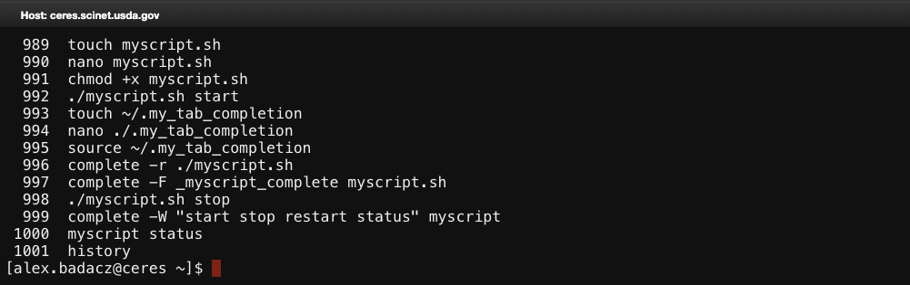
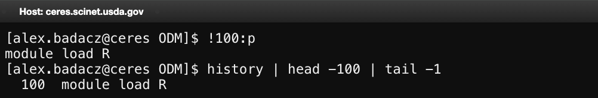
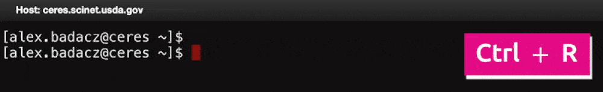

---

title: Command history
description: "A record of previously executed commands that allows users to recall, search and reuse past inputs in the CLI."
type: interactive tutorial
order: 2
tags: [history command, search history, never-ending history, repeatablity, productivity] 
packages: 
level: 
author: Aleksandra Badaczewska

---

# Overview

This interactive tutorial explores command history, a powerful shell feature that allows users to recall, reuse and search previously executed commands. 
By leveraging history navigation and search tools, you can significantly improve efficiency and avoid repetitive typing, especially in HPC environments, 
where executing long and complex commands is common. You will learn how to view, search, and manage command history using built-in shortcuts like Up/Down arrows, 
`Ctrl + R` for reverse search and the `history` command. 
<br>

<div id="info-alerts-1" class="highlighted highlighted--info ">
<div class="highlighted__body"  markdown="1">
<h4 class="highlighted__heading">Main Objectives</h4>
* Learn how to navigate and reuse previously entered commands efficiently.
* Explore reverse search (`Ctrl` + `R`) for quick retrieval of past commands.
* Understand how to manage and configure command history for improved usability.
</div>
</div>

<div id="success-alerts-1" class="highlighted highlighted--success ">
<div class="highlighted__body"  markdown="1">
<h4 class="highlighted__heading">Goals</h4>
<p>By the end of this tutorial, you will:</p>
* Use history navigation shortcuts (`↑↓`, `!!`, `!n`, `!string`) to recall commands efficiently.
* Master incremental search (`Ctrl` + `R`) for quickly finding past commands.
* Customize history settings to optimize command recall in HPC workflows.
* Manage and clear history when necessary for privacy and organization.
</div>
</div>


### Tutorial scope

This tutorial provides a hands-on guide to efficiently using command history in the shell. It covers basic history navigation, 
advanced search techniques and history management, helping users reduce redundant typing and improve workflow efficiency, 
particularly when working with long command chains and complex inline scripts in SCINet HPC environments.
<div class="usa-accordion">


<div id="scope-concepts" class="accordion_content" markdown="1">
* **Command history:** A record of previously executed commands that can be recalled and reused.
* **Reverse search:** A shortcut for quickly searching past commands by keyword.
* **History expansion:** Methods for executing previous commands without retyping.
* **Persistent history:** A file storing past commands across sessions.
</div>

 
<div id="scope-tools" class="accordion_content" markdown="1">
* **Bash shell:** A popular shell environment (command interpreter) available on most Unix-like and HPC systems.
* **`history` command:** Displays a list of past commands.
* **Keyboard shortcuts:** `Ctrl + R`, `!!`, `↑↓` for quick recall.
* **Shell configuration files (`.bashrc`):** Shell startup script used to enable and customize autocompletion behavior.
</div>

 
<div id="scope-apps" class="accordion_content" markdown="1"> 
* **Reusing long commands:** Quickly recall and modify frequently used HPC job submission commands.
* **Enhanced productivity:** Use shortcuts to speed up navigation through command history.
* **History customization:** Adjust history settings for **long-term tracking** of command usage.
* **Efficient troubleshooting:** Retrieve and inspect previous commands instead of manually retyping them. 
</div>
</div>

---


## What is command history?

Command history is a continuous record of previously executed commands that can be browsed, modified and reused for greater efficiency.
This feature minimizes redundant typing, speeds up repetitive tasks and improves troubleshooting by allowing users to quickly access past commands. 
It also aids knowledge retention and serves as a built-in project documentation tool, preserving a trace of analytical steps and computational procedures for future reference.

***Benefits of using command history, particularly in an HPC environment***

| capabilities | practical advantage |
|-- |-- |
| **Efficiency & Productivity** | Saves time by reusing long data processing commands and automating repetitive workflows. |
| **Troubleshooting & Debugging** | Tracks command evolution, simplifies troubleshooting, and provides context for errors to refine execution. |
| **Error reduction** | Minimizes mistakes by reusing previously tested commands, reducing typos and incorrect execution. |
| **Learning & Optimization** | Reinforces CLI knowledge, accelerates learning, and optimizes command recall with history expansion. |
| **Collaboration & Documentation** | Facilitates knowledge sharing and serves as an implicit record for workflow documentation and reproducibility. |
| **Customization & Adaptability** | Enables history customization in `~/.bashrc` (e.g., `HISTIGNORE`, `HISTSIZE`) for tailored usability. |
| **Long-term usability** | Ensures history persistence across sessions and enhances multi-terminal productivity by synchronizing command history. |


### Access past commands: `history`

Most Unix-like shells, including Bash, keep a history of past commands. You can access them with a command:
```bash
history
```
*This displays a numbered list of previous commands, with the most recent ones at the bottom.*


To explore this output, you can scroll up the page. If the list is long, limit the output to show only the last `N=20` commands:
```bash
history 20
```

<div id="info-alerts-1" class="highlighted highlighted--note ">
<div class="highlighted__body"  markdown="1">
1. The `history` command shows the in-shell record of **commands stored in memory for the current session**, 
which may not yet be **written to the [persistent `~/.bash_history` file]()** until the session ends or is manually updated.
2. Each entry consists of a **history index number** followed by the actual command, 
with the most recent ones appearing at the bottom of the list. 
3. The index numbers in history serve as unique references, allowing [direct retrieval and execution]() of specific commands. 
4. Due to the default limit on stored commands, **older entries are automatically removed** to make space for newer ones, 
though this limit can be adjusted to maintain an [unlimited history]().
</div></div>


### Navigate history with keyboard

Besides using `history` command to display the entire command history or showing a specific number of recent entries, 
you can also **browse past commands one at a time** using keyboard shortcuts. 
This method is useful when searching for a recent command without overwhelming output.

* Press `↑` (Up Arrow) to go to the previous command.
* Press `↓` (Down Arrow) to move forward in history.

<div id="info-alerts-1" class="highlighted highlighted--tip ">
<div class="highlighted__body"  markdown="1">
For faster [navigation and editing](/computing-skills/command-line/cli-interface/shell/commands/#navigating-the-command-line), when working with long or multi-line commands:
* `Ctrl + A` moves the cursor to the beginning of the line.
* `Ctrl + E` moves the cursor to the end of the line.
</div></div>


## Recall commands using expansion

History expansion allows you to quickly reuse previously executed commands without retyping them. 
This feature is especially useful in HPC environments, where commands for job submissions, file management or on-the-fly data processing 
are often repetitive and long. Instead of [scrolling through history](#navigate-history-with-keyboard) and [manually copying commands](#access-past-commands-history) you can execute them directly using shortcuts.

<div id="info-alerts-1" class="highlighted highlighted--note ">
<div class="highlighted__body"  markdown="1">
**History expansion** allows you to **retrieve and execute previous commands using their index numbers** from the history list, so you first need to check the command's index with `history` or `history | grep "keyword"` before referencing it with `!<index>` (absolute) or `!-<index>` (relative) syntax.
<br><br>
*This approach becomes especially useful when you naturally remember the index of a frequently used command over time, allowing you to quickly rerun it without searching through history, saving time and effort.*
</div></div>

<div id="info-alerts-1" class="highlighted highlighted--warning ">
<div class="highlighted__body"  markdown="1">
Be cautious when running history expansion commands (`!!`, `!n`, `!-n`) as they execute immediately without confirmation. 
Use the preview option (`:p`) if unsure about a command's content before running it.
</div></div>


### *Always Preview before running*

Each command in history has an [index number](#access-past-commands-history), which allows you to reference and execute it directly.
To preview a command from history at a specific index before executing it, append `:p` *(aka. print)* to the `!<index>` expansion command. 
This prevents accidental execution, allowing you to verify its content.

```bash
!100:p
```
*This prints command #100 from history instead of running it.*



### *Repeat last command: `!!`*

The `!!` shortcut executes the most recent command from history. <br>
This is useful when retrying a failed command or quickly re-running previous operations.

```bash
!!
```
*This runs the latest command again.*


### *Run command by* ***relative index***

You can **execute a previously used command based on its position relative to the most recent one**. 
This approach is useful when you know how many steps back a command was run but don't need to check its exact history index. 
It provides a quick way to recall recent commands without listing the full history. 

```bash
!-3
```
*This executes the command that was run three steps ago.*

<div id="info-alerts-1" class="highlighted highlighted--tip ">
<div class="highlighted__body"  markdown="1">
This is useful when you know exactly how many steps ago a command was executed, allowing you to recall it directly using relative history expansion.
</div></div>


### *Run command by* ***absolute index***

Once you know the **exact history index of a command**, you can retrieve and execute it in a single step using the `!<index>` expansion. 
This method is useful when recalling a specific command from history, especially for frequent or complex ones.
```bash
!100
```
*This runs command #100 from the history list.*

<div id="info-alerts-1" class="highlighted highlighted--warning ">
<div class="highlighted__body"  markdown="1">
Ensure you [check the command before execution](#always-preview-before-running) to avoid running unintended or outdated commands. 
In this case, use `!100:p` to preview before running.
</div></div>


## **Search command history**

When working in the terminal, [manually scrolling through past commands](#access-past-commands-history) can be inefficient, 
especially in HPC environments where the number of entered commands is large and repetitive. 
Instead of [cycling through history one command at a time](#navigate-history-with-keyboard), you can **quickly locate and reuse specific commands using search techniques**. The shell provides powerful tools like [incremental search](#incremental-search-ctrl--r) and [filtering with `grep`](#filter-history-with-grep) 
to find past commands based on keywords, saving time and reducing repetitive typing.

### *Incremental search: `Ctrl + R`*

<div id="info-alerts-1" class="highlighted highlighted--note ">
<div class="highlighted__body"  markdown="1">
Incremental search allows you to **dynamically search through your command history as you type**, refining results with each keystroke. 
This is particularly useful in HPC environments where job submission or data processing commands are frequently reused.
</div></div>

Press `Ctrl + R` and start typing part of a previous command, e.g., `sbatch`. <br>
The shell will dynamically display the most recent matching command:
```bash
# (reverse-i-search)`sbatch': sbatch job_script.sh
```
* Press `Enter` to execute the command immediately.
* Press `→` (Right Arrow) to move the command to the prompt for editing before execution.
    * Press `Ctrl + A` to move the cursor to the beginning of the command.
    * press `Ctrl + E` to move the cursor to the end of the command.
* Press `Ctrl + R` again to cycle through older matches.
* Press `Ctrl + G` to exit the search without selecting a command.



<div id="info-alerts-1" class="highlighted highlighted--warning ">
<div class="highlighted__body"  markdown="1">
Be cautious when executing history commands directly, especially destructive ones (e.g.,`rm -rf *`). <br>
Always review before hitting `Enter`.
</div></div>

### *Filter history with `grep`*

Instead of [manually scrolling](#navigate-history-with-keyboard) through history or using [incremental search](#incremental-search-ctrl--r), 
you can filter past commands using `grep` to quickly locate specific entries. 
This method is useful when you need to **find all occurrences of a particular command**, option or keyword.

*For example,* to find a past SLURM job submission command without entering search mode, run:
```bash
history | grep sbatch
```
*This will list all previously executed commands that contain `sbatch`.*


<div id="info-alerts-1" class="highlighted highlighted--tip ">
<div class="highlighted__body"  markdown="1">
If you frequently use specific commands, consider [creating an alias](/computing-skills/command-line/cli-interface/shell/customization/aliases) in 
[your startup configuration file `~/.bashrc`](/computing-skills/command-line/cli-interface/shell/customization/bashrc) 
for quicker access and to avoid repetitive typing. *(links redirect to the corresponding tutorials)*
</div></div>


## **Control persisted history records**

By default, Bash maintains an in-memory `history` of commands during an active session, providing immediate and interactive access to previously executed commands. 
When the session ends, these commands are automatically written to `~/.bash_history` file, enabling users to retrieve past commands across sessions. 
However, there are times when you may want to edit, clear or temporarily disable history, for example, 
to **remove sensitive commands** or **declutter your persisted history**. 
The following techniques can help you take control of recorded history based on your specific needs.


### Edit `.bash_history` file

The `~/.bash_history` file stores past commands even after you log out. 
If you need to manually remove or modify specific entries (e.g., clearing sensitive commands like passwords or API keys), you can edit the file directly.

To edit history records manually, use text editor:
```bash
nano ~/.bash_history
```
*Make the necessary changes, then save by pressing `Ctrl + X`, then `Y`, then `Enter` to exit.*

<div id="info-alerts-1" class="highlighted highlighted--highlighted ">
<div class="highlighted__body"  markdown="1">
Editing the history file won't take effect immediately in the current session. To reload the modified history, run:
```bash
history -r
```
</div></div>

### Disable or clear session history

**While working in a current shell session**, you may want to clear in-memory recorded commands or prevent them from being saved for future sessions. 
This could be for privacy, security, or simply to keep your history clean. You have two main options to do so:

| behavior   | [clear in-memory history](#clear-in-memory-history)| [disable writing to .bash_history](#disable-writing-to-bash_history) |
|--          |--                     |--                      |
| usage      | `history -c`          | `unset HISTFILE`       |
| past commands from current session | **permanantly removed** <br>(cannot be accessed via `history` or arrow keys) | still available until the session ends |
| future commands in current session | still recorded in memory and accessible | still recorded in memory and accessible |
| saving records to `.bash_history` file | what's in memory is saved at session end | **nothing saved to .bash_history** <br>(history logging in this session is disabled) |
| future shell sessions              | unaffected, will record commands in memory and save to `.bash_history` at session end | unaffected, will save command history to `.bash_history` at session end |

<div id="info-alerts-1" class="highlighted highlighted--highlighted ">
<div class="highlighted__body"  markdown="1">
Neither approach affects commands already saved in `~/.bash_history`. The default `history` behavior, including in-memory tracking and history saving, 
will be restored automatically in future shell sessions.
</div></div>


#### Clear in-memory history 

To remove all command history up to this point in the current session:
```bash
history -c
```
*This clears the in-memory command history for the current session, preventing past commands from appearing when using `history` or arrow-key navigation.* 
*All future commands will still be recorded in memory and saved to `~/.bash_history` at session end.*


#### Disable writing to `.bash_history` 

To prevent the shell from saving any commands from this session to the `~/.bash_history` file:
```bash
unset HISTFILE
```
*This disables history logging for the current session, ensuring that no commands will be written to `~/.bash_history`.* 
*However, until the session ends, you can still access and reuse past commands from this session, as they remain in memory `history`.*

<div id="info-alerts-1" class="highlighted highlighted--tip ">
<div class="highlighted__body"  markdown="1">
For complete privacy, you can combine both:
```bash
history -c && unset HISTFILE
```
*This clears existing session history and disables further logging to `.bash_history` for the current session.*
</div></div>


## **Customize command history**

You can modify history behavior by setting corresponding variables in `~/.bashrc` *([shell startp script](/computing-skills/command-line/cli-interface/shell/customization/bashrc))*. 
These configurations help control how commands are stored, synchronized and shared across sessions. 
By applying these techniques, you can control, modify and protect your shell history as needed, 
ensuring efficiency while maintaining privacy and security in your HPC environment.

### Configure history size

Control how many commands are stored in memory and the history file:
```bash
export HISTSIZE=1000        # number of temporary commands stored in memory for a current session
export HISTFILESIZE=2000    # number of permanant commands saved to the history file
```
* `HISTSIZE` controls the number of commands retained in memory for the current session.
* `HISTFILESIZE` determines the total number of commands saved to ~/.bash_history across sessions.

### ***Never-ending history***

To store an unlimited number of commands, set both values to unlimited:
```bash
export HISTSIZE=
export HISTFILESIZE=
```
*This ensures that your history file grows indefinitely.* 

<div id="info-alerts-1" class="highlighted highlighted--tip ">
<div class="highlighted__body"  markdown="1">
Leaving history sizes empty in some Bash versions may not properly handle unlimited history. 
In such a case, explicitly set them to a large number like 1000000 to ensure history is retained.
</div></div>


### Ignore duplicated entries

To prevent duplicate history entries use:
* `ignoredups` to prevent duplicate consecutive commands <br>
*(If you run the same command multiple times in a row, only the first occurrence is recorded.)*
* `erasedups` to ignore all duplicates, regardless of spacing
```bash
export HISTCONTROL=ignoredups       # ignores consecutive duplicates
export HISTCONTROL=erasedups        # keeps only one record per unique command
```

### Ignore specific commands

To exclude specific commands (e.g., `ls` and `pwd`) from history:
```bash
export HISTIGNORE="ls:pwd:clear"
```
* Use a colon (`:`) separator between commands.
* Wildcards can be used to ignore patterns: `"rm *:ls:cd"` <br>
*(This will ignore any `rm` command with arguments, all `ls` and `cd` commands.)*

<div id="info-alerts-1" class="highlighted highlighted--tip ">
<div class="highlighted__body"  markdown="1">
Automatically ignore commands that contain sensitive keywords like `password` or `token`:
```bash
export HISTIGNORE="ls:pwd:mkdir:rm *:clear:exit:*password*:*token*"
```
</div></div>


### Append instead of overwriting

<div id="info-alerts-1" class="highlighted highlighted--highlighted ">
<div class="highlighted__body"  markdown="1">
By default, when you open a new terminal session, Bash overwrites the history file.

***Ensure that history from multiple sessions is merged rather than overwritten!***
</div></div>

To append new commands to history instead of overwriting it:
```bash
shopt -s histappend
```
*This ensures that history from multiple concurrent sessions is merged instead of lost when closing a terminal.*

### Make updates immediate

<div id="info-alerts-1" class="highlighted highlighted--highlighted ">
<div class="highlighted__body"  markdown="1">
By default, history is only written to the file when a session ends.
</div></div>

To write (and persist) each command immediately after execution:
```bash
export PROMPT_COMMAND='history -a'
```
*This ensures commands appear in `~/.bash_history` as soon as they are executed, making them available in new sessions.*


### Multi-session history synchronization

<div id="info-alerts-1" class="highlighted highlighted--highlighted ">
<div class="highlighted__body"  markdown="1">
When using multiple terminal sessions concurrently, history changes might not be immediately visible in all open windows.
</div></div>

To sync history across sessions dynamically:
```bash
export PROMPT_COMMAND="history -a; history -n; history -w"
export HISTCONTROL=ignoreboth
shopt -s histappend
```
* `history -a` appends the latest command to ~/.bash_history.
* `history -n` loads new history from the file into memory.
* `history -w` ensures history is written to disk immediately, reducing the risk of losing commands if the shell crashes.
* For full synchronization, also enable `HISTCONTROL` and `histappend`. <br>
*This ensures real-time updates and no duplicate history entries across multiple open sessions.*


### Export history to share

To save command history for sharing or documentation:
```bash
history > my_hpc_commands.txt
```

To reload the history into another session:
```bash
cat my_hpc_commands.txt >> ~/.bash_history
```

<div id="info-alerts-1" class="highlighted highlighted--tip ">
<div class="highlighted__body"  markdown="1">
This is useful for collaborative work or preserving session commands for later use.
</div></div>


## **Make customization permanent**

To ensure that your command history settings persist across sessions, add the following configurations to your `~/.bashrc` file:

**1. Open your Bash configuration file for edition:**
```bash
nano ~/.bashrc
```

### *Ready-made history settings*

**2. Append your changes** *(or the following ready-made)* **command history configuration:**
```bash
# Command History Customization
export HISTSIZE=               # Number of commands stored in memory: unlimited
export HISTFILESIZE=           # Number of commands stored in ~/.bash_history: unlimited
export HISTIGNORE="ls:pwd:mkdir:rm *:clear:exit:*password*:*token*"  # Commands to exclude from history
HISTTIMEFORMAT="%F %T "         # Save timestamped history
# Synchronize history across multiple sessions
shopt -s histappend             # Append history instead of overwriting
export HISTCONTROL=ignoreboth   # Includes duplicate removal & ignores extra spaces
export PROMPT_COMMAND="history -a; history -n; history -w"      # Append, write and reload history after each command in any session
```

**3. Save and exit edition mode:** <br>
Press `CTRL + X`, then press `Y` and hit `Enter` to save changes.

**4. Reload the configuration to apply changes immediately:**

Source your updated configuration file:
```bash
source ~/.bashrc
```

### Useful aliases & shell functions

In addition to history customization, you may find these aliases and functions helpful for managing and interacting with your command history more efficiently.
* Use [aliases](#aliases-for-quick-history-management) for quick actions like clearing, wiping or viewing history with timestamps.
* Utilize [shell functions](#shell-functions-for-advanced-history-handling) to search, remove or export history for better control.

#### Aliases for quick history management

*(Reference tutorial: [Alias definition and usage: create shortcuts for repetitive commands](/computing-skills/command-line/cli-interface/shell/customization/aliases))*

```bash
# Backup history automatically;                         # usage: histbackup
alias histbackup='cp ~/.bash_history ~/.bash_history.backup'

# View history with timestamps                          # usage: histtime
alias histtime="HISTTIMEFORMAT='%F %T ' history"

# Clear current session history                         # usage: histclear
alias histclear="history -c"

# Remove all history permanently                        # usage: histwipe
alias histwipe="cat /dev/null > ~/.bash_history && history -c && exit"
```

#### Shell functions for advanced history handling

*(Reference tutorial: [Shell Functions: group command sequences and enable argument passing](/computing-skills/command-line/cli-interface/shell/customization/functions))*

```bash
# Search command history interactively                  # usage: histsearch sbatch
histsearch() { history | grep --color=auto "$1"; }

# Remove the command at specific history index          # usage: histremove 1002
histremove() {
    history -d "$1"
    history -w
}

# Export command history to a file with a timestamp     # usage: histexport
histexport() { history > "history_$(date +'%Y-%m-%d_%H-%M-%S').txt"; }
```


