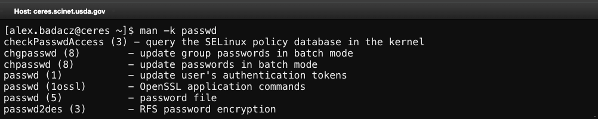
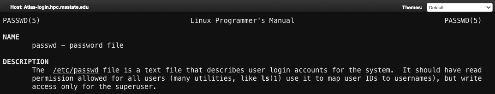
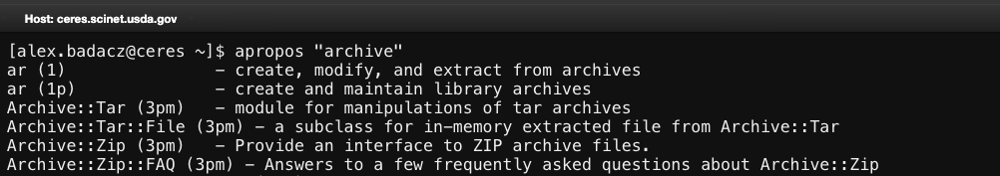
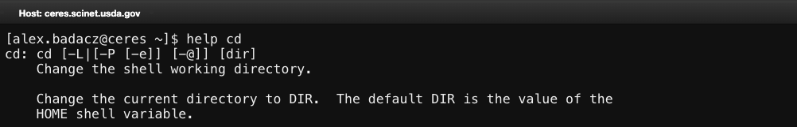
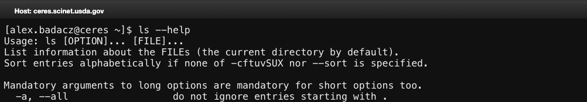

---

title: 'Command manual '
description: "Built-in documentation providing detailed descriptions, usage and options for system commands and utilities."
type: interactive tutorial
order: 3
tags: [command manual, command help, documentation] 
packages: 
level: 
author: Aleksandra Badaczewska

---

# Overview

This interactive tutorial explores the command manual, a built-in system for accessing detailed documentation about shell commands and utilities. 
By using manual pages (`man`), quick-help options (`--help`) and other lookup tools (`whatis`, `apropos`), users can efficiently find command syntax, 
descriptions and examples without leaving the terminal. This tutorial provides hands-on exercises to help you confidently navigate command manuals 
and get the information you need when working in the shell.
<br>

<div id="info-alerts-1" class="highlighted highlighted--info ">
<div class="highlighted__body"  markdown="1">
<h4 class="highlighted__heading">Main Objectives</h4>
* Learn how to use the manual pages (`man`) to find command details and options.
* Explore alternative quick-help tools (`--help`, `whatis`, `apropos`) for fast lookups.
* Develop skills to efficiently navigate and search within manual pages.
</div>
</div>

<div id="success-alerts-1" class="highlighted highlighted--success ">
<div class="highlighted__body"  markdown="1">
<h4 class="highlighted__heading">Goals</h4>
<p>By the end of this tutorial, you will:</p>
* Use `man` pages to access detailed documentation on shell commands.
* Quickly find command usage with `--help` and related lookup tools.
* Search within manual pages for specific keywords and options.
* Understand manual page sections and how to retrieve relevant documentation efficiently.
</div>
</div>


### Tutorial scope

This tutorial provides a hands-on guide to using the shell's built-in documentation system, focusing on efficient lookup methods, 
navigation shortcuts and practical applications for HPC workflows. Users will learn how to quickly find information, 
troubleshoot command usage and optimize their work without relying on external documentation.

<div class="usa-accordion">


<div id="scope-concepts" class="accordion_content" markdown="1">
* **`man` pages:** Detailed documentation for Unix commands, including syntax, options and examples.
* **Quick-help (`--help`):** A command-line flag that provides a brief summary of command usage.
* **Command lookup tools (`whatis`, `apropos`):** Methods for finding command descriptions and related utilities. 
* **Manual page navigation:** Shortcuts for searching, scrolling and exiting (`/search`, `q`, `h`). 
</div>

 
<div id="scope-tools" class="accordion_content" markdown="1">
* **Bash shell:** A popular shell environment (command interpreter) available on most Unix-like and HPC systems.
* **`man` command:** Displays detailed manual pages for system commands.
* **`--help` flag:** Provides a quick command summary directly in the terminal.
* **Navigation tools:** `/` (search), `q` (quit), `h` (help) for interacting with manual pages.
</div>

 
<div id="scope-apps" class="accordion_content" markdown="1"> 
* **Finding command usage and syntax:**  Learn how to use commands correctly with `man` and `--help`.
* **Searching for relevant commands:** Use `apropos` to find related tools for specific tasks.
* **Troubleshooting errors:** Look up error messages and options in command documentation.
* **HPC environment optimization:** Quickly access reference documentation for complex HPC utilities.
</div>
</div>

---


## What is the command manual?

For HPC users, understanding how to quickly access documentation is essential when working with unfamiliar commands, 
troubleshooting issues or optimizing scripts on SCINet HPC clusters. Unix-based systems provide built-in manuals and 
help tools for almost every command to learn command syntax, options and usage. For HPC users, this knowledge is even more critical. 

Efficiently accessing built-in documentation allows you to:
* Learn unfamiliar commands quickly.
* Find the right options without trial and error.
* Troubleshoot errors effectively.
* Optimize scripts and improve productivity.

#### *Why use built-in documentation instead of searching online?*

* **Immediate access:** *No need for internet connectivity, which may be restricted in some HPC environments.*
* **Version-specific information:** *Online resources may not match the specific software versions installed on an HPC system.*
* **Detailed and authoritative:** *Built-in manuals are maintained by the developers of the command or system.*
* **Faster and more efficient:** *Searching for help directly in the terminal can be quicker than browsing online documentation.*


### Types of command documentation

Unix-based systems provide multiple ways to access help, each with different levels of detail:

| method    | description | best used for | usage |
|--         |--           |--             |--     |
| `man`     | Full manual pages for commands with detailed documentation. | Understanding a command in-depth, including all options and examples. | `man ls` |
| `help`    | Displays information about shell-built-in commands. | Checking shell commands like `cd`, `echo` or `alias`. | `help cd` |
| `--help`  | Quick usage summary, typically showing basic syntax and available options.	| Getting a quick reference without opening a full manual. | `ls --help` |
| `whatis`  | Provides a short, one-line description of a command. | Confirming what a command does at a glance. | `whatis grep` |
| `apropos`	| Searches for commands related to a keyword. | Finding commands when you don’t remember the exact name. | `apropos search` | 
| `info`    | Extended documentation for some commands, structured like a book. | Exploring commands that offer more complex documentation. | `info ls` |
| `tldr`    | Community-driven, simplified examples of command usage. | Quickly learning common use cases of a command. | `tldr tar` |


### **Explore Command Manuals**: `man`

The `man` command is a powerful tool that allows users to access comprehensive documentation directly from the terminal. 
Learning to navigate and search within manual pages can significantly enhance your efficiency in an HPC environment.

<div id="info-alerts-1" class="highlighted highlighted--note ">
<div class="highlighted__body"  markdown="1">
The `man` (**manual**) command is the primary way to access detailed documentation for commands in Unix/Linux. 
It provides structured information, including syntax, available options and examples. <br>

| command syntax | description | example usage |
|--       |--           |--             |
| `man <command>` | Opens the complete manual page for a command. | `man grep` |
| `/keyword`      | Searches for a term inside a man page.        | `/-i` <br>*(inside man grep)* |
| `man <section><command>` | Opens a specific manual section.    | `man 5 passwd` | 
| `man -k <keyword>`        | Lists commands related to a keyword. | `man -k passwd` |

*For HPC users, understanding how to efficiently use man pages can greatly improve workflow efficiency by providing immediate access to command details without leaving the terminal.*
</div></div>

#### Structure of man pages

When you open a manual page, you will typically see these sections:

| section         | purpose |
|--               |--       |
| **NAME**        | The command name and a brief one-line description. |
| **SYNOPSIS**    | Basic usage and syntax. |
| **DESCRIPTION** | Detailed explanation of what the command does. |
| **OPTIONS**     | Available command flags and their functions. |
| **EXAMPLES**    | Practical examples of usage. |
| **SEE ALSO**    | References to related commands or documentation. |

#### Opening a `man` page

To access the manual for any command, simply use `man` keyword followed by a command name:
```bash
man ls
```
*This shows the manual page for `ls` command.*

<div id="info-alerts-1" class="highlighted highlighted--tip ">
<div class="highlighted__body"  markdown="1">
Scroll through the page and observe the NAME, SYNOPSIS and OPTIONS sections.
</div></div>


#### Navigating man pages

Once inside a `man` page, you can navigate efficiently using the following shortcuts:

| shortcut | Function |
|--        |--        |
| `/keyword` | Search for a specific word in the man page. |
| `n`        | Jump to the next search result. |
| `q`        | Quit the man page. |
| `h`        | Display help for navigation. |
| `Space`    | Scroll down one page. |
| `b`        | Scroll back one page. |


<div id="success-alerts-1" class="highlighted highlighted--success ">
<div class="highlighted__body"  markdown="1">
<h4 class="highlighted__heading">Exercise: Try it yourself!</h4>
1. Open the manual page for the `grep` command:
```bash
man grep
```

2. Search for the `-i` option (case-insensitive search). <br>
*Press `/`, type `-i` and hit `Enter`.*

3. Exit the manual using `q`.
</div>
</div>


#### Be aware of manual categories

<div id="info-alerts-1" class="highlighted highlighted--highlighted ">
<div class="highlighted__body"  markdown="1">
Unix manual pages are organized into categories, often referred to as sections. 
Each section groups related commands, system calls or configuration files, helping users locate the correct documentation for a given term.
<br><br>
Sometimes, a single name can refer to multiple components. For example, `passwd` exists as both:
* `passwd(1)` – The user command to change passwords.
* `passwd(5)` – The system file format for storing password-related data.

*By understanding man categories, you can retrieve precise documentation and avoid opening the wrong page.*
</div></div>

**Unix manual pages are divided into sections based on command types.** <br>
The most common sections for HPC users are in bold:

| section | description |
|--       |--           |
| **1** | User commands *(most relevant for general users)* |
| **2** | System calls *(kernel functions)* |
| **3** | Library functions *(e.g., `C` library functions)* |
| `4` | Special files *(devices)* |
| **5** | File formats and configuration files |
| `6` | Games & screensavers |
| `7` | Miscellaneous *(protocols, conventions, etc.)* |
| `8` | System administration commands *(e.g., `mount` filesystems)* |

**Checking all available `man` sections**

Since multiple components can share the same name, always check which sections are available by running:
```bash
man -k <command>

man -k passwd
```
*This will list all available manual pages related to passwd, showing their section numbers.*



**To access the correct page, specify the section number:**
```bash
man <section_number> <command>

man 5 passwd
```
*This opens the documentation for the `passwd` file format rather than the `passwd` command.*



<div id="success-alerts-1" class="highlighted highlighted--success ">
<div class="highlighted__body"  markdown="1">
<h4 class="highlighted__heading">Exercise: Try it yourself!</h4>
1. Compare the following:
```bash
man 1 passwd
man 5 passwd
```

2. Notice how they provide different information!
</div>
</div>


## Alternative command documentation

### Check command purpose: `whatis`

<div id="info-alerts-1" class="highlighted highlighted--note ">
<div class="highlighted__body"  markdown="1">
`whatis` retrieves one-line descriptions of commands by searching the short descriptions stored in the [man page](#using-the-man-command) database. 
It is essentially a shortcut for viewing the NAME section of a man page without opening the full manual.
</div></div>

If you only need a brief description of a command, you can use:
```bash
whatis mkdir
```
*This returns a one-line description of the command.*


### Find related commands: `apropos`

<div id="info-alerts-2" class="highlighted highlighted--note"> 
<div class="highlighted__body" markdown="1"> 
`apropos` helps you find commands related to a specific keyword by searching the short descriptions in the [man page](#what-is-the-command-manual) database. 
It is useful when you **don’t remember the exact command name** but know a relevant term. *This allows you to quickly identify relevant commands and decide which one to explore using `man` pages.*
</div></div>

If you’re unsure which command to use for a task, try:
```bash
apropos "archive"
```
*This lists commands related to the keyword "archive" along with their short descriptions.*



<div id="success-alerts-1" class="highlighted highlighted--success ">
<div class="highlighted__body"  markdown="1">
<h4 class="highlighted__heading">Exercise: Try it yourself!</h4>
<p>Find Commands Related to Text Processing</p>
1. Run:
```bash
apropos "text"
```

2. Identify useful commands related to text manipulation.
</div>
</div>


### Support for shell built-ins: `help`

<div id="info-alerts-3" class="highlighted highlighted--note"> 
<div class="highlighted__body" markdown="1"> 
The `help` command provides brief descriptions and usage details **for shell built-in commands**. 
Unlike `man`, which documents external programs, `help` is specific to commands that are built into the shell, such as `cd`, `echo` or `alias`.
</div></div>

To display help for a shell built-in, use:
```bash
help cd
```



<div id="info-alerts-2" class="highlighted highlighted--tip"> 
<div class="highlighted__body" markdown="1"> 
*This is useful when you need a quick reference without opening a full manual.*

For a list of all available shell built-ins, run:
```bash
help
```
For more detailed information on a built-in command, you can use:
```bash
help <command> | less

help export | less
```
</div></div>

### Get quick help with `--help`

Most modern commands support --help for a quick summary of options:
```bash
ls --help
```
*This shows a brief explanation of the cd command and its options.*




### ***Use command autocompletion***

*(Reference tutorial: [Command autocompletion](/computing-skills/command-line/cli-interface/shell/commands/autocompletion))*

<div id="info-alerts-2" class="highlighted highlighted--tip"> 
<div class="highlighted__body" markdown="1"> 
Typing long commands and file names can be tedious and error-prone. Command autocompletion speeds up your workflow by automatically suggesting and completing commands, file paths and options.

**Press `Tab` to autocomplete; press `Tab` twice to list available suggestions.** <br>
*You can use `Tab` at any point while typing a command to dynamically find matches.*
</div></div>


### Online documentation

<div id="info-alerts-2" class="highlighted highlighted--info"> 
<div class="highlighted__body" markdown="1"> 
Many Linux distributions provide web-based manuals and resources, such as [man7.org](https://man7.org), [manpages.ubuntu.com](https://manpages.ubuntu.com) or official wikis, for accessing command documentation and system references. These online resources can be especially useful when:
- the built-in man pages lack examples or detailed explanations,
- need cross-version comparisons, as online documentation often covers multiple Linux distributions,
- working on a remote system without installed manual pages,
- want community-driven explanations from forums, wikis or Q&A sites like Stack Overflow and ArchWiki.
</div></div>


## *A practical lookup challenge*

<div id="info-alerts-1" class="highlighted highlighted--tip ">
<div class="highlighted__body"  markdown="1">
Mastering the command manual and lookup tools helps you work efficiently on HPC systems. <br>
By using `man`, `--help`, `whatis` and `apropos`, you can quickly find the right command, 
understand its options and troubleshoot issues, saving valuable time.
</div>
</div>

<div id="success-alerts-1" class="highlighted highlighted--success ">
<div class="highlighted__body"  markdown="1">
<h4 class="highlighted__heading">Exercise: Try it yourself!</h4>
1. Find the command that allows you to count the number of words in a file.
2. Find a related command that performs line counting.
3. Use `man`, `whatis` or `apropos` to compare them.
4. Find an option for one of the commands that allows counting characters instead.
5. Try searching for lesser-known commands related to your HPC tasks.
</div>
</div>