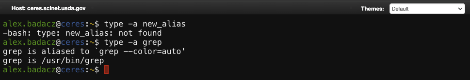
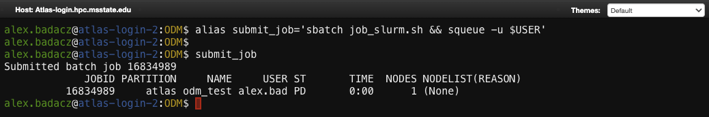
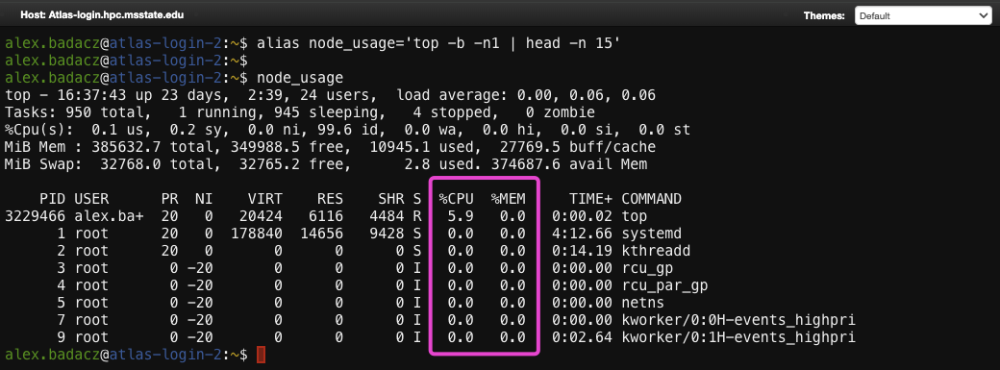

---

title: "Alias definition and usage: create shortcuts for repetitive commands"
description: "User-defined abbreviations that simplify complex or frequently used commands with customized options."
type: interactive tutorial
order: 3
tags: [UNIX, shell customization, alias, command shortcut, automation, bashrc]
packages: 
level:
author: Aleksandra Badaczewska

---

## Overview

This interactive tutorial introduces the concept of command aliases in Unix-like operating systems, offering a way to streamline and simplify repetitive tasks in the shell environment. By defining custom shortcuts for frequently used or complex commands, you can significantly enhance your productivity and efficiency when working on the command line. This guide will cover alias creation, usage and management with a practical, hands-on approach fully compatible with the SCINet HPC environment.
<br>

<div id="info-alerts-1" class="highlighted highlighted--info ">
<div class="highlighted__body"  markdown="1">
<h4 class="highlighted__heading">Main Objectives</h4>
* Understand the syntax and purpose of command aliases in the shell.
* Learn how to define, use and persist aliases across terminal sessions.
* Explore practical use cases for aliases in everyday terminal workflows, particularly within an HPC context.
</div>
</div>

<div id="success-alerts-1" class="highlighted highlighted--success ">
<div class="highlighted__body"  markdown="1">
<h4 class="highlighted__heading">Goals</h4>
<p>By the end of this tutorial, you will:</p>
* Grasp the syntax and conventions for creating aliases in a Bash shell.
* Be able to define both temporary and permanent aliases to improve your command-line experience.
* Develop an understanding of best practices for managing aliases to avoid conflicts and ensure reliability.
* Confidently troubleshoot common issues related to aliases, such as path conflicts or shell incompatibilities.
</div>
</div>


### Tutorial scope

This tutorial offers a practical, step-by-step guide to creating and managing command aliases. The focus is on real-world applications where repetitive tasks can be simplified, allowing for faster and more efficient interaction with the shell. Users working on SCINet clusters will benefit from persistent, session-aware configurations and practical tips to manage aliases in multi-user environments.

<div class="usa-accordion">


<div id="scope-concepts" class="accordion_content" markdown="1">
* **Command Aliases:** Shortcuts that allow you to replace long or repetitive commands with simpler, custom-defined keywords.
* **Alias Persistence:** Techniques for saving aliases permanently using shell configuration files.
* **Temporary vs. Permanent Aliases**: The difference between session-specific and persistent alias definitions.
* **Alias Expansion and Nesting:** Handling complex commands or sequences of commands using aliases.
</div>

 
<div id="scope-tools" class="accordion_content" markdown="1">
* **Bash shell:** A popular shell environment (command interpreter) available on most Unix-like and HPC systems.
* **Configuration file:** Text file like `.bashrc` or `.bash_profile` that define environment variables and other shell settings, including text coloring and prompt styles.
* **Command substitution:** A technique used to enhance aliases by embedding dynamic commands.
</div>

 
<div id="scope-apps" class="accordion_content" markdown="1">    
* **Time-saving shortcuts:** Define aliases for long or complex commands, such as data processing or file management sequences.
* **Automation:** Simplify cluster-specific tasks like job submission (sbatch), monitoring, or file transfers with user-defined shortcuts.
* **Environment setup:** Create startup aliases that load specific modules, set variables or initialize project environments.
* **Error-prone commands:** Minimize typos and accidental mistakes by using intuitive aliases for potentially dangerous commands (e.g., replacing rm with a safer version).
* **Coloring text outputs:** Combine aliases with `echo`, `grep`, `awk` or `tail` commands using ANSI color codes to highlight specific keywords, warnings or errors. *This is particularly useful when exploring log files or quickly detecting issues during interactive debugging sessions on clusters.*
</div>
</div>


### Prerequisites 

[Pre-setup for shell customization on SCINet HPC](/computing-skills/command-line/cli-interface/shell/customization/index#prerequisites)

----

## What is an alias in a shell?

<div id="note-alerts-1" class="highlighted highlighted--note ">
<div class="highlighted__body" markdown="1">
An alias in Unix-like systems is a simple, user-defined shortcut that represents a longer or more complex command. Instead of typing out the full command with all flags and options every time, you can create a short, memorable word or abbreviation to run the command with all configurations instantly. 
```bash
alias lsc='ls --color=auto'         # define alias
lsc                                 # use alias like a new command
```
Aliases are a key tool for making repetitive tasks quicker and more efficient, minimizing the risk of mistakes and improving overall productivity on the command line.
</div>
</div>

<div id="note-alerts-1" class="highlighted highlighted--tip ">
<div class="highlighted__body" markdown="1">
Imagine you frequently need to list files in detail within a directory. Instead of typing `ls -l` every time, you can create an alias like `ll` to perform the same task. Or perhaps you want to check the status of a Git project repeatedly, so setting up `alias gs='git status'` could save you lots of typing. In daily work on HPC infrastructure, aliases can help you highlight errors or quickly search logs without manually adding options to every command.
</div>
</div>

### Purpose of command aliases

The primary purpose of aliases is to simplify and speed up command-line usage by reducing typing and repetitive actions. 
- Aliases help users define custom shortcuts for commands, making workflows more personalized and efficient. 

They fit seamlessly into the larger [shell customization ecosystem](/computing-skills/command-line/cli-interface/shell/customization/index), working alongside [environment variables](/computing-skills/command-line/cli-interface/shell/variables), [shell functions](/computing-skills/command-line/cli-interface/shell/customization/functions) and [configuration files](/computing-skills/command-line/cli-interface/shell/customization/bashrc). Together, these components allow users to tailor their [shell environment](/computing-skills/command-line/cli-interface/shell/) to their specific needs, whether that means automating tasks, enhancing readability or ensuring safer command execution.

### How alias differs from commands?

While both built-in commands and aliases are essential components of the command-line experience, they serve different roles. 
- Built-in commands are **integral to the system** and perform core operations, while
- aliases are **flexible shortcuts** created by users to enhance efficiency and convenience. 

| built-in commands | aliases | 
|--                 |--       |  
| Built-in shell commands are predefined commands that come as part of the shell’s core functionality, like `cd`, `ls` or `echo`. | Aliases are **user-defined** and flexible, meaning you can customize them to suit your personal preferences. |
| They provide essential operations that interact directly with the operating system, such as changing directories or displaying file contents. | Aliases only **serve as shortcuts** to shell commands, making it quicker and easier to perform repetitive or complex tasks. |
| Commands cannot be easily modified or replaced. Their behavior is determined by the shell and the underlying system. | Aliases can extend commands, often by adding custom options or **combining multiple commands**, allowing users to streamline their workflows. |
| Built-in commands are always available and cannot be turned off or ignored. | Aliases are optional, temporary unless made permanent and **can be disabled or overridden** if needed. |

<div id="note-alerts-1" class="highlighted highlighted--success ">
<div class="highlighted__body" markdown="1">
This distinction ensures that while built-in commands handle core system tasks, aliases allow for lightweight customization and enhanced user productivity without altering the fundamental behavior of the shell.
</div>
</div>

### How alias differs from variables?

While both aliases and variables play a role in simplifying tasks on the command line, they serve different purposes and behave differently. 
- Variables are designed for storing and manipulating data, while 
- aliases focus on command substitution to streamline shell usage. 

| shell variables   | aliases | 
|--                 |--       |  
| Variables store data or values, such as strings, numbers, or file paths. <br>For example, `mydir="/home/user/project"`. | Aliases act as shortcuts that store command sequences, making it easier to execute repetitive tasks. <br>For example, `alias ll='ls -l'`. |
| When a variable is referenced (e.g., `$mydir`), the shell replaces it with its assigned value before execution. | When an alias is referenced (e.g., `ll`), the shell expands it into the original command (e.g., `ls -l`) before execution. |
| Variables are used for dynamic content like user input, configuration values, or temporary storage. | Aliases provide static command substitutions and are not meant to hold or manipulate dynamic data. |
| Variables are flexible and can be used in scripting and programming logic, such as loops and conditionals. | Aliases are limited to simple command substitutions and are not suited for conditional or complex logic. |
| Variables can store and pass data between commands and scripts. | Aliases do not store or pass data; they merely trigger predefined commands. |
| Variables are defined using the syntax: `name=value`, and are referenced with `$name`. | Aliases are defined using `alias name='command'` and called directly by their name. |

<div id="note-alerts-1" class="highlighted highlighted--success ">
<div class="highlighted__body" markdown="1">
This distinction is important because while both aliases and variables simplify command-line tasks, **aliases excel in command customization**, while variables are better suited for dynamic content manipulation and scripting.
</div>
</div>

## **Creating aliases: basic syntax**

Aliases in Unix-like systems allow you to create shortcuts by **defining simple names for longer commands**, similar to creating a new variable that stores a value. The main difference is that instead of storing data, aliases "store" commands or command sequences that you can run using the defined shortcut.

When you **define an alias**, you are essentially assigning a custom name to a command using the alias keyword, making the command easier and quicker to execute. The process is straightforward and flexible, but understanding the syntax and how to avoid common pitfalls is important for making the most of them.

To define an alias, use the following syntax:
```bash
alias name='command'
```
- `alias`  is the keyword to define an alias.
- `name` is the shortcut you will use to execute the command.
- `command` is the full command that will be run when the alias is called. ***Always wrap the command in single quotes `'command'`!***

<div id="note-alerts-1" class="highlighted highlighted--tip ">
<div class="highlighted__body" markdown="1">
Think of it as storing a frequently used command in a variable-like structure that can be called anytime. 

*For example:*
```bash
alias ll='ls -l'
```
*Here, instead of typing `ls -l` every time, you just type `ll` to execute the same command.*
</div>
</div>

### Simple common aliases

Here are some common and useful alias examples:

* Listing files with detailed information: *(new shortcut)*
```bash
alias ll='ls -l'                     # usage:  ll
```
* Git status shortcut: *(new shortcut)*
```bash
alias gs='git status'                # usage:  gs
```
* Colorized search with `grep`: *(overwritten command)*
```bash
alias grep='grep --color=auto'       # usage:  grep
```

### Quoting and escaping special characters 

<div id="note-alerts-1" class="highlighted highlighted--highlighted ">
<div class="highlighted__body" markdown="1">
When defining an alias, it's important to correctly handle commands that contain spaces, special characters or multiple commands.
</div>
</div>

Aliases are treated like **text substitutions**, so `quoting` and `escaping` ensure the commands work as intended when `expanded`.


**Use single quotes** <br>
Always wrap the command in single quotes ' ' to prevent the shell from interpreting special characters immediately.
```bash
alias today='date +%Y-%m-%d'
```
*Without quotes, the shell could try to expand the `date` command during the alias definition, which may cause errors.*

**Combine multiple commands** <br>
If an alias combines several commands, separate them using semicolon `;` so they execute in sequence.
```bash
alias update='sudo apt update; sudo apt upgrade -y'
```

**Commands containing variables** <br>
If you’re using variables (like some environment variables `$HOME` or `$USER`) in the alias, ensure they are properly escaped when necessary.
```bash
alias mydir='echo "You are in $HOME"'
```

### Avoiding conflicts with system commands

<div id="note-alerts-1" class="highlighted highlighted--highlighted ">
<div class="highlighted__body" markdown="1">
Aliases can easily conflict with existing commands if they are not named carefully. 
</div>
</div>

**Check if a command name is already taken** <br>
Before creating an alias, use the following command to check whether a command name already exists as a built-in shell command, alias or executable program:
```bash
type -a command_name
```

*For example, the command `type -a` shows that `new_alias` is not defined, while `grep` is both an alias  to `grep --color=auto` and an executable located at `/usr/bin/grep`, demonstrating how shell aliases can override system commands.*

**Avoid overwriting important commands** <br>

<div id="note-alerts-1" class="highlighted highlighted--warning ">
<div class="highlighted__body" markdown="1">
Never alias commonly used system utilities (`rm`, `cp`, `mv`, etc.) unless you have a very good reason and understand the risks. 
Overriding these commands could lead to unintended behavior.
</div></div>

If you accidentally redefine a built-in command (e.g., creating `alias rm='rm -i'`), you can temporarily disable it using:
```bash
unalias command_name
```

**Use meaningful prefixes to avoid conflicts** <br>
For example, adding a personal or project-based prefix can help distinguish your aliases from system commands.
```bash
alias my_ls='ls -lh --color=auto'
alias dev_start='cd /path/to/project/dev'
```

### Tips for alias management

**Use descriptive words to indicate specific tasks** <br>
Choose words that describe the specific action or purpose of the alias. This makes it easier to remember what the alias does without needing documentation.

<div id="note-alerts-1" class="highlighted highlighted--tip ">
<div class="highlighted__body" markdown="1">
Use descriptive and distinct names for aliases in HPC to avoid conflicts with system commands.

When defining aliases in an HPC environment, it’s important to choose names that clearly describe their function while avoiding conflicts with existing system commands or other users' aliases. This ensures that your aliases don’t inadvertently override essential commands and are easy to remember and use effectively.

| good alias name   | why it's good? | bad alias name | why it's bad? |
|--                 |--              |--              |--             |
| `my_jobs`         | Clearly describes the purpose (checking job status). | `jobs`   | Conflicts with the built-in shell command jobs. |
| `process_logs`    | Indicates the action of processing log files.        | `log`    | Too generic and could conflict with project-specific scripts. |
| `disk_usage`      | Descriptive and specific about showing disk usage.   | `du`     | Overwrites the existing du command for disk usage. |
| `submit_sbatch`   | Makes it clear that it submits jobs using sbatch.    | `submit` |	Too broad and could be confusing in job scripts. |
| `clean_tmp_files` | Clearly specifies the action of cleaning temporary files. | `rm` | Dangerous as it overrides the default rm command. |

</div>
</div>

**Test new aliases before making them permanent** <br>
When defining a new alias, test it as a temporary alias first to ensure it works as expected and does not cause issues. 
If successful, then make it permanent by adding it to your configuration file (`~/.bashrc`).

**Document your aliases** <br>
If you’re defining many aliases, especially in a shared HPC environment, consider creating a brief list or comments 
in your configuration file (`~/.bashrc`) for future reference.
```bash
# Aliases for job monitoring
alias my_jobs='squeue -u $USER'

# Aliases for quick navigation
alias go_to_project='cd /path/to/project/my_account/project_X'
```


## **Persisting aliases**

Understanding the correct usage of **temporary and permanent aliases** in an HPC environment can significantly enhance your workflow, 
especially when dealing with large-scale job submissions, data processing and system monitoring.

#### Temporary aliases

Aliases defined within the current shell session are temporary and are not retained once the session ends. 
These aliases are particularly useful for testing or for one-time use during interactive sessions on HPC nodes.

Limitations of temporary aliases include:
- **Session-specific:** These aliases are valid only for the session in which they are defined.
- **Lost after logout:** Once you log out or terminate the session, these aliases will no longer exist.
- **No long-term applications:** For repetitive tasks that span multiple sessions or across different nodes, temporary aliases are insufficient.

*Suppose you are working on a project where you need to frequently process large log files generated during a simulation. The (long) output path and searching for (Error) keywords is only relevant for this project and not for general use, so you don’t want to create a permanent alias.*

Use the `alias` command directly in the terminal (shell session) to define temporary aliases:
```bash
alias process_log='cat /project/my_account/my_project/iteration_X/*.log | grep "ERROR"'
```
After defining the alias, you can invoke it immediately just like any other command:
```bash
process_log
```
*You get a quick summary of all error messages from the simulation logs. Once the project is done, you don’t need this alias anymore.*

<div id="note-alerts-1" class="highlighted highlighted--tip ">
<div class="highlighted__body" markdown="1">
This is particularly useful during debugging or analysis in a project where you’re reviewing simulation issues or results 
but won’t need the alias after this step is complete.
</div>
</div>

#### Permanent Aliases

Permanent aliases are **stored in configuration files**, allowing them to persist across shell sessions. <br>
 • For bash shell users, `~/.bashrc` file is commonly used to store aliases. <br>
 • **Persistent across sessions:** Since these aliases are stored in configuration files, they will be available each time you log in. <br>
*This is essential for workflows on HPC clusters where you frequently log in and out of different nodes.*

*Working on HPC, you frequently submit jobs, so you repeatedly need to check their status, making it a common task. A permanent alias can help streamline this process and ensure quick access across sessions.*

**To create a permanent alias:**
1. Open your `~/.bashrc` configuration file:
```bash
nano ~/.bashrc
```
2. Add the alias definition:
```bash
alias my_jobs='qstat -u $USER'
```
*This alias helps you quickly check the status of all jobs submitted under your username in an HPC environment. By defining a permanent alias, you ensure that you can monitor your job submissions efficiently across multiple sessions without additional configuration.*
3. Save the file (`CTRL + X`, then `Y`) and reload the configuration:
```bash
source ~/.bashrc 
```

<div id="note-alerts-1" class="highlighted highlighted--tip ">
<div class="highlighted__body" markdown="1">
This is particularly useful for tasks you perform regularly, such as monitoring job statuses, managing data or running repetitive commands across sessions, 
ensuring less typing and consistent, more efficient workflows throughout your projects.
</div>
</div>


## **Practical aliases for HPC**

These practical aliases are crafted to reduce repetitive typing and help you navigate, manage data and monitor jobs efficiently in SCINet HPC environments.

*Shortcuts for frequently used commands*

<div class="usa-accordion">


<div id="alias-set1-1" class="accordion_content" markdown="1">
These shortcuts save time when moving between directories in deep folder hierarchies.
```bash
alias ..='cd ..'                               # Move up one directory
alias ...='cd ../..'                           # Move up two directories
alias go_project='cd /project/my_project'      # Navigate to project directory quickly
```
</div>

 
<div id="alias-set1-2" class="accordion_content" markdown="1">
Aliases for quick and consistent file transfers using `rsync` or `scp`. 
Useful for transferring large files or datasets between local machines and remote SCINet clusters. <br>
***NOTE:***Below are examples of aliases to be defined on your local machine!**
* **send to Ceres:**
```bash
alias send_proj='rsync --avz --no-p --no-g <dir_name> <SCINetID>@ceres-dtn.scinet.usda.gov:/project/<project_name>'     
# usage: send_proj
```
*This will recursively transfer all new and updated files in the directory `dir_name` on the local machine into directory `/project/project_name/dir_name` on Ceres.*

* **get from Atlas:**
```bash
alias get_proj='scp <SCINetID>@atlas-dtn.hpc.msstate.edu:/project/<project_name>/file.ext  <local_path_to_file/>dest.ext' 
# usage: get_proj
```
*This download the `file.ext` file  from`/project/project_name/` on Atlas to the specified path on your local machine.*

<div id="note-alerts-1" class="highlighted highlighted--tip ">
<div class="highlighted__body" markdown="1">
Learn more practical examples of [SCINet File Transfer](https://scinet.usda.gov/guides/data/datatransfer#scinet-file-transfer) that can be shortcuted with aliases from User Guides on SCINet website.
</div></div>
</div>

 
<div id="alias-set1-3" class="accordion_content" markdown="1"> 
Alias to easily request a 1-hour interactive session on a compute node: <br>
***NOTE:*** Remember to specify your `scinet-project` to use for resource allocation!
```bash
alias get_interactive='salloc -N1 -n1 -t 1:00:00 -A <scinet-project>'
# usage: get_interactive
```
*Requests an interactive session with 1 node and 1 core for 1 hour under your specified account, without the need to remember or manually input all the flags.*

<div id="note-alerts-1" class="highlighted highlighted--tip ">
<div class="highlighted__body" markdown="1">
This alias is particularly useful if your interactive session requirements and account remain consistent across tasks. When you need to preview the exact syntax of your standard request or change options temporarily, you can use:
```bash
type -a get_interactive
```
This reveals the full command behind the alias, allowing you to adjust parameters without needing to look them up in your notes or SLURM guides.
</div></div>

</div>
</div>

*Aliases for commands with options and flags*

<div class="usa-accordion">


<div id="alias-set3-1" class="accordion_content" markdown="1">
Alias to automatically enable colored output with grep:
```bash
alias grep='grep --color=auto'        
# usage: grep "pattern" file
```
*Makes it easier to spot matches in command-line outputs, especially when filtering large log files.*

</div>

 
<div id="alias-set3-2" class="accordion_content" markdown="1">
Alias to use long-format listing with human-readable file properties:
```bash
alias ll='ls -lh'
# usage: ll
```
*Displays file sizes, permissions, owner, modification date and softlink source path, making it easier to learn file properties.*
</div>

</div>

*Combining multiple independent commands*

<div class="usa-accordion">


<div id="alias-set2-1" class="accordion_content" markdown="1">
When you frequently work with specific software (e.g., Python-based projects) on HPC, loading the correct module is a common first step. This alias simplifies the process by combining the loading and verification steps, reducing errors caused by missing dependencies.
```bash
alias load_python='module load python_3 && module list'
# usage: load_python
```
*Loads the user-selected `python_3` module and immediately verifies that it has been successfully loaded by listing all currently loaded modules.*

</div>

 
<div id="alias-set2-2" class="accordion_content" markdown="1">
For users working on multiple projects with deep directory structures, navigating to a project and checking its contents is a daily task. This alias makes it easier by combining navigation with an informative directory listing.
```bash
alias start_projectX='cd /project/project_X && ls -lah'
# usage: start_projectX
```
*Changes to the `project_X` directory and immediately lists its contents in long format, displaying file details such as size, permissions and modification dates.*
</div>

</div>


*Dynamic aliases using command substitution*

<div class="usa-accordion">


<div id="alias-set4-1" class="accordion_content" markdown="1">
Alias to create timestamped backups of important files (e.g., `~/.bashrc`):
```bash
alias backup_config='cp ~/.bashrc ~/backups/bashrc_$(date +%Y%m%d_%H%M%S).bak'
# usage: backup_config
```
*Automatically appends the current date and time to the backup filename, making it easy to track multiple versions.*
</div>

 
<div id="alias-set4-2" class="accordion_content" markdown="1">
Alias to archive a selected folder (e.g., `logs`) based on the name of current directory:
```bash
alias archive_logs='tar -czvf logs_$(basename "$PWD")_$(date +%Y%m%d).tar.gz logs/'
# usage: archive_logs
```
*Creates an archive of logs with the current directory name and date, useful for organizing project and reducing the size of stored data.*
</div>

</div>


*Configuring aliases for job submission and resource monitoring*

<div class="usa-accordion">


<div id="alias-set5-0" class="accordion_content" markdown="1">
Alias to display partitions available on each SCINet cluster:
```bash
alias show_partitions='scontrol show partitions | grep "PartitionName"'
# usage: show_partitions
```
*This alias quickly extracts and displays the available partitions, making it easy to see the key details without navigating through lengthy output. It's particularly useful when selecting the correct partition for job submissions.*


<div id="note-alerts-1" class="highlighted highlighted--highlighted ">
<div class="highlighted__body" markdown="1">
To use this alias consistently on both clusters, you need to define it separately in each cluster’s configuration file (e.g., add it to `~/.bashrc` to make it permanent). Once set, you only need to remember the alias name `show_partitions` to get partition details, regardless of which cluster you're on.
</div></div>
<div id="note-alerts-1" class="highlighted highlighted--tip ">
<div class="highlighted__body" markdown="1">
For more detailed partition information, you can preview the full command using:
```bash
type -a show_partitions
```

*This reveals the real command behind the alias, allowing you to skip the `grep` part and see the complete partition details without searching through notes or user guides.*

</div></div>

</div>


<div id="alias-set5-1" class="accordion_content" markdown="1">
Alias to submit jobs using sbatch and immediately confirm job status:
```bash
alias submit_job='sbatch job_slurm.sh && squeue -u $USER'
# usage: submit_job
```
*Submits the job and checks its status right away, ensuring that the submission was successful. It streamlines job submission and status checking in a single command, saving you time and effort.*



<div id="note-alerts-1" class="highlighted highlighted--highlighted ">
<div class="highlighted__body" markdown="1">
This alias is truly useful as a permanent alias if all your SLURM submission scripts are consistently named the same, such as `job_slurm.sh`. 
Even if a compute node hasn't been assigned yet, you can immediately review details such as the correctness of the **selected partition**, 
job priority or potential errors in the submission. This ensures that any issues can be addressed quickly.
</div></div>
</div>

 
<div id="alias-set5-2" class="accordion_content" markdown="1">
Alias to monitor memory and CPU usage on the current node:
- **When the login node feels laggy:** Check for users consuming excessive resources.
- **During an interactive session on a compute node:** Monitor your task’s memory and CPU usage in real-time.

```bash
alias node_usage='top -b -n1 | head -n 20'
# usage: node_usage
```
*Provides a quick snapshot of the most resource-intensive processes without keeping the terminal locked on the `top` command. This can help you diagnose and respond to performance issues efficiently.*

</div>

 
<div id="alias-set5-3" class="accordion_content" markdown="1"> 

Alias to quickly show disk usage in human-readable format for your home directory:
```bash
alias disk_check='du -h --max-depth=1 ~ | sort -h'
# usage: disk_check
```
*Displays a sorted list of directories (including hidden folders) and their respective disk usage, helping you quickly identify which folders are consuming the most space.*


<div id="note-alerts-1" class="highlighted highlighted--tip ">
<div class="highlighted__body" markdown="1">
This alias is particularly useful when troubleshooting or cleaning up large datasets during interactive HPC sessions.
</div></div>

</div>
</div>


## **Troubleshooting common issues**

- Alias not working: Check shell sessions, typos, and file sources.
- Conflicts with system commands: Identify and resolve overlaps.
- Aliasing dangerous commands safely: Strategies for making commands like `rm` safer.


### Best Practices for Managing Aliases

- Naming conventions: Keep aliases intuitive and easy to remember.
- Organizing aliases: Group related aliases in your shell configuration files.
- Avoiding conflicts: Check existing aliases or commands before creating new ones.
- Using comments: Document aliases in configuration files for maintainability.
