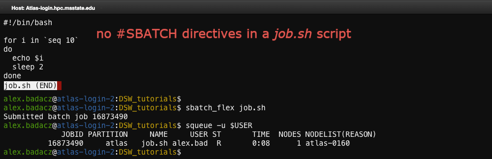
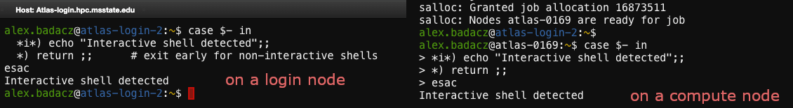

---

title: "Shell configuration files (startup scripts): <code>.bashrc</code>"
description: "Pre-defined settings for customizing environment variables, aliases and functions during shell startup."
type: reference material
order: 5
tags: [UNIX, shell configuration, shell customization, startup script, config file, bashrc, bash_profile]
packages: 
level: 
author: Aleksandra Badaczewska

---

## Overview

This interactive tutorial focuses on enhancing your shell experience by mastering the `.bashrc` startup script to optimize your workflow, 
automate tasks and customize your shell environment on SCINet HPC clusters. Through practical examples and hands-on exercises, 
you will learn how to modify `.bashrc` to persist aliases, manage environment variables, automate module loading and create useful shell functions. 
The tutorial is designed for regular users without administrative privileges, providing real-world applications that improve daily efficiency.
<br>

<div id="info-alerts-1" class="highlighted highlighted--info ">
<div class="highlighted__body"  markdown="1">
<h4 class="highlighted__heading">Main Objectives</h4>
* Understand the role of `.bashrc` in the shell startup process and how it affects your session.
* Learn to define permanent aliases, environment variables and functions to streamline repetitive tasks.
* Automate software environment setup and module loading for seamless HPC workflows.
* Implement best practices to keep `.bashrc` efficient and avoid common pitfalls.
</div>
</div>

<div id="success-alerts-1" class="highlighted highlighted--success ">
<div class="highlighted__body"  markdown="1">
<h4 class="highlighted__heading">Goals</h4>
<p>By the end of this tutorial, you will:</p>
* Develop confidence in modifying and managing your `.bashrc` file for an optimized shell experience.
* Understand how to make persistent and effective shell customizations without administrative privileges.
* Gain practical skills in defining aliases, managing environment variables and automating tasks.
* Learn debugging techniques to troubleshoot `.bashrc` errors and prevent login issues.
</div>
</div>


### Tutorial scope

This tutorial offers a comprehensive, hands-on guide to customizing shell environments using the `.bashrc` configuration file. The focus is on **real-world applications that make daily tasks on SCINet HPC clusters more efficient** and user-friendly. From persisting aliases to configuring environment variables for installed software, this tutorial provides practical techniques for optimizing and automating your HPC settings on shell startup.

<div class="usa-accordion">


<div id="scope-concepts" class="accordion_content" markdown="1">
* **Shell startup scripts:** `.bashrc` is a user-specific script that configures the shell environment upon login.
* **Environment variables:** Key-value pairs that define system-wide settings and influence the behavior of processes. <br>*(e.g., `$PATH`, `$LD_LIBRARY_PATH`)*
* **Aliases and functions:** Shortcuts for commands to increase efficiency in the terminal. 
* **Module loading automation:** Automatically loading frequently used software modules on HPC systems.
* **Conditional execution:** Running different commands in `.bashrc` based on hostname or shell type. 
</div>

 
<div id="scope-tools" class="accordion_content" markdown="1">
* **Bash shell:** A popular shell environment (command interpreter) available on most Unix-like and HPC systems.
* **Configuration file:** Text file like `.bashrc` or `.bash_profile` that define environment variables and other shell settings.
* **Module system:** The `module` command used in HPC clusters to load software environments.
</div>

 
<div id="scope-apps" class="accordion_content" markdown="1"> 
* **Shell customization for productivity:** Define aliases, environment variables and functions to enhance efficiency.
* **Automated environment setup:** Load software modules and set variables automatically on session startup.
* **Persistent shell modifications:** Ensure that all customizations remain effective across different sessions.
* **Troubleshooting configuration issues:** Identify and fix common problems related to `.bashrc` setups.
</div>
</div>


### Prerequisites 

[Pre-setup for shell customization on SCINet HPC](/computing-skills/command-line/cli-interface/shell/customization/index#prerequisites)

List of related tutorials for deeper understanding:
- [What is a Unix Shell? The Command Interpreter for the CLI](/computing-skills/command-line/cli-interface/shell/)
- [Using environment and shell variables](/computing-skills/command-line/cli-interface/shell/variables)
- [Shell customization](/computing-skills/command-line/cli-interface/shell/customization/index)
  - [Prompt styling: PS1 variable](/computing-skills/command-line/cli-interface/shell/customization/prompt)
  - [Text coloring: LS_COLORS, GREP_COLORS](/computing-skills/command-line/cli-interface/shell/customization/coloring)
  - [Alias definition and usage: create shortcuts for repetitive commands](/computing-skills/command-line/cli-interface/shell/customization/aliases)
  - [Shell Functions: group command sequences and enable argument passing](/computing-skills/command-line/cli-interface/shell/customization/functions)

----

## What is `.bashrc` configuration?

<div id="note-alerts-1" class="highlighted highlighted--note ">
<div class="highlighted__body" markdown="1">
The `.bashrc` file is a **user-specific shell startup script** that automatically executes when opening a new interactive shell session. 
It allows users to customize their command-line environment, automate frequently performed tasks and define **personalized configurations without requiring administrative privileges**.
<br>
*By editing .bashrc, users can:* <br>
✓ Set **environment variables** (e.g., `PATH`, `EDITOR`) <br>
✓ Create **aliases** for quicker command execution <br>
✓ Define **shell functions** to automate repetitive tasks <br>
✓ Load **modules** and software automatically <br>
✓ Configure shell behavior for an optimized workflow, *for example:* <br>
&emsp; \- *Set never ending history to track all past commands across sessions.* <br>
&emsp; \- *Optimize apptainer (former singularity) usage by setting up paths and default bind mounts.* <br>
&emsp; \- *Set default text editor for system-wide consistency.*
</div> </div>

<div id="note-alerts-1" class="highlighted highlighted--success ">
<div class="highlighted__body" markdown="1">
`.bashrc` is a powerful yet simple way to enhance productivity, reduce errors and optimize your shell experience in [command-line environment](/computing-skills/command-line/cli-interface/concepts/). 
By leveraging this startup script, you can create a highly efficient and personalized CLI environment that works seamlessly across sessions on SCINet HPC clusters.
</div> </div>

### *Why is it important for HPC users?*

`.bashrc` is a fundamental tool for personalizing and optimizing the shell environment on HPC systems. 
Instead of manually configuring settings in each session, users can store them in `.bashrc` for persistent automation.


| key characteristics | core benefits |
|--                   |--             |
| Automated environment setup | Eliminates manual setup; Load required software modules automatically upon login. |
| Customizable per user  | Users can tailor settings without root privileges. |
| Define default settings | Set environment variables for specific projects without retyping them in a shell. |
| Stores persistent settings | Keep configurations persistent ensuring consistency across sessions. |
| Supports aliases & functions | Enables quick access to frequently used or complex commands. |
| Loads modules & software | Automates (conditional) software environment setup in HPC. |
| Configures shell behavior | Enhances daily productivity and usability in the CLI. |

<div id="note-alerts-1" class="highlighted highlighted--tip ">
<div class="highlighted__body" markdown="1">
Imagine you frequently need to:
- Load specific software modules *(compute node only)*
- Set environment variables specific for a project
- Use long, complex commands for your custom tasks

By implementing those steps directly in your `.bashrc` once, you eliminate repetitive in-shell setups and create a consistent CLI experience every time you log in. 

```bash
# Load specific software modules automatically
module load python/3.9
```
```bash
# Set default environment variables without manually exporting them every session
export PROJECT_DIR=/project/scinet-project/$USER/my_project
export PATH=$HOME/software/bin:$PATH
```
```bash
# Use custom commands without typing long paths by defining aliases and functions
alias mycode="cd ~/my_project && nano script.py"
function jobinfo() { squeue -u $USER; }
```
</div> </div>


### `.bashrc` vs. `.bash_profile`

In Unix-like systems, multiple configuration files control shell behavior, but they serve different purposes. 
Understanding their differences helps in properly managing startup scripts on HPC systems.

| file              | *When it runs?* | purpose | typical use case |
|--                 |--               |--       |--                |
| `~/.bashrc`       | every time an interactive, non-login shell starts | configures the shell environment (aliases, functions, prompt, etc.)   | customizing terminal behavior, setting up commands for regular shell use |
| `~/.bash_profile` | only on login shell sessions (e.g., SSH login)    | runs once per session, used to set up environment variables | setting up user environment (`PATH`, `modules`, etc.) at login | 
| `~/.profile`      | only on login shell sessions, but applies to multiple shells (not just Bash) | similar to `.bash_profile`, but used by shells like `sh`, `dash` | Setting universal environment variables if `bash_profile` is missing |

Since `.bash_profile` runs only in login shells, it’s common to include `.bashrc` inside `.bash_profile` to apply customized user settings in all shell sessions. 
*This ensures that when you log in via SSH, `.bashrc` settings are also loaded automatically (so, no need for separate in-shell sourcing).*
```bash
# inside ~/.bash_profile
if [ -f ~/.bashrc ]; then
    source ~/.bashrc
fi
```


## **Working with `.bashrc`**

Customizing `.bashrc` requires careful editing to avoid errors that might disrupt your shell environment. 
*This section covers how to [locate](#locating-bashrc), [edit](#editing-safely), [apply](#applying-changes) and [back up](#backing-up-configuration-files) your `.bashrc` configuration safely, ensuring a smooth experience on SCINet HPC.*

### *When does `.bashrc` run?*

`.bashrc` is **executed every time you start an interactive shell** that is not a login shell.
- **interactive shell:** A shell session where you type commands manually <br>*(e.g., opening a terminal, opening SCINet shell access via OOD, starting Bash in an existing session).*
- **non-interactive shell:** A shell session used for executing scripts *(e.g., running a job script on HPC)*.

***interactive vs. non-interactive shell behavior***

<table>
<tr>
  <th style="width: 250px; background-color: #dfe1e2;"><b>shell type</b></th> 
  <th style="width: 120px; background-color: #dfe1e2;"><b>runs .bashrc?</b></th> 
  <th style="width: 120px; background-color: #dfe1e2;"><b>runs .bash_profile?</b></th> 
  <th style="width: 500px; background-color: #dfe1e2;"><b>example scenarios</b></th>
</tr>
<tr><th style="width: 250px;">login shell</th> <th style="width: 120px;">No</th> <th style="width: 120px;">Yes</th> <th style="width: 500px;">SSH login, first terminal login</th></tr>
<tr><th style="width: 250px;">non-login interactive shell</th> <th style="width: 120px;"><b>Yes</b></th> <th style="width: 120px;">No</th> <th style="width: 500px;">opening a new terminal window, running bash manually</th></tr>
<tr><th style="width: 250px;">non-interactive shell</th> <th style="width: 120px;">No</th> <th style="width: 120px;">No</th> <th style="width: 500px;">running a shell script, executing remote commands via SSH</th></tr>
</table>

### Locating .bashrc

The `.bashrc` file is **stored in your home directory** *(shortcuted with `~`)* and can be accessed on a path:
```bash
~/.bashrc
```

To check if it exists, use:
```bash
ls -la ~/.bashrc
```

If the file is missing, you can create one using:
```bash
touch ~/.bashrc
```

<div id="note-alerts-1" class="highlighted highlighted--success ">
<div class="highlighted__body" markdown="1">
SCINet HPC clusters provide a [default `.bashrc`](/computing-skills/command-line/cli-interface/shell/customization/bashrc#bashrc) for every user - modifying it carefully ensures system-wide settings remain intact.
</div> </div>

### Editing safely

Use a command-line text editor like **nano** or **vim** to modify `.bashrc`:
```bash
nano ~/.bashrc       # easy-to-use text editor
```
or
```bash
vim ~/.bashrc        # advanced editor (if you're comfortable with Vim)
```

<div id="note-alerts-1" class="highlighted highlighted--tip ">
<div class="highlighted__body" markdown="1">
Always keep a backup of your `.bashrc` - in case changes cause errors you may need to revert quickly.
</div> </div>


### Applying changes 

<div id="note-alerts-1" class="highlighted highlighted--note ">
<div class="highlighted__body" markdown="1">
***When to use `source ~/.bashrc`?***
- If you added aliases, functions or variable exports and want to apply them in a curent session.
- Useful for testing small changes without opening a new session.

***When to restart the shell?*** <br>
If the changes involve `PATH` modifications or environment variables, a fresh session ensures they are applied consistently.
</div> </div>

#### Applying changes in a current session without logging out

After modifying `.bashrc`, apply the changes immediately without starting a new terminal:
```bash
source ~/.bashrc
```

**Alternatively, you can restart your shell by closing and reopening the terminal.**

<div id="note-alerts-1" class="highlighted highlighted--tip ">
<div class="highlighted__body" markdown="1">
If something breaks, open a new shell and revert `~/.bashrc` from your backup or create a new one and copy-paste the [default content](#bashrc).
</div> </div>

### Backing up configuration files

Before making major changes, always create a backup to restore previous settings if needed:
```bash
cp ~/.bashrc ~/.bashrc.backup      # Copy current .bashrc as a backup with a new filename
```

If an error occurs, you can restore the backup with:
```bash
cp ~/.bashrc.backup ~/.bashrc && source ~/.bashrc
```

<div id="note-alerts-1" class="highlighted highlighted--tip ">
<div class="highlighted__body" markdown="1">
Consider using version control (`git`) to track changes over time:
```bash
git init ~/bashrc_backup
cp ~/.bashrc ~/bashrc_backup/
cd ~/bashrc_backup
git add .bashrc
git commit -m "Initial backup of .bashrc"
```
</div> </div>


## **Shell customization in `.bashrc`**

<div id="note-alerts-1" class="highlighted highlighted--info ">
<div class="highlighted__body" markdown="1">
*(Reference tutorial: [Shell customization](/computing-skills/command-line/cli-interface/shell/customization/index))*
</div></div>

Customizing your shell settings through `~/.bashrc` allows you to create a more efficient, user-friendly and automated by default command-line experience. 
By defining **variables**, **aliases**, **shell functions** and modifying **system paths**, you can significantly speed up your daily routine and repetitive tasks on SCINet clusters.

### *Essential shell commands for `.bashrc` customization*

To customize `~/.bashrc`, you’ll frequently use this command:
```bash
nano ~/.bashrc          # open .bashrc in nano editor
```

To immediately load changes from `~/.bashrc` (or any other custom script):
```bash
source ~/.bashrc        # applies recent changes in a current shell
source ~/.bash_aliases  # load additional aliases from a separate file (if it exists)
```

### Setting env/shell variables: `export` 

<div id="note-alerts-1" class="highlighted highlighted--info ">
<div class="highlighted__body" markdown="1">
*(Reference tutorial: [Using environment and shell variables](/computing-skills/command-line/cli-interface/shell/variables))*
</div></div>

#### Understanding environment vs. shell variables

<div id="note-alerts-1" class="highlighted highlighted--highlighted ">
<div class="highlighted__body" markdown="1">
***Quick recap: Variables*** <br>
Environment variables define global settings that affect how programs and commands behave in your shell session. 
They are useful for setting default paths, configuring software and automating tasks on HPC systems.
- **Environment variables** are available to all processes launched from the shell.
- **Shell variables** exist only within the current shell session and are not inherited by subprocesses.

*For example:*
```bash
VAR1="Hello"         # Shell variable (only exists in the current session)
export VAR2="Hi"     # Environment variable (available to all subprocesses)
```
</div> </div>

#### Exporting variables 

To make a variable available globally across all processes, use `export`. 

**SYNTAX:** `export VAR_NAME=value`

Add `export` statments to `.bashrc` to persist them across sessions.
```bash
# paste these lines into your ~/.bashrc 
export EDITOR=nano   # Set default text editor to nano
export MY_PROJECT_DIR=/projects/<scinet-project>/$USER    # Define project directory variable
```
*`source ~/.bashrc` or open a new shell to have changes applied.*

### *Modifying $PATH for local binaries*

<div id="note-alerts-1" class="highlighted highlighted--note ">
<div class="highlighted__body" markdown="1">
The `$PATH` variable determines **where the shell looks for executable programs** when you type a command. 
Appending directories to `$PATH` allows you to run programs from custom locations using directly its name, without specifying full paths. 
To add a new directory (`/your/custom/path`) to your `$PATH`, ensure that each path is separated by a colon (`:`), as shown below:
```bash
export PATH="$HOME/bin:/your/custom/path:$PATH"
```
* `$HOME/bin` is a commonly used directory for user scripts and binaries.
* But, you can add a path (`/your/custom/path`) to any custom directory with executables to make them directly accessible in the command line.
* `:$PATH` at the end, ensures existing directories remain in the search path and the new ones are appended.
</div> </div>

#### Adding ~/bin to $PATH 

If you have custom software in `~/bin`, adding it to `$PATH` lets you run it from anywhere without specifying its full path.
```bash
# paste these lines into your ~/.bashrc 
export PATH=$HOME/bin:$PATH
```
*`source ~/.bashrc` or open a new shell to have changes applied.*

Verify changes using:
```bash
echo $PATH
```

### Defining useful **aliases**

<div id="note-alerts-1" class="highlighted highlighted--info ">
<div class="highlighted__body" markdown="1">
*(Reference tutorial: [Alias definition and usage: create shortcuts for repetitive commands](/computing-skills/command-line/cli-interface/shell/customization/aliases))*
</div></div>

<div id="note-alerts-1" class="highlighted highlighted--highlighted ">
<div class="highlighted__body" markdown="1">
***Quick recap: Aliases*** <br>
Aliases allow you to create shortcuts for frequently used commands, reducing typing and preventing errors.
Add `alias` statments to `~/.bashrc` or dedicated `~/.aliases` file to persist them across sessions.

*For example:*
* Defining an alias for a long command
```bash
# paste these lines into your ~/.bashrc 
alias ll='ls -lah --color=auto'     # List files with details and color output
```
* Alias for checking job status
```bash
# paste these lines into your ~/.bashrc 
alias myjobs='squeue -u $USER'      # Show only your running jobs
```
*`source ~/.bashrc` or open a new shell to have changes applied.*
</div> </div>


### Creating simple shell **functions**

<div id="note-alerts-1" class="highlighted highlighted--info ">
<div class="highlighted__body" markdown="1">
*(Reference tutorial: [Shell Functions: group command sequences and enable argument passing](/computing-skills/command-line/cli-interface/shell/customization/functions))*
</div></div>

<div id="note-alerts-1" class="highlighted highlighted--highlighted ">
<div class="highlighted__body" markdown="1">
***Quick recap: Shell Functions*** <br>
Shell functions group multiple commands into a single callable function, making repetitive tasks more efficient.
* more powerful than aliases (since they accept arguments and logic)
* great for automating repetitive tasks on HPC clusters
* can be used to define project-specific workflows

Add `function` definitions to `~/.bashrc` or dedicated `~/.functions.sh` file to persist them across sessions.

*For example:*
* Function for quick directory creation & navigation
```bash
# paste these lines into your ~/.bashrc 
mkcd() { mkdir -p "$1" && cd "$1"; }        # Instead of typing `mkdir newdir && cd newdir` every time
# usage: mkcd newdir
```
* Function for batch file renaming
```bash
# paste these lines into your ~/.bashrc 
rename_to_backup() {
    for file in *.txt; do
        mv "$file" "${file%.txt}.backup"
    done
}
```
*`source ~/.bashrc` or open a new shell to have changes applied.*
</div> </div>


### Enhancing shell usability 

Optimizing your shell experience goes beyond just defining aliases and functions. By improving tab completion, 
command history and formatting, you can work more efficiently in interactive sessions on SCINet HPC clusters. 
This section covers essential tweaks that enhance usability, reduce repetitive typing and beautify the text outputs in a shell. 

✓ Improve navigation and file browsing with [tab completion](#improve-tab-completion) tweaks. <br>
✓ Save time with better [command history](#enhance-command-history) management. <br>
✓ Ensure a consistent editing experience across multiple applications. <br>
✓ Make command output clearer and more readable with [color formatting](#improve-less-and-grep-formatting).

#### Improve tab completion

Tab completion is a powerful feature that helps you auto-complete file names, directories and commands with the `Tab` key. <br>
*Instead of typing `cd myfolder`, you can simply type `myfolder` and press `Enter`.*
```bash
shopt -s autocd         # Change directories by typing their name without `cd`  
```

#### Enable command auto-correction

To make navigation easier, you can enable automatic correction for minor typos when changing directories.
```bash
shopt -s cdspell        # Correct minor directory name typos automatically
```

#### Automatically adjust window size

The following setting ensures the terminal updates its display correctly after resizing, preventing visual glitches when working in SSH sessions or with resizable terminal windows.
```bash
shopt -s checkwinsize   # Automatically adjust window size after resizing terminal  
```

#### Enhance command history

The shell's history feature allows you to revisit and reuse previously typed commands, making it a crucial tool for productivity. 

<div id="note-alerts-1" class="highlighted highlighted--highlighted ">
<div class="highlighted__body" markdown="1">
By default, Bash limits the number of commands stored in history. 
However, on HPC systems, **keeping an extensive persistent command history can be invaluable** for tracking past jobs, debugging commands, and reusing complex workflows.
</div></div>

By optimizing history settings, you can track past commands across sessions and keep a copy of never-ending history.

```bash
export HISTFILESIZE=    # no limit on the number of commands stored in history file  
export HISTSIZE=        # no limit on the number of commands stored in memory  
export HISTFILE=~/.bash_eternal_history  # use a dedicated history file  
export HISTTIMEFORMAT="[%F %T] " 
export HISTCONTROL=ignoredups:erasedups  # remove duplicate entries  
shopt -s histappend                      # append history instead of overwriting it  
export PROMPT_COMMAND="${PROMPT_COMMAND:+$PROMPT_COMMAND$'\n'}history -a; history -c; history -r"
```

*This is useful when working with multiple terminals to keep the command history synchronized across sessions.*

* Large history storage ensures you can retrieve commands from previous sessions, making it easier to reuse complex commands.
* `ignoredups:erasedups` prevents duplicate entries (e.g., running `ls` multiple times won't clutter your history).
* `histappend` ensures that new commands are added to history instead of replacing the previous session's history, preserving command history between multiple terminal windows.
* `PROMPT_COMMAND` is a special Bash variable that runs a command before displaying each prompt. <br>The syntax used ensures that every time a new prompt is displayed:<br>
&emsp; \- `history -a` : The command history is saved to the history file (`~/.bash_history`). <br>
&emsp; \- `history -c` : The in-memory history is cleared. <br>
&emsp; \- `history -r` : The latest history is reloaded from the file (`~/.bash_history`).


<div id="note-alerts-1" class="highlighted highlighted--info ">
<div class="highlighted__body" markdown="1">
**Useful history shortcuts for daily use:**

`!!` - Re-run the last command <br>
`!123` - Run command number 123 from history <br>
`!grep` - Run the most recent command that started with 'grep' <br>
`Ctrl + R` - Search command history interactively <br>
</div></div>

#### Set default text editor

Many programs, such as `git` or `visudo`, rely on a default text editor when opening files. 
* If `EDITOR` variable is not set, some applications might default to `vi`, which may not be user-friendly for everyone.

Setting the `EDITOR` variable ensures consistency across applications.

```bash
export EDITOR=nano  # Use nano (or replace with vim/emacs)  
```

#### Improve `less` and `grep` formatting

By tweaking settings for commonly used commands like `less` and `grep`, you make output more readable and visually distinct.
* Highlights matching text in selected color, making it easier to locate search results in long log files.
* Improves readability when scrolling through formatted log files and command outputs.

**Enable Color Output for `grep`** <br>
<div id="note-alerts-1" class="highlighted highlighted--info ">
<div class="highlighted__body" markdown="1">
*(Reference tutorial: [Coloring `grep` with `GREP_COLORS`](/computing-skills/command-line/cli-interface/shell/customization/coloring#coloring-grep-with-grep_colors))*
</div></div>
```bash
export GREP_OPTIONS='--color=auto'  # Enable colored output  
export GREP_COLOR='1;32'            # Set color to bright green  
```
  
**Optimize `less` for better navigation** <br>
<div id="note-alerts-1" class="highlighted highlighted--info ">
<div class="highlighted__body" markdown="1">
*(Reference tutorial: [Coloring `ls` output with `LS_COLORS`](/computing-skills/command-line/cli-interface/shell/customization/coloring#coloring-ls-output-with-ls_colors))*
</div></div>
```bash
export LESS='-R'                    # Enable raw control characters for color output  
```

## **Manage software accessibility**

SCINet HPC environments include a wide range of [pre-installed software](https://scinet.usda.gov/guides/software/), but most applications are located outside the space dedicated for individual users. 
Instead, software is managed through environment modules, allowing users to load, unload and switch between different versions of programs seamlessly.

### Environment modules on SCINet

<div id="note-alerts-1" class="highlighted highlighted--note">
<div class="highlighted__body" markdown="1">
HPC systems typically use module systems *(e.g., Lmod or [Environment Modules](https://scinet.usda.gov/guides/software/modules))* to dynamically configure the software environment. 
Instead of manually setting environment variables, <br>users can **load specific software versions with the `module` command**.
</div></div>

#### Automatically loading frequently used modules

If you frequently use specific software, you can ensure it loads automatically when you start a new session by adding the following command to your `~/.bashrc` file:
```bash
module load python_3/3.9.18 gcc/12.2.0              # specify your desired modules
```
*This ensures that Python 3.9 and GCC 12.2 are always available without needing to manually load them each time you log in.*

<div id="note-alerts-1" class="highlighted highlighted--warning ">
<div class="highlighted__body" markdown="1">
On Ceres Cluster, the `module` command is **only available on compute nodes**, meaning it cannot be used directly on the login or transfer node.
To prevent errors when sourcing `~/.bashrc`, you should **conditionally load modules** only when on a compute node. <br>
You can add conditional `module` loading in your `.bashrc` like this:
```bash
if [[ $(hostname) =~ "compute" ]]; then
    module load python_3/3.9.18 gcc/12.2.0
fi
```
*`source ~/.bashrc` or open a new shell to have changes applied.*
</div></div>


### Custom user installations

While HPC clusters provide many pre-installed software packages via the [module system](#environment-modules-on-scinet), you may need to install and manage your own software, 
particularly if a required package is missing or you need a specific version. Since regular users do not have root access, 
software must be installed in `/home` directories or allocated storage locations (`/project/<scinet-project>/$USER/SOFTWARE`). 

<div id="note-alerts-1" class="highlighted highlighted--highlighted ">
<div class="highlighted__body" markdown="1">
To make custom installations accessible, you need to properly configure environment variables such as <br> `PATH` and `LD_LIBRARY_PATH`.
</div></div>


#### Setting `PATH` for locally installed software

<div id="note-alerts-1" class="highlighted highlighted--info ">
<div class="highlighted__body" markdown="1">
*(Reference tutorial: [Using environment and shell variables: Environment Variables](/computing-skills/command-line/cli-interface/shell/variables#environment-variables))* <br>
*(see also section [Modifying $PATH for local binaries](#modifying-path-for-local-binaries) in this tutorial)*
</div></div>

If you install software in a local directory (e.g., `$HOME/software`), you must update your `PATH` so that the system can locate and execute these programs.
```bash
export PATH=$HOME/software/bin:$PATH            # the executable is typically stored in a bin subdirectory of installed software
```
*This adds `~/software/bin` to the system's search path for executables, ensuring that binaries in this directory can be run without specifying their full path.*


#### Setting up user-installed software with Conda

<div id="note-alerts-1" class="highlighted highlighted--info ">
<div class="highlighted__body" markdown="1">
If you use Conda to manage environments, you may need to adjust your environment settings. <br>Follow the up-to-date instructions provided in [SCInet User Guides](https://scinet.usda.gov/guides/software/conda).
</div></div>

#### Setting `LD_LIBRARY_PATH` for custom library locations

Some software depends on custom-built libraries stored outside standard system locations. <br>(e.g., `/usr/local/bin:/usr/bin:/usr/local/sbin:/usr/sbin:/usr/local/cuda/bin:/usr/local/cuda/lib64`) <br>
If an application complains about **missing shared libraries** (`.so` files), you need to extend `LD_LIBRARY_PATH`:

```bash
export LD_LIBRARY_PATH=$HOME/software/lib:$LD_LIBRARY_PATH
```
*This ensures that shared libraries in `~/software/lib` are found by programs that need them.*

<div id="note-alerts-1" class="highlighted highlighted--warning ">
<div class="highlighted__body" markdown="1">
Modifying `LD_LIBRARY_PATH` incorrectly can cause system applications to behave unexpectedly. <br>
**Always append a new value** using colon syntax (`:`$LD_LIBRARY_PATH) rather than overwrite the variable.

*To check whether the correct library path is set, use:*
```bash
echo $LD_LIBRARY_PATH
# or
ldd /path/to/binary         # Lists the shared libraries used by a program
```
</div></div>


### Set up Singularity/apptainer

<div id="note-alerts-1" class="highlighted highlighted--note ">
<div class="highlighted__body" markdown="1">
Some software packages may not be available for the version of Linux running on the HPC cluster. In this case, users may want to run containers. 
Containers are self-contained application execution environments that contain all necessary software to run an application or workflow, 
so users don’t need to worry about installing all the dependencies. There are many pre-built container images for scientific applications available for download and use.
</div></div>

Follow the up-to-date instructions provided in [SCInet User Guides](https://scinet.usda.gov/guides/software/singularity#singularity-apptainer-containers).

<div id="note-alerts-1" class="highlighted highlighted--highlighted ">
<div class="highlighted__body" markdown="1">
While pulling/building the containers, pay attention to the home directory as the cached image blobs will be saved in `$HOME/.apptainer`. 
Since the home directory has a limited amount of space, this can fill up quite easily. Users can change where the files will be cached by setting environment variables.

*We recommend adding the following two commands to the job scripts that use apptainer:*
```bash
export APPTAINER_CACHEDIR=$TMPDIR 
export APPTAINER_TMPDIR=$TMPDIR
```
</div></div>


### Customize SLURM tasks

In high-performance computing (HPC) environments, job scheduling with SLURM is essential for efficiently managing computational workloads. 
Customizing SLURM-related settings in your `~/.bashrc` file can streamline job submissions, optimize resource allocation and simplify the starting of an interactive session on a compute node. 

To get started with custom configurations, check out:
- **the [Practical Aliases for HPC](/computing-skills/command-line/cli-interface/shell/customization/aliases#practical-aliases-for-hpc)** provided in tutorial *[Alias definition and usage: create shortcuts for repetitive commands](/computing-skills/command-line/cli-interface/shell/customization/aliases)*, including:
  - Load module and check module list:
  ```bash
  alias load_python='module load python_3 && module list'
  # usage: load_python
  ```
  - Check names of available partitions:
  ```bash
  alias show_partitions='scontrol show partitions | grep "PartitionName"'
  # usage: show_partitions
  ```
  - Interactive session request:
  ```bash
  alias get_interactive='salloc -N1 -n1 -t 1:00:00 -A <scinet-account>'
  # usage: get_interactive
  ```
  - Monitor resource usage on a current node:
  ```bash
  alias node_usage='top -b -n1 | head -n 20'
  # usage: node_usage
  ```

- **the [Practical Shell Functions](/computing-skills/command-line/cli-interface/shell/customization/functions#practical-shell-functions-for-hpc)** for HPC in tutorial *[Shell Functions: group commands and enable argument passing](/computing-skills/command-line/cli-interface/shell/customization/functions)*, including:
  - [Check quota on any SCINet cluster](/computing-skills/command-line/cli-interface/shell/customization/functions#check-quota-on-any-scinet-cluster)
  - [Quick stats on queued jobs](/computing-skills/command-line/cli-interface/shell/customization/functions#quick-stats-on-queued-jobs)
  - [GPU resources check](/computing-skills/command-line/cli-interface/shell/customization/functions#gpu-resources-check)
  - [CPU and memory on a node](/computing-skills/command-line/cli-interface/shell/customization/functions#cpu-and-memory-on-a-node)

These resources offer ready-to-use shortcuts and functions that streamline job management, making your HPC workflow more efficient right from the start.

*Here, you'll find a few more practical examples to further streamline your daily work with SLURM tasks, helping you save time and manage jobs more efficiently.*


#### Quick SLURM job submission for any script

<div id="note-alerts-1" class="highlighted highlighted--note ">
<div class="highlighted__body" markdown="1">
Any Bash script (`.sh`) can be submitted with sbatch, even if it does not contain #SBATCH directives inside the script itself. 
Instead of embedding `#SLURM` directives in the script, you can specify all SLURM options directly in the command line when submitting the job.

*If a script does contain #SBATCH directives and you also specify options in the `sbatch` command, the* ***command-line options override the ones in the script***.
</div></div>

Since SLURM allows submitting any `.sh` script using sbatch with command-line options, it's useful to create a shell function with predefined settings (or a few customizable via arguments). 
This enables quick submission of test jobs for any script, saving time and effort when working in an HPC environment.

```bash
# Replace <your_account> with your actual scinet account
function sbatch_quick {
    sbatch --account=isu_gif_vrsc --nodes=1 --ntasks=4 --time=01:00:00 "$1"
}
# usage: sbatch_quick my_script.sh
```


#### Quick SLURM job submission with custom request for memory, CPU and partition

This version allows users to specify memory (in GB) CPU cores and partition as arguments to enable more flexible applications:
```bash
# Replace <your_account> with your actual scinet account
function sbatch_flex {
    local script="$1"        # script to run
    local cores="${2:-2}"    # default: 2 cores
    local queue="${3}"       # optional: user-selected partition
    local mem="${4:-4G}"     # default: 4GB


    if [[ -z "$script" ]]; then
        echo "Usage: sbatch_flex <script> <cores> <queue> <mem>"
        return 1
    fi
    
    if [[ -z "$queue" ]]; then
        case "$HOSTNAME" in
            *atlas*) queue="atlas" ;;  # if $HOSTNAME is Atlas cluster, sets "atlas" partition as default
            *ceres*) queue="short" ;;  # if $HOSTNAME is Ceres cluster, ses "short" partition as default
        esac
    fi

    sbatch --account=<your_account> --time=02:00:00 --ntasks="$cores" --partition="$queue" --mem="$mem" "$script"
}
# usage:  sbatch_flex my_script.sh                # default cores and memory
# usage:  sbatch_flex my_script.sh 4              # request 4 cores for this job
# usage:  sbatch_flex my_script.sh 2 development  # specify cores and preferred partition
# usage:  sbatch_flex my_script.sh 8 bigmem 8G    # specify all prior arguments to request custom memory
```



<div id="note-alerts-1" class="highlighted highlighted--note ">
<div class="highlighted__body" markdown="1">
It's best to order arguments from most essential to least frequently changed. This improves usability by making the function intuitive while reducing unnecessary typing for common cases.
- **required arguments**, always needed for the function to work *(e.g., script name in sbatch_flex)*
- **frequently altered arguments**, often modified based on job requirements *(e.g., CPU cores, partition)*
- **rarely changed arguments**, defaults are usually sufficient, but customization is still possible *(e.g., timewall, memory)*
- **fixed values**, the default determined will always be used *(e.g., `<scinet-account>`)*
</div></div>

## **Advanced .bashrc configurations**

Beyond basic aliases and functions, `~/.bashrc` can be tailored for adaptive behavior based on system conditions such as hostname, user or shell type. 
This allows for smarter resource usage, conditional command execution and dynamic environment adjustments.

*Below are a few practical examples of advanced `~/.bashrc` configurations to optimize efficiency and flexibility in an HPC environment.*

###  Conditional execution

<div id="note-alerts-1" class="highlighted highlighted--info ">
<div class="highlighted__body" markdown="1">
***Quick recap:*** <br>
Conditional execution in Bash allows scripts to make decisions based on conditions like the hostname, user or environment variables, enabling more dynamic and efficient behavior.

For a deeper dive into practical use cases, check out [Conditionals and loops](/computing-skills/command-line/cli-interface/shell/customization/functions#conditionals-and-loops) section 
in the tutorial about [Shell Functions](/computing-skills/command-line/cli-interface/shell/customization/functions).
</div> </div>

#### Distinguishing between interactive and non-interactive shells

Some commands (e.g., prompts, aliases) are only needed for interactive shells, while non-interactive shells (e.g., batch jobs submitted via sbatch) should avoid unnecessary processing.

```bash
case $- in
  *i*) echo "Interactive shell detected";;
  *) return ;;      # exit early for non-interactive shells
esac
```
- `$-` contains shell flags, where `i` indicates an interactive shell.

*If the shell is interactive, it prints a message but can be enhanced to load any interactive-specific settings required by your tasks. If not interactive (e.g., running in batch mode), it exits early, skipping unnecessary commands.*



<div id="note-alerts-1" class="highlighted highlighted--info ">
<div class="highlighted__body" markdown="1">
To use this snippet effectively, place it in your `~/.bashrc` **before executing commands that should only run in an interactive shell**. 
You can use it standalone to load modules, set up environment variables or call functions conditionally, 
ensuring that non-interactive shells (such as SLURM batch jobs) skip unnecessary processing.
</div> </div> 
<div id="note-alerts-1" class="highlighted highlighted--tip ">
<div class="highlighted__body" markdown="1">
To ensure that certain configurations or commands only run in batch jobs (non-interactive shells), you can use the opposite logic of the interactive shell check. 
This is particularly useful for loading specific modules, setting environment variables (e.g., software/library paths) or **configuring SLURM-specific settings only when running a batch job**.
```bash
case $- in
  *i*) ;;  # Do nothing for interactive shells; adjust accordingly
  *)
    echo "Batch job detected"
    module load python/3.12.5        # load python module only for batch jobs
    export PYTHONPATH="/path/to/custom/python/modules:$PYTHONPATH"  # set custom Python path
    ;;
esac
```
*Batch jobs automatically load Python and set PYTHONPATH, ensuring the correct environment is available.*
</div> </div>


#### Prevent running scripts in certain cases

Sometimes, you might want to avoid running scripts on login nodes or specific hosts.

```bash
if [[ "$HOSTNAME" =~ login ]]; then
    echo "Skipping resource-heavy commands on login node"
else
    my_heavy_command          # runs only if NOT on the login node
fi
```
*Prevents resource-intensive scripts from running on login nodes, ensuring compliance with HPC policies.*


### Lazy-loading: avoid heavy setup

Loading modules or running resource-intensive commands every time a new shell starts can slow down login times and waste resources. Instead, use lazy-loading, where commands are only executed when needed.

#### Lazy-loading modules & reducing startup overhead

Loading software modules every time the shell starts can slow down login times and consume resources, especially in HPC environments. 
A more efficient approach is lazy-loading, where modules are loaded only when needed. This can be done using a function or alias, ensuring that the module is initialized on demand rather than at every session start.
```bash
function load_python {
    module load python/3.12.5
}
alias pyload=load_python
```
Now, instead of loading Python automatically at login, you can simply run this in a shell or script when needed:
```bash
pyload         # loads Python on request
```
*This method keeps your shell lightweight and responsive while still allowing quick access to essential modules when needed.*

### Unified setup for Atlas & Ceres

When working across multiple clusters (e.g., Atlas & Ceres), differences in environment paths, modules or project directories can cause inconsistencies. 
Setting environment variables dynamically based on the `hostname` ensures a seamless transition between systems while using the same functions or entire configuration files.


#### Set environment variables or project paths based on hostname

If working on the same project on both SCINet clusters, it's useful to adjust configurations per host to maintain the functionality of your pipeline.

```bash
case "$HOSTNAME" in
    *atlas*) export MY_PROJECT_DIR=/project/<scinet-account>/$USER/my_custom_path_1 ;;
    *ceres*) export MY_PROJECT_DIR=/project/<scinet-account>/$USER/my_custom_path_2 ;;
    *) export MY_PROJECT_DIR=~ ;;
esac
```
*This adjusts the MY_PROJECT_DIR path dynamically based on the cluster hostname.*

### Experiment and refine setups

Customizing `~/.bashrc` is an iterative process — it's good practice to test and refine changes before making them permanent.

#### Safe testing in a temporary shell

Instead of modifying ~/.bashrc directly and risking shell issues, create a separate script (e.g., `~/.bashrc-test`)`, introduce your changes there, and test them in a subshell before applying them permanently. 
```bash
bash --rcfile ~/.bashrc-test
```
*This runs a new Bash instance with the test file. Once you `exit`, all changes are gone, leaving your original shell unchanged.*


## **Sample shell configurations**

### `.bashrc`

***Always [make a backup](#backing-up-configuration-files) before making changes to avoid losing important settings.***

Below is the default content of `.bashrc` as set on SCINet HPC clusters. <br>
*If your file has been accidentally removed or overwritten, you can restore it by copying this content back into `~/.bashrc` to ensure your environment loads correctly with all necessary configurations.*


**Ceres**
```bash
# .bashrc
# Source global definitions
if [ -f /etc/bashrc ]; then
        . /etc/bashrc
fi
# Uncomment the following line if you don't like systemctl's auto-paging feature:
# export SYSTEMD_PAGER=
# User specific aliases and functions
alias ls='ls --color=auto'
alias UTILITIESgit=Path2thisRepo
export PATH=$PATH:$UTILITIESgit/wrappers
```

**Atlas**
```bash
# @(#).bashrc  2019.04.14
################################################################################
##
##  This is the default HPC2 ~/.bashrc file.
##  This file and others are used to define and setup the user environment.
##  Lines beginning with a # are comments and are ignored by the shell.
##  For additional details, see the bash man page, "man bash".
##
################################################################################
##  Source global definitions: The next line must be the first non-commented line.
[ -f /etc/bashrc ] && . /etc/bashrc
##      =================================================
##  ==== NO MODIFICATIONS SHOULD BE MADE ABOVE THIS LINE ====
##      =================================================
##
##  All modifications should be made below for defining
##  any user aliases, functions, variables, etc.
##  The module call should be used to gain access to software that is NOT
##  included in system defaults or for making personal customizations.
##  Module can be called from within a file or on the command line.
##  "module help" shows additional details.
##  "module avail" shows a list of available software for loading.
##  "module load local" loads a package that adds $HOME/bin to your path.
#module load local
################################################################################
##  All non-interactive shells will exit on the next line.
##  Nothing after this line is used by batch shell scripts.

if [ -z "$PS1" ]; then return; fi

#module load rdesktop

##  Example aliases
alias la='ls -AC'
alias ll='ls -l'
alias lsc='ls -CF'
alias ls='ls --color=auto'
```


### `.bash_profile`

<div id="note-alerts-1" class="highlighted highlighted--warning ">
<div class="highlighted__body" markdown="1">
**Do Not Modify `~/.bash_profile`**

On both SCINet HPC clusters, the `.bash_profile` is already configured to automatically load everything from your `.bashrc`. 
Modifying `.bash_profile` directly can cause conflicts or unexpected behavior in your shell environment.
***[Put all customizations](#working-with-bashrc) in `.bashrc` to keep your setup clear, organized and error-free.***
</div> </div>

Below is the default content of `.bash_profile `as set on SCINet HPC clusters. <br>
*If your file has been accidentally removed or overwritten, you can restore it by copying this content back into `~/.bash_profile` to ensure your environment functions correctly.*

**Ceres**
```bash
# .bash_profile
# Get the aliases and functions
if [ -f ~/.bashrc ]; then
        . ~/.bashrc
fi
# User specific environment and startup programs
PATH=$PATH:$HOME/.local/bin:$HOME/bin
export PATH
```

**Atlas**
```bash
# @(#).bash_profile  2015.01.28
################################################################################
##
##  DO NOT REMOVE OR MODIFY THIS FILE  -- HPC2 Computing Office
##
##  This is the default HPC2 ~/.bash_profile file.
##  It is used to source the ~/.bashrc file.
##  This file should not be removed or modified.
##  Any user aliases, functions, variables, etc.
##  should be placed in the ~/.bashrc file instead.
##
################################################################################
[ -f $HOME/.bashrc ] && . $HOME/.bashrc
```

## **Troubleshooting common issues**

A well-configured .bashrc can significantly improve productivity in an HPC environment, but misconfigurations can lead to login issues, broken environments or unexpected behavior. 
This section covers error detection, organization tips, common mistakes and best practices to help keep your setup clean and reliable.

### Common mistakes

- Overwriting `$PATH` and `LD_LIBRARY_PATH` instead of [appending](#modifying-path-for-local-binaries)
- Forgetting to [make changes take effect](#applying-changes)
- Infinite Loops due to sourcing `~/.bashrc` inside itself
  - ***NOTE:*** *Running `source ~/.bashrc` inside `.bashrc` creates an infinite recursion, causing the shell to hang.*

### Best practices

#### Check for errors

Before applying changes to .bashrc, it's crucial to check for syntax errors to avoid breaking your shell.

*To check for syntax errors without executing the file, run:*
```bash
bash -n ~/.bashrc           # syntax check
```
*This ensures there are no typos, misplaced quotes or missing brackets. If errors exist, they will be reported without applying the changes.*

*To track where a script is failing, enable debug mode:*
```bash
bash -x ~/.bashrc
```
*This prints each command before execution, helping identify where .bashrc is failing.*

#### Keep .bashrc clean & modular

A cluttered `~/.bashrc` can slow down shell startup and make maintenance difficult. The best approach is to modularize configurations by splitting them into separate files.

Instead of filling `~/.bashrc` with aliases, functions and environment variables, load them in your .bashrc from separate files:
```bash
[[ -f ~/.aliases.sh ]] && source ~/.aliases.sh
[[ -f ~/.functions.sh ]] && source ~/.functions.sh
[[ -f ~/.env_variables.sh ]] && source ~/.env_variables.sh    # user-defined environment variables such as paths
```
*This keeps .bashrc minimal and easy to manage, while allowing quick modifications without affecting the entire configuration.*

For HPC environments, it's useful to separate SLURM-related settings:
```bash
[[ -f ~/.my_slurm.sh ]] && source ~/.my_slurm.sh
```