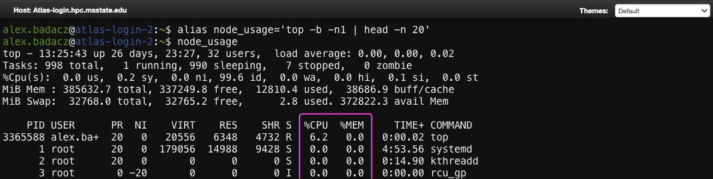
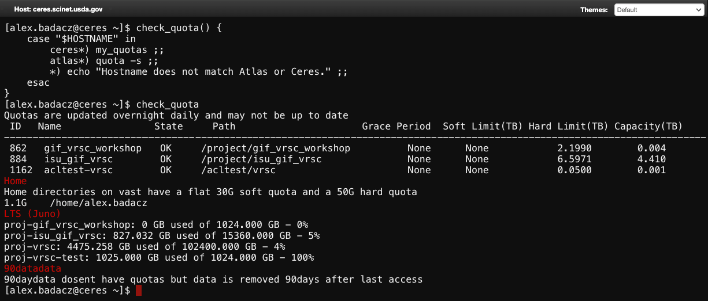
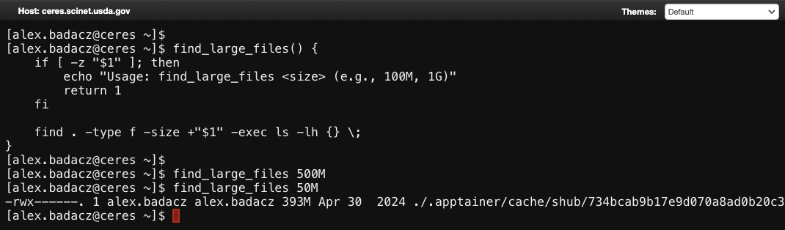
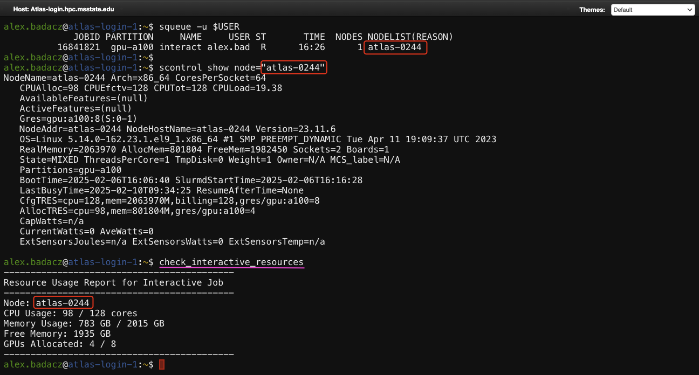
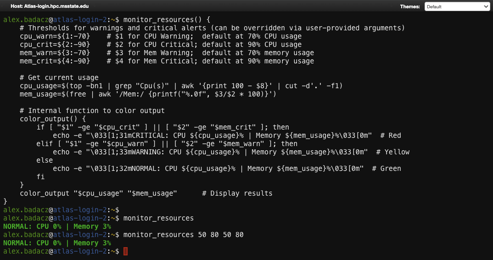

---

title: "Shell Functions: group command sequences and enable argument passing"
description: "Reusable system-wide shell utilities that combine multiple commands into a single function with dynamic input handling."
type: interactive tutorial
order: 4
tags: [UNIX, shell customization, shell function, custom function, argument, automation, bashrc]
packages: 
level:
author: Aleksandra Badaczewska

---

## Overview

This interactive tutorial introduces the concept of shell functions in Unix-like operating systems, which allow you to group sequences of commands and enable flexible argument passing. Shell functions serve as reusable, modular building blocks that enhance productivity by making complex or repetitive command sequences more manageable and efficient. This guide focuses on defining, using and managing shell functions through practical examples, with emphasis on how they can optimize workflows in SCINet HPC environment.
<br>

<div id="info-alerts-1" class="highlighted highlighted--info ">
<div class="highlighted__body"  markdown="1">
<h4 class="highlighted__heading">Main Objectives</h4>
* Understand the purpose, syntax and structure of shell functions. 
* Learn how to pass arguments and control function behavior dynamically.
* Explore practical applications of shell functions, especially for repetitive or complex tasks in an HPC environment.
</div>
</div>

<div id="success-alerts-1" class="highlighted highlighted--success ">
<div class="highlighted__body"  markdown="1">
<h4 class="highlighted__heading">Goals</h4>
<p>By the end of this tutorial, you will:</p>
* Master the basics of defining, calling and passing arguments to shell functions.
* Create both simple and advanced shell functions with conditionals, loops and error handling.
* Understand key differences between shell functions, aliases and built-in shell commands.
* Gain insights into best practices for function design and troubleshooting common issues.
</div>
</div>


### Tutorial scope

This tutorial provides a step-by-step guide to creating and using shell functions in the shell environment. 
It covers everything from basic syntax to advanced concepts like argument parsing and modular design. 
You’ll explore how shell functions can be used to automate, streamline and optimize tasks, with practical examples relevant to HPC environment.

<div class="usa-accordion">


<div id="scope-concepts" class="accordion_content" markdown="1">
* **Shell Functions:** Reusable blocks of commands grouped under a function name that can be invoked with arguments.
* **Function arguments:** The ability to pass dynamic inputs to shell functions using positional parameters like `$1`, `$2`, and `$@`.
* **Return values:** Mechanisms to output results or pass status codes back to the shell.
* **Function scope:** Understanding local vs. global variable scope within shell functions.
</div>

 
<div id="scope-tools" class="accordion_content" markdown="1">
* **Bash shell:** A popular shell environment (command interpreter) available on most Unix-like and HPC systems.
* **Shell scripting:** Defining shell functions to automate tasks and improve workflow efficiency.
* **Shell configuration files:** Configuring functions to persist across sessions using files like `.bashrc` or `.bash_profile`.
</div>

 
<div id="scope-apps" class="accordion_content" markdown="1">    
* **Task automation:** Automate sequences such as data analysis pipelines, file operations or log monitoring using shell functions.
* **Customized workflows:** Create functions for initializing environments, loading modules or setting project-specific configurations.
* **Dynamic processing:** Use functions to process large datasets with argument-driven logic for tasks like file transformations or reporting.
* **Error handling and cleanup:** Simplify complex cleanup operations in scripts by encapsulating them within functions with error-handling capabilities.
</div>
</div>


### Prerequisites 

[Pre-setup for shell customization on SCINet HPC](/computing-skills/command-line/cli-interface/shell/customization/index#prerequisites)

----

## What is a Shell Function?

<div id="note-alerts-1" class="highlighted highlighted--note ">
<div class="highlighted__body" markdown="1">
A shell function in Unix-like systems is a user-defined **block of commands** that can be grouped together and executed **under a single function name**. 
Shell functions are designed **to simplify repetitive tasks** or complex workflows by allowing users to write a sequence of commands once and then call them as needed, 
**with the added benefit of passing arguments** for dynamic behavior.
```bash
greet_user() {
    echo "Hello, $1! Welcome to the SCINet system."
}
# Function call with argument
greet_user "Alice"
```
Unlike [aliases](/computing-skills/command-line/cli-interface/shell/customization/aliases), which only provide a static shortcut for commands, 
functions allow for logic, argument passing, conditionals and loops, making them much more powerful and flexible.
</div>
</div>

When you define a shell function, you're essentially creating a mini-program within your shell session. Functions can take positional arguments (`$1`, `$2`, etc.), 
allowing users to provide input dynamically when calling the function. Functions are a core tool for automation and reusability, especially in HPC environments, 
where repetitive tasks such as job submissions, log monitoring and resource checks are common. By defining command sequences as functions, users can improve efficiency and reduce errors.

| key characteristics | core benefits |
|--                   |--             |
| **Defined with a name and reusable** <br>Functions can be invoked anywhere within the shell session using their name.                                              | **Automation** <br>Automate complex multi-step tasks in a single reusable function. |
| **Dynamic and flexible** <br>They can accept arguments (`$1`, `$2`), which are passed during execution, making them ideal for handling different input scenarios.  | **Efficiency** <br>Eliminate repetitive manual commands while allowing flexibility through argument passing. |
| **Support complex logic** <br>Functions can include conditionals (`if` statements), loops and even other function calls, offering enhanced control and automation. | **Error reduction** <br>Minimize errors by writing logic once and reusing it, avoiding manual typos or omissions. |

Shell functions are integral to [shell customization](/computing-skills/command-line/cli-interface/shell/customization/index) and complement other tools like 
[aliases](/computing-skills/command-line/cli-interface/shell/customization/aliases), [environment variables](/computing-skills/command-line/cli-interface/shell/variables) 
and [startup scripts](/computing-skills/command-line/cli-interface/shell/customization/bashrc). 
Together, they form a robust environment for tailoring the command line to fit specific needs, including routine daily tasks in HPC infrastructure or hihly customized workflows specific to user or project.


### Purpose of Shell Functions

Shell functions are a powerful mechanism for **automating workflows and reducing code duplication**. By grouping commands, handling dynamic inputs and embedding logic, 
functions can streamline tasks that would otherwise require lengthy sequences of commands or repetitive code blocks in scripts.

The primary purpose of shell functions is to reduce redundancy and enable modular, reusable workflows in shell scripting. Functions enable users to:
* **group multiple commands** under one name to streamline complex tasks
* **use arguments** to dynamically change behavior or input parameters
* **enhance automation** by incorporating loops, conditionals and error handling

<div id="note-alerts-1" class="highlighted highlighted--success ">
<div class="highlighted__body" markdown="1">
When working on a cluster you need to repeatedly check job statuses and derive statistics to monitor progress and identify any bottlenecks. Instead of typing multiple commands each time, 
you can create a function that encapsulates this entire routine and executes it with a single call. Once saved and stored in a configuration file (e.g., `~/.bashrc`), 
it can be reused indefinitely by calling its name.
</div>
</div>

*Example shell function to quickly derive statistics on jobs in the queue*

```bash
job_stats() {
    local user=${1:-$USER}          # specify user.name or use $USER as default
    
    # Count running and pending jobs
    running_jobs=$(squeue -u "$user" -t RUNNING | wc -l)
    pending_jobs=$(squeue -u "$user" -t PENDING | wc -l)
    
    # Find the job with the longest running time
    longest_running=$(squeue -u "$user" -o "%A %L %j" --sort=-L | head -n 2 | tail -n 1)
    
    # Find the most recently started job
    most_recent=$(squeue -u "$user" -o "%A %S %j" --sort=-S | head -n 2 | tail -n 1)

    # Display the results
    echo "Running jobs: $((running_jobs - 1))"  # Subtract header line
    echo "Pending jobs: $((pending_jobs - 1))"  # Subtract header line
    echo "Longest-running job: $longest_running"
    echo "Most recently started job: $most_recent"
}

# usage for current user:   job_stats()
# usage for any user:       job_stats() user.name
```


By encapsulating all steps into a single shell function `job_stats` you can quickly get useful statistics such as:
- the total number of running and pending jobs
- the longest-running job
- the most recently started job

Additionally, this function offers flexibility by dynamically generating statistics for the current user (`$USER`) by default, 
while also allowing the option to specify any other user when submitting jobs in a team project.


### *How functions differ from commands*

When using the shell, understanding the difference between shell functions and commands is important for choosing the most effective method to execute tasks. 
While both can be used to execute actions within the shell, functions offer unique advantages for grouping commands and reusing logic.
* Built-in or external commands are **ideal for standard operations** like listing files, navigating directories or displaying text.
* Use a shell function to apply **complex logic, error handling or enable flexible argument handling**. 
  * *For example, if you frequently perform a task that involves multiple steps, you can encapsulate those steps within a reusable function.*

| built-in commands | custom shell functions | 
|--                 |--                      |
| Commands are part of the system's core utilities or external binaries and have global scope, accessible across sessions without needing to redefine them. | Functions are defined within the shell session and have a limited scope, typically tied to the session or script in which they are defined, unless persisted in configuration files like `.bashrc`. |
| Commands are often fixed in behavior, though they can take arguments to alter their output. | Fully customizable, allowing users to encapsulate multiple steps and apply logic, loops and conditions. |
| Commands are persistent as long as the relevant binaries or shell built-ins exist. | Functions exist only within the context of a session unless saved to `.bashrc.` |
| Commands are either built-in (`cd`, `echo`) or external programs (`ls`, `grep`). | Can be user-defined with custom argument handling and logic (using `function_name() { ... }`).

<div id="note-alerts-1" class="highlighted highlighted--success ">
<div class="highlighted__body" markdown="1">
This distinction ensures that while built-in commands are designed to handle core system operations with fixed functionality, 
shell functions empower users to create custom workflows by grouping commands, adding logic and enabling argument handling, making repetitive or complex tasks easier and more efficient.
</div>
</div>

### *How functions differ from aliases*

Functions and aliases both provide ways to enhance the shell experience by reducing the effort required to execute common tasks. 
However, their scope and capabilities differ significantly:

| custom command aliases  | custom shell functions | 
|--                       |--                      |
| Aliases are simple shortcuts that replace a command with all its options. | Functions **group multiple commands together**, allowing error handling, argument passing and dynamic behavior. |
| Aliases are defined within the shell session but can be made persistent by adding them to `.bashrc`. | Functions are defined within the shell session but **can be made persistent** by adding them to `.bashrc`.  |
| Aliases are simple and cannot include logic, argument parsing or complex workflows. | Functions can **encapsulate complex logic**, include loops, conditionals and argument handling. |
| Aliases cannot natively handle arguments. They are simple substitutions with limited flexibility. | Functions can **accept and process arguments** (`$1`, `$2`, etc.), allowing dynamic behavior based on input. |
| Aliases are limited to simple substitutions or command extensions. | Functions are customizable and can execute sequences of commands while **responding to input dynamically**. |
| ***Use an alias when:*** | ***Use a function when:*** |
| - You only need to simplify a single command with options. <br>- The task does not involve dynamic input handling. <br>- Performance is critical (aliases are slightly faster for simple substitutions). | - You need to execute multiple commands sequentially. <br>- The task requires argument handling. <br>- Logic (e.g., `if-else`, loops) is required. |

<div id="note-alerts-1" class="highlighted highlighted--success ">
<div class="highlighted__body" markdown="1">
This distinction is important because while both shell functions and aliases simplify command-line tasks, functions excel in handling complex workflows and argument processing.
</div>
</div>

### *Functions handle arguments and errors*

Unlike [aliases](/computing-skills/command-line/cli-interface/shell/customization/aliases), which act as simple command shortcuts, shell functions excel in handling arguments, executing conditional logic and managing errors. 
This makes them ideal for automating multi-step tasks that require decision-making or dynamic input. 
Shell functions can also seamlessly fit into complex workflows involving pipes and file processing.

| aspect               | aliases | shell functions |
|--                    |--       |--               |
| argument handling    | Limited argument handling; cannot handle input directly.      | Can take and process multiple arguments dynamically using `$1`, `$2`. |
| logic and conditions | No ability to include logic or conditional execution.         | Can execute commands conditionally using control structures (`if`, `case`). |
| error handling       | No built-in error handling; relies on the underlying command. | Can detect, handle and recover from errors using return codes and conditions. |
| workflow integration | Can be piped, but with static behavior once defined.          | Can generate, filter and pass output dynamically while making decisions. |

*Here’s a simple but illustrative and useful example for **quick resource usage monitoring**.*

**Aliases** are limited to simple command substitutions, making them useful for quick tasks like displaying system usage:
```bash
alias node_usage='top -b -n1 | head -n 20'
# usage: node_usage
```


<div id="note-alerts-1" class="highlighted highlighted--tip ">
<div class="highlighted__body" markdown="1">
For any meaningful logic, color output or argument-based thresholds, you’d need a shell function.
</div></div>

In contrast, a **shell function** like `monitor_cpu` ([explore more powerful function `monitor_resources`]()) not only **integrates multiple system commands** (e.g., `top` and `free`) to monitor CPU and memory usage on the current node but also **supports argument handling** (e.g., allowing users to set custom usage thresholds with each function call) and **implements flow-control logic** (e.g., using `if` conditions) to trigger warnings and critical alerts based on usage levels.
```bash
monitor_cpu() {
    cpu_warn=${1:-70}            # sets default warning threshold at 70% CPU usage
    cpu_usage=$(top -bn1 | awk '/Cpu\(s\)/ {print 100 - $8}' | cut -d'.' -f1)

    if [ "$cpu_usage" -ge "$cpu_warn" ]; then
        echo -e "\033[1;33mWARNING: CPU Usage at ${cpu_usage}%\033[0m"  # Yellow
    else
        echo "CPU Usage: ${cpu_usage}%"
    fi
}
# usage: monitor_cpu            # uses default warning threshold at 70% CPU usage
# usage: monitor_cpu 50         # uses custom threshold using $1 positional argument
```


*This example demonstrates:*
* ***[Argument handling](/computing-skills/command-line/cli-interface/shell/customization/functions#passing-arguments-to-functions):*** *Accepts optional CPU thresholds via positional argument ($1).*
* ***Error handling:*** *Basic, but detects missing arguments and defaults thresholds to safe values if not provided.*
* ***[Logic and Conditions](/computing-skills/command-line/cli-interface/shell/customization/functions#conditionals-and-loops-in-functions):*** *Uses `if` conditions to determine output based on warning thresholds.*
* ***Workflow integration:*** *Integrates system commands like `top` to extract real-time system data.*

<div id="note-alerts-1" class="highlighted highlighted--success ">
<div class="highlighted__body" markdown="1">
Explore section [Passing arguments to functions](/computing-skills/command-line/cli-interface/shell/customization/functions#passing-arguments-to-functions) in this tutorial, to learn effective strategies for [advanced argument handling](#advanced-argument-handling) to make your shell functions more flexible and robust.
- [Using `$1`, `$2` and other positional parameters within a function](#using-1-2-and-other-positional-parameters-within-a-function)
- [Managing arguments effectively: use `$#` to check for missing arguments](#managing-arguments-effectively)
- [Using `shift` for processing variable-length arguments](#using-shift-for-processing-variable-length-arguments)
- [Working with `$@` and `$*` to handle all arguments](#working-with--and--to-handle-all-arguments)
- [Parsing named arguments for better readability and maintenance](#parsing-named-arguments-for-better-readability-and-maintenance)
</div>
</div>

## Defining shell functions: basic syntax

Shell functions in Unix-like systems enable you to group multiple commands under a single name and run them as a unit. 
They are more powerful than aliases because they support argument passing, logic, and conditionals. Defining a function 
is like writing a mini-program directly in the shell, which you can call and execute whenever needed.

When you define a shell function, you are essentially telling the shell to execute a sequence of commands in a specific order, 
with optional arguments, loops and condition handling. Mastering their syntax is key to taking full advantage of the shell’s capabilities.

To define a function, use the following syntax:
```bash
function name() {
    command1
    command2
    ...
}
```
or simply:
```bash
name() {
    command1
    command2
    ...
}
```
* `function` ***(optional)*** is the keyword to define a function. It is optional in most shells.
* `name` is the name of the function, which you’ll use to call it.
* `{  }` The curly braces group the commands within the function.
* `command1, command2` The commands the function will execute, in sequence.

<div id="note-alerts-2" class="highlighted highlighted--tip"> <div class="highlighted__body" markdown="1"> 
Think of shell functions as "wrapping" multiple commands into a single callable block of code, like a custom command with added flexibility and logic. <br>
*For example:*
```bash
startup_checks() {
    echo "User: $USER"
    pwd
    ls -lh
}
# usage: startup_checks 
```
*This simple function displays the current user (`$USER`), prints the present working directory (`pwd`) and lists the files in that directory 
with detailed information (`ls -lh`), providing a quick overview of the user's environment when starting a session.*
</div> </div>

**Best practices when defining shell functions**

* **Use descriptive names** <br>
Choose meaningful names like `backup_logs` or `check_status` to reflect the function's purpose.

* **Use argument checks** <br>
Always check if the correct number of arguments is provided (`[ $# -eq <expected_count> ]`).

* **Handle errors gracefully** <br>
Use `return` to exit a function with an error code if something goes wrong.


| aspect      | [one-line function](#defining-a-one-line-function) | [multi-line function](#defining-multi-line-functions) |
|--           |--                                                  |--                                                     |
| definition  | Defined on a single line using `{ … }` with commands separated by semicolons (`;`) and spaces around content in brackets `{ content }`.     | Defined on a single line using { ... }. |
| complexity  | Best for simple commands with minimal logic. | Ideal for functions with conditionals, loops, and logic. |
| readability | Easy to define but can be harder to extend.  | Easier to read and maintain for complex tasks. |
| spaces and semicolons | Requires a space after `{ ` and before `}`. Commands must be separated by semicolons (`;`) to avoid syntax errors. | Requires a space after `{ ` and before `}`. No semicolons are needed as commands are separated by newlines. | 

### *Defining a one-line function*

If a function is simple and contains only one command, you can define it on a single line:
```bash
hello() { echo "Hello, $1!" }
# usage: hello John
```

<div id="note-alerts-1" class="highlighted highlighted--warning ">
<div class="highlighted__body" markdown="1">
In Bash, when defining a one-line function, the **content inside the curly braces `{ command }` must be separated from the brackets** 
by at least a single space to ensure the shell correctly interprets the commands within the function. 
This helps the shell distinguish the function's structure and the command block properly. <br>
*Without proper spacing, Bash may produce a syntax error!*
```bash
# ERROR
bash: syntax error near unexpected token `{'
```
</div> </div>

When multiple commands are on the same line, a semicolon (or newline in multi-line functions) is required to separate them.

```bash
greet() { echo "Hello, $1"; echo "Welcome to the system"; }
# usage: greet John
```

<div id="note-alerts-1" class="highlighted highlighted--warning ">
<div class="highlighted__body" markdown="1">
In one-line shell functions, the **semicolon (`;`) is used to separate multiple commands** inside the curly braces 
`{ coomand1; command2; }` when they are written on the same line. It tells the shell where one command ends and the next one begins, ensuring proper execution order. <br>
*Without a semicolon or newline, the shell would interpret the commands as one continuous, invalid statement, leading to syntax errors!*
</div> </div>

### *Defining multi-line functions*

Most shell functions you’ll encounter or create will be multi-line, especially when they involve loops, conditionals or error handling. 
```bash
backup() {
    if [ -z "$1" ]; then
        echo "Usage: backup <directory>"
        return 1
    fi

    echo "Backing up $1..."
    tar -czf "$1-backup.tar.gz" "$1" && echo "Backup completed."
}
# usage: backup <directory>
```
*In this example the function is named `backup`.*
* *It checks if an argument (directory name, $1) is provided.*
* *If the directory exists, it creates a compressed backup using `tar`.*
* *Output message changes based on success or failure (i.e., prints "Usage" message).*

### Conditionals and loops in functions

Enhancing shell functions with conditionals and loops allows users to **introduce dynamic decision-making and repetition** making the same code reusable for different inputs or applications. 
This is particularly valuable on HPC systems, where tasks such as batch processing, file checks and iterative computations are common.

<div id="note-alerts-1" class="highlighted highlighted--note ">
<div class="highlighted__body" markdown="1">
By integrating control flow, shell functions can adapt to varying inputs and automate tasks efficiently.
</div>
</div>

<details><summary>Quick lesson about the <b>for loop</b></summary>

<div id="note-alerts-1" class="highlighted highlighted--note ">
<div class="highlighted__body" markdown="1">
A for loop in shell scripting is used to iterate through a list of items, executing commands for each item in the list. 
This is particularly useful for repetitive tasks like processing multiple files or commands sequentially.
```bash
for variable in list
do
  commands
done
```
*For example, this loop will iterate over all `.txt` files and execute the command for each:*
```bash
for file in *.txt
do
  echo "Processing $file"
done
```
</div>
</div>

</details>

<details><summary>Quick lesson about the <b>while loop</b></summary>

<div id="note-alerts-1" class="highlighted highlighted--note ">
<div class="highlighted__body" markdown="1">
A `while` loop in shell scripting executes commands repeatedly as long as a specified condition remains true. 
It is useful for tasks requiring continuous monitoring or iterative processing until a condition is met.
```bash
while [ condition ]
do
  commands
done
```
*For example, this loop prints a message five times, incrementing the counter on each iteration:*
```bash
count=1
while [ $count -le 5 ]
do
  echo "Iteration $count"
  count=$((count + 1))
done
```
</div>
</div>

</details>

<details><summary>Quick lesson about the <b>if-else-fi conditional</b></summary>

<div id="note-alerts-1" class="highlighted highlighted--note ">
<div class="highlighted__body" markdown="1">
The `if-else-fi` construct allows decision-making in shell scripts by executing commands based on conditions. 
If a condition evaluates to true, the `if` block runs; otherwise, the `else` block (if present) executes.
```bash
if [ condition ]
then
  commands
else
  alternative_commands
fi
```
*For example, this checks whether `data.txt` exists and prints a corresponding message:*
```bash
if [ -f "data.txt" ]
then
  echo "File exists."
else
  echo "File does not exist."
fi
```
</div>
</div>

</details>

<details><summary>Quick lesson about the <b>case statement</b></summary>

<div id="note-alerts-1" class="highlighted highlighted--note ">
<div class="highlighted__body" markdown="1">
The `case` statement provides a way to execute commands based on pattern matching, 
making it useful for scenarios involving multiple conditions (like menu options or command-line arguments).
```bash
case variable in
  pattern1)
    commands ;;
  pattern2)
    commands ;;
  *)
    default_commands ;;
esac
```
*For example, this takes user input and prints a message based on the entered day, with a default response for invalid inputs:*
```bash
read -p "Enter a day (mon, tue, wed): " day
case $day in
  mon)
    echo "Start of the work week" ;;
  tue)
    echo "It's Tuesday" ;;
  wed)
    echo "Halfway through the week" ;;
  *)
    echo "Invalid input" ;;
esac
```
</div>
</div>

</details>

Using the control flow elements, we can create useful shell functions that automate repetitive tasks, make decisions based on conditions and efficiently process data. With a `for` loop, we can **iterate over files or arguments**, while a `while` loop enables **continuous execution until a condition is met**. The `if-else-fi` conditional allows **dynamic branching based on specific criteria**, and the `case` statement simplifies **handling multiple conditions**, making shell functions more powerful and flexible for HPC environments.

### *Example: `for` loop and `if-else`*

**A function to check if files exist and process them if they do**:
```bash
process_files() {
  for file in "$@"; do
    if [ -e "$file" ]; then
      echo "Processing $file"
      # Code your task here
    else
      echo "Warning: $file not found"
    fi
  done
}
# usage: process_files file1.txt file2.txt file3.txt
```
*This function iterates through the user-provided file arguments using a loop, checks their existence with a conditional and processes them if found.*

### *Example: `while` loop and `case`*

**A function to provide an interactive menu for executing different actions based on user input:**
```bash
user_menu() {
  while true; do
    read -p "Choose (start/stop/exit): " choice
    case $choice in
      start) echo "Starting process...";;  
      stop) echo "Stopping process...";;  
      exit) echo "Exiting..."; break;;  
      *) echo "Invalid option. Try again.";;  
    esac
  done
}
# usage: user_menu
```
*This function continuously prompts the user for input using a `while` loop, processes the input using a `case` statement to execute commands ander selected option, and exits when the user types "exit".*
- *The `choice` variable stores the user's input, which is evaluated using a `case` statement to determine the corresponding action.*
- *You can modify this template function to include your own options with custom commands.*

### Passing arguments to functions

When you pass arguments to a shell function, the **arguments are accessed using positional parameters** like `$1`, `$2`, `$3`, etc. 
These represent the first, second and third arguments *(i.e., separate words)* passed to the function during execution, and they are managed similarly to how arguments are passed to shell scripts.
```bash
function_name arg_value1 arg_value2 arg_value3
#             $1         $2         $3
```

<div id="note-alerts-1" class="highlighted highlighted--note ">
<div class="highlighted__body" markdown="1">
Shell functions also support advanced argument handling techniques, allowing you to work with variable-length argument lists and even named arguments for better flexibility and readability.
</div>
</div>

#### Using $1, $2 and other positional parameters within a function

When a function is called, the arguments passed are automatically assigned to positional parameters ($1, $2, $3, etc.). 
You can access and manipulate these inside the function as needed.
```bash
greet() { echo "Hello, $1!"; }
# usage: greet "Alice"             # The function prints: "Hello, Alice!"
```
* `$1` *refers to the first argument passed to the function (`Alice`).*


#### Managing arguments effectively

It is considered a good practice to check if the correct number of arguments has been provided or handle missing arguments. 
You can use simple `if` statements or `[ ]` syntax to test missing arguments.
```bash
backup() {
    if [ $# -ne 2 ]; then
        echo "Usage: backup <source_directory> <destination_directory>"
        return 1
    fi

    src=$1; dest=$2;
    echo "Backing up $src to $dest"
    cp -r "$src" "$dest"
    echo "Backup completed."
}
# usage: backup source_dir destination_path
```
* `$#` *represents the number of arguments passed to the function.*
  * *If exactly 2 arguments are not provided, a usage message is printed and the function exits with an error.*

---

#### Advanced argument handling

---

#### Using `shift` for processing variable-length arguments

The `shift` command moves the positional parameters to the left, discarding the first argument (`$1`) and shifting all others. 
This is useful for processing a list of arguments one at a time.
```bash
print_args() {
    while [ $# -gt 0 ]; do
        echo "Argument: $1"
        shift
    done
}
# usage:  print_args "apple" "banana" "cherry"
```
* Initial call of a functions takes all positional arguments: $1="apple", $2="banana", $3="cherry"
* First iteration in the while loop prints `apple` and shifts the arguments (`$1` becomes `banana`). It continues until no arguments remain.


<div id="note-alerts-1" class="highlighted highlighted--tip ">
<div class="highlighted__body" markdown="1">
Shifting arguments with `shift` is useful when you want to **perform the same task on all items in the argument list** within a single function call. 
Instead of calling the function multiple times for each input, you can loop through the arguments one by one, processing them efficiently in a single job. 
This reduces overhead, making scripts more streamlined and effective for tasks like batch processing files or handling multiple inputs dynamically.
</div>
</div>

#### Working with `$@` and `$*` to handle all arguments

| syntax | *what it does?* |
|-- | --|
| `$@` | Represents all arguments passed to the function as **separate words**. | 
| `$*` | Represents all arguments as a **single word** (concatenated string). |

<div id="note-alerts-1" class="highlighted highlighted--highlighted ">
<div class="highlighted__body" markdown="1">
When quoted, `"$@"` treats each argument as a separate string, while `"$*"` combines them into a single string.
</div>
</div>

```bash
show_all_args() {
    echo "All arguments using \$@: $@"
    echo "All arguments using \$*: $*"

    echo "Iterating over \"\$@\":"
    for arg in "$@"; do
        echo "[Arg]: $arg"
    done

    echo "Iterating over \"\$*\":"
    for arg in "$*"; do
        echo "[Arg]: $arg"
    done
}

# usage: show_all_args apple banana "cherry pie"
```


Explanation:
- `$@` (unquoted): Expands to all arguments as separate words (`apple` `banana` `cherry pie`).
- `$*` (unquoted): Expands into a single string (`apple banana cherry pie`).
- `"$@"` (quoted): Treats each argument as an individual string (`"apple"` `"banana"` `"cherry pie"`).
- `"$*"` (quoted): Combines all arguments into one string (`"apple banana cherry pie"`).


#### Parsing named arguments for better readability and maintenance

Named arguments provide more readable and maintainable code by explicitly **labeling each argument** instead of relying on positional parameters. 
This is typically done by parsing the argument list with a `while` loop and `case` statements.

*For example, this function processes named options (--task, --priority, --user) and assigns values to corresponding variables.*
```bash
run_task() {
    while [ $# -gt 0 ]; do
        case $1 in
            --task) task=$2 ;;
            --priority) priority=$2 ;;
            --user) user=$2 ;;
            *) echo "Unknown option $1"; return 1 ;;
        esac
        shift 2
    done

    echo "Running task '${task:-default_task}' with priority '${priority:-normal}' for user '${user:-default_user}'."
}

# usage: run_task --task "backup" --priority "high" --user "Alice"
```
* `shift 2` *skips the option and its value to process the next argument.*
* *If no arguments are provided, the variables will default to hard-coded values: `task="default_task"`, `priority="normal"`, `user="default_user"`.*


<div id="note-alerts-1" class="highlighted highlighted--tip ">
<div class="highlighted__body" markdown="1">
When parsing named arguments in shell functions, using the `case` statement with `shift` allows you to handle options flexibly and cleanly. 
Assigning default values ensures your **function works even if some arguments are missing**, improving robustness and user experience. 
This approach is particularly useful for functions that need **optional or multiple inputs**.
</div>
</div>


### Capturing function output

When writing shell functions, capturing and handling their output effectively is crucial for debugging, 
automation and integrating functions into larger workflows. This section explores methods for returning values, 
redirecting output and handling exit codes.

Functions in shell scripting do not return values like traditional programming languages. Instead, they communicate results using:
1. `echo` command for standard output *(used for passing text or data)*.
2. Exit status codes (i.e., `return` or `exit`) for signaling success or failure.

<div id="note-alerts-1" class="highlighted highlighted--success ">
<div class="highlighted__body" markdown="1">
By using echo for output and exit codes for control flow, shell functions become more reliable, modular and easier to integrate into larger scripts.
</div>
</div>

#### Returning output using `echo`

```bash
get_date() { echo "$(date +"%Y-%m-%d")"; }
```
*Use `echo` when the function needs to return data for further use.*

You can use the returned value in the following way:
```bash
# Call a function to display returned value:
get_date

# Capture the returned value in a variable for later use:
today=$(get_date)

# Use the returned value dynamically using expansion:
echo "Today's date is: " $(get_date)    # or
echo "Today's date is: $today"
```

#### Returning an exit status code for error handling

Every command in Linux returns an exit code (**0 for success**, non-zero for failure). <br>
Functions can propagate these exit codes for error handling.

```bash
# Return 0 if file exists, 1 otherwise
check_file() { [ -f "$1" ] && return 0 || return 1; }
```
*Use exit codes when the function’s success or failure determines script execution flow.*

You can use the returned exit code (0 ~ success; 1 ~ failure) as conditions for further processing:
```bash
check_file "data.txt" && echo "File found!" || echo "File missing!"
```

#### Filtering function output with `grep`

Use pipes (`|`) to pass function output to another command.
```bash
list_logs() { ls /project/my_project; }
# USAGE:
list_logs | grep "log"                # Filter only log files
```

#### Redirecting function output to a file

Use `>` or `>>` to save function output for logging or further processing.
```bash
backup_logs() {
    tar -czf logs_backup.tar.gz /project/my_project/log
    echo "Backup completed"
}
# USAGE:
backup_logs > backup_report.txt       # Save output to a file
```


## Tips for Function Management
- Organizing functions in scripts or configuration files.
- Modular function design.

### Quoting and Escaping Special Characters in Functions
- Preventing errors due to improper quoting.
- Working with special characters like $, *, and &.

### Avoiding Conflicts with System Functions and Commands
- Checking for conflicts and using naming conventions.
- Shadowing system commands.

### Enhancing Functions with Debugging and Logging
- Using set -x and set -e for debugging.
- Logging function activities to files.

### Timing and Performance Monitoring
- Measuring the execution time of functions using built-in commands like time.
- Practical examples for performance-critical scenarios.

### Security Considerations
- Avoiding security risks when using shell functions.
  - Sanitizing user input.
  - Preventing command injection.
  - Using readonly functions where necessary.


## Persisting functions
- Adding functions to .bashrc, .zshrc, or profile scripts for persistent usage.

### Environment and scope of shell functions

- Understanding local vs. global scope of variables within functions.
- Using the local keyword for variable isolation.
- When and why functions inherit environment variables.

### Loading External Function Libraries

- Organizing reusable functions into external scripts or libraries.
- Sourcing files using source or . to make functions accessible across sessions.


## **Practical shell functions for HPC**

Here are some common and useful shell function examples:

### *List all functions defined in a shell*

In Bash, you can list all function names using:
```bash
declare -F | awk '{print $3}'
```
*This outputs only the function names (without definitions).*

Another Bash-specific method to list functions:
```bash
compgen -A function
```
*This is concise and directly outputs function names.*

To list both function names and their definitions:
```bash
typeset -f
```


### Check quota on any SCINet cluster

*This script allows for flexibility in environments where different clusters (Atlas vs. Ceres) require distinct quota management commands.*
```bash
check_quota() {
    case "$HOSTNAME" in
        ceres*) my_quotas ;;
        atlas*) quota -s ;;
        *) echo "Hostname does not match Atlas or Ceres." ;;
    esac
}
```

<div id="note-alerts-1" class="highlighted highlighted--highlighted ">
<div class="highlighted__body" markdown="1">
In the case statement within shell scripts, the double semicolon (`;;`) is used to mark the end of a case branch. 
This tells the shell that the commands for the current pattern have finished, and it should proceed to check the next pattern (if any).
</div>
</div>

  
  


### Find large files in a directory 

*(e.g., files larger than 500 MB in the current directory)*
```bash
find_large_files() {
    if [ -z "$1" ]; then
        echo "Usage: find_large_files <size> (e.g., 100M, 1G)"
        return 1
    fi

    dir=${2:-.}
    find "$dir" -type f -size +"$1" -exec ls -lh {} \;
}
# usage: find_large_files 500M
# usage: find_large_files 500M <directory> 
```
  - `$1`: *File size threshold (e.g., 100M, 1G).*
    - If no size is specified, a help message will be displayed to guide the user on proper usage.
  - `$2`: *Directory to search in. If not provided, it defaults to the current directory (`.`).*
  - `find "$dir"`: *Dynamically searches the provided directory.*

  


### Display a file or directory size

*(your /home when no arguments provided)*
```bash
check_dir_usage() { dir=${1:-~}; du -sh "$dir"/*; }
# usage: check_dir_usage 
# usage: check_dir_usage <directory>
```
  - `dir=${1:-~}`: *If a directory provided ()`$1`), it will check that directory. Otherwise, it defaults to the home directory (`~`).*
  -  `du -sh "$dir"/*`: *Displays the disk usage of each item in the specified directory.*

  


### GPU resources check 

*(works on a GPU node only)*

This function provides a quick and user-friendly summary of the key resources allocated to an interactive job on an HPC cluster, including CPU cores, memory usage, free memory and GPUs. 
It may help you monitor and optimize your job's performance and resource usage in real time.

```bash
check_interactive_resources() {
    # Step 1: Get interactive jobs for the current user
    job_info=$(squeue -u "$USER" | grep "interact")

    # If no job found, return
    if [ -z "$job_info" ]; then
        echo "No interactive jobs found for the current user."
        return 1
    fi

    # Extract the node name from the NODELIST field (8th column)
    node_name=$(echo "$job_info" | awk '{print $8}')

    # Step 2: Get node details
    node_details=$(scontrol show node="$node_name")

    # Step 3: Extract useful information
    cpu_alloc=$(echo "$node_details" | grep -oP 'CPUAlloc=\K[0-9]+')
    cpu_total=$(echo "$node_details" | grep -oP 'CPUTot=\K[0-9]+')
    mem_alloc=$(echo "$node_details" | grep -oP 'AllocMem=\K[0-9]+')
    mem_total=$(echo "$node_details" | grep -oP 'RealMemory=\K[0-9]+')
    free_mem=$(echo "$node_details" | grep -oP 'FreeMem=\K[0-9]+')
    gpu_alloc=$(echo "$node_details" | grep -oP 'AllocTRES=.*?gres/gpu:[^=]+=*\K[0-9]+' | head -1)
    gpu_total=$(echo "$node_details" | grep -oP 'CfgTRES=.*?gres/gpu:[^=]+=*\K[0-9]+' | head -1)

    # Step 4: Convert memory values from MB to GB
    mem_alloc_gb=$((mem_alloc / 1024))
    mem_total_gb=$((mem_total / 1024))
    free_mem_gb=$((free_mem / 1024))

    # Step 5: Display the user-friendly report
    echo "-------------------------------------------"
    echo "Resource Usage Report for Interactive Job"
    echo "-------------------------------------------"
    echo "Node: $node_name"
    echo "CPU Usage: $cpu_alloc / $cpu_total cores"
    echo "Memory Usage: ${mem_alloc_gb} GB / ${mem_total_gb} GB"
    echo "Free Memory: ${free_mem_gb} GB"
    echo "GPUs Allocated: $gpu_alloc / $gpu_total"
    echo "-------------------------------------------"
}
# usage: check_interactive_resources
```

*How to interpret results?*
- **Node:** The node on which the interactive job is running.
- **CPU Usage:** Shows the number of CPU cores allocated versus the total available.
- **Memory Usage:** Shows the amount of allocated memory versus total memory (in GB).
- **Free Memory:** Displays available memory on the node (in GB).
- **GPUs Allocated:** Shows the number of GPUs currently in use by your job versus the total available on the node.

### CPU and memory on a node

This function demonstrates:
- argument handling (custom thresholds), 
- logic/conditions (different usage levels), 
- workflow integration (system commands like `top`) and 
- color-coded output: 
(<span style="color:green;">Normal usage</span> ; <span style="color: yellow; background-color: black;">Warning if usage exceeds a threshold</span> ; <span style="color: red;">Critical if usage is dangerously high</span>).

*This code checks CPU and memory usage on the current node and displays them immediately.*
```bash
monitor_resources() {
    # Thresholds for warnings and critical alerts (can be overridden via user-provided arguments)
    cpu_warn=${1:-70}    # $1 for CPU Warning;  default at 70% CPU usage
    cpu_crit=${2:-90}    # $2 for CPU Critical; default at 90% CPU usage
    mem_warn=${3:-70}    # $3 for Mem Warning;  default at 70% memory usage
    mem_crit=${4:-90}    # $4 for Mem Critical; default at 90% memory usage

    # Get current usage
    cpu_usage=$(top -bn1 | grep "Cpu(s)" | awk '{print 100 - $8}' | cut -d'.' -f1)
    mem_usage=$(free | awk '/Mem:/ {printf("%.0f", $3/$2 * 100)}')

    # Internal function to color output
    color_output() {
        if [ "$1" -ge "$cpu_crit" ] || [ "$2" -ge "$mem_crit" ]; then
            echo -e "\033[1;31mCRITICAL: CPU ${cpu_usage}% | Memory ${mem_usage}%\033[0m"  # Red
        elif [ "$1" -ge "$cpu_warn" ] || [ "$2" -ge "$mem_warn" ]; then
            echo -e "\033[1;33mWARNING: CPU ${cpu_usage}% | Memory ${mem_usage}%\033[0m"  # Yellow
        else
            echo -e "\033[1;32mNORMAL: CPU ${cpu_usage}% | Memory ${mem_usage}%\033[0m"  # Green
        fi
    }
    color_output "$cpu_usage" "$mem_usage"      # Display results
}
```
Run with default thresholds:
```bash
monitor_resources                     # no arguments provided; uses default thresholds
```
Run with custom thresholds (e.g., warning at 50% and critical at 80%):
```bash
monitor_resources 50 80 50 80         # arguments: $1=60 $2=80 $3=60 $4=80
```


*This example demonstrates:*
- ***Argument handling:*** *Accepts optional CPU and memory thresholds via arguments (`$1`, `$2`, `$3`, `$4`).*
- ***Error handling:*** *Basic, but detects missing arguments and defaults thresholds to safe values if not provided.*
- ***Workflow integration:*** *Integrates system commands like `top` and `free` to extract real-time system data.*
- ***Logic and Conditions:*** *Uses if conditions to determine output based on warning and critical thresholds.*
- ***Nested/internal functions:*** *The main function defines internal functions to handle subtasks like resource checks or formatting. This modular design simplifies maintenance and enhances reusability.*


## **Troubleshooting common issues**

- Common errors (e.g., unrecognized arguments, syntax errors).
- Debugging tips and best practices.

### Best practices

- Naming conventions.
- Efficient argument parsing.
- Avoiding common pitfalls.