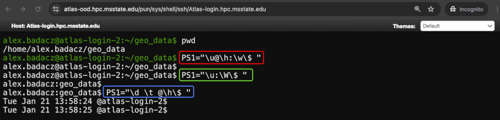
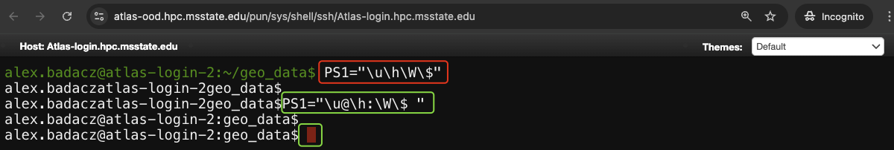
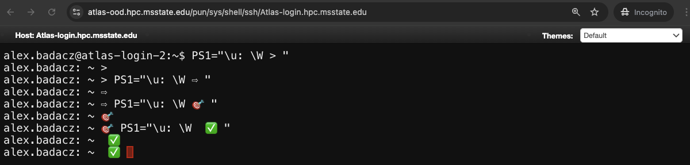

---

title: Shell customization with text coloring and prompt styling
description: "(Page description here)"
type: interactive tutorial
order: 3
tags: [UNIX, ANSI codes, prompt styling, CLI text coloring, shell customization]
packages: 
level: 
author: Aleksandra Badaczewska

---

## Overview

This interactive tutorial focuses on teaching you how to customize your shell for improved clarity, productivity and aesthetics by mastering text coloring and prompt styling. Through practical examples and hands-on exercises, you will learn how to modify your shell prompt (`PS1`), apply ANSI color codes for dynamic output styling and create visually engaging terminal environments tailored to your needs. The tutorial is designed for both beginners and intermediate users working with Bash, Zsh and similar Unix shells, specifically on SCINet HPC clusters.
<br>

<div id="info-alerts-1" class="highlighted highlighted--info ">
<div class="highlighted__body"  markdown="1">
<h4 class="highlighted__heading">Main Objectives</h4>
* Understand how ANSI escape codes work and how they can be used for text styling in the shell.
* Learn to modify the shell prompt (`PS1`) to display helpful information, including dynamic content.
* Gain practical skills for colorizing terminal output, such as enhancing `ls` and `grep` readability.
* Persist your customizations across sessions and ensure compatibility with different shells.
</div>
</div>

<div id="success-alerts-1" class="highlighted highlighted--success ">
<div class="highlighted__body"  markdown="1">
<h4 class="highlighted__heading">Goals</h4>
<p>By the end of this tutorial, you will:</p>
* Acquire knowledge of how to apply ANSI escape codes for effective text coloring in **Bash and Zsh shells**.
* Develop confidence in customizing the `PS1` prompt for improved usability on SCINet clusters.
* Learn how to save your configurations permanently in `.bashrc` or `.zshrc`.
* Understand how to troubleshoot common issues when working with shell customizations.
</div>
</div>


### Tutorial scope

This tutorial offers a comprehensive, hands-on guide to customizing shell environments using text coloring and prompt styling techniques. The focus is on practical, real-world applications of shell customization, including persistent configurations and troubleshooting for productivity and improved convenience on SCINet computing clusters.

<div class="usa-accordion">


<div id="scope-concepts" class="accordion_content" markdown="1">
* **ANSI escape codes:** Special sequences used in the terminal to control text appearance (color, bold, underline).
* **Shell prompt (PS1):** A customizable string displayed in the terminal, commonly showing the user, hostname and current directory.
* **CLI text styling:** Adjusting terminal text with colors, effects (like bold or underline), and symbols to highlight important information.
* **Prompt Customization:** Modifying `PS1` to create a visually engaging and functional shell prompt.
* **Variable Persistence:** Techniques for storing customizations across sessions using configuration files like `.bashrc` and `.zshrc`.
</div>

 
<div id="scope-tools" class="accordion_content" markdown="1">
* **Bash shell:** A popular shell environment (command interpreter) available on most Unix-like and HPC systems.
* **Configuration file:** Text file like `.bashrc` or `.bash_profile` that define environment variables and other shell settings, including text coloring and prompt styles.
</div>

 
<div id="scope-apps" class="accordion_content" markdown="1">    
* **Text styling for readability:** Enhance terminal output with colored text for better visibility of errors and key results.
* **Prompt customization for productivity:** Design a dynamic shell prompt that displays essential details like the current working directory, username and Git branch.
* **Persistent customization:** Apply long-term shell modifications by editing shell configuration files.
* **Troubleshooting in shell setups:** Identify and fix issues like broken prompts or incorrect ANSI sequences.
</div>
</div>


----

## Shell customization

<div id="note-alerts-1" class="highlighted highlighted--note ">
<div class="highlighted__body" markdown="1">
Shell customization is essential for improving productivity, clarity and efficiency, especially in HPC environments where working with complex data sets, multiple jobs and parallel tasks is common. <br>*A well-configured shell helps you:* <br>
**✓  Enhance Readability** <br>&emsp;  *Differentiate between standard output, errors and informational messages with text colors.* <br>
**✓  Streamline Workflow** <br>&emsp;  *Display essential information (e.g., current directory, active job status) directly in the prompt.* <br>
**✓  Increase Efficiency** <br>&emsp;  *Reduce the need for repetitive commands by adding dynamic elements like Git status or cluster information.* <br>
**✓  Prevent Errors** <br>&emsp;  *Highlight critical elements such as error messages and warnings in contrasting colors for quick identification.*
</div>
</div>

### Prerequisites 
<div class="usa-accordion">


<div id="launch-shell-1" class="accordion_content" markdown="1">
1. **Access a Unix-based terminal on Atlas or Ceres using:**
  - SCINet OOD: [Web-based access to HPC CLI](/computing-skills/command-line/cli-interface/concepts/cli-scinet-hpc#web-based-access-to-hpc-cli)
  - SCINet SSH: [Command-line access to HPC CLI](/computing-skills/command-line/cli-interface/concepts/cli-scinet-hpc#command-line-access-to-hpc-cli)
<br>
2. **Identify the default Shell on a cluster:**
```bash
echo $SHELL
```
*On Atlas and Ceres, the default shell is typically Bash (`/bin/bash`).*
<br>
3. **List available shells and switch between them:** <br>
*To view all installed shells:*
```bash
cat /etc/shells
```
*To switch between common shells (sh, Zsh, Bash):*
```bash
/bin/sh
/bin/zsh
/bin/bash
```
*After each change, check the active shell again using `echo $SHELL`. Finally, activate `/bin/bash` for this exercise.*
</div>
</div>

***What can be customized in a Shell appearance?***

| feature | description | quick navigation |
| --      | --          | --               |
| **Prompt** | Modify the shell prompt to display dynamic information like the current directory, user and active Git branches. Add colors and symbols for better visibility. | [Prompt styling basics](#prompt-styling-basics) |
| **CLI text coloring** | Apply ANSI escape codes to style terminal text. Highlight important information such as errors and warnings. | [Terminal text colorig](#text-coloring-for-shell-output) |

Beyond text coloring and prompt styling, you can also customize other shell components:

| feature | description | tutorial |
| --      | --          | --       |
| Command Aliases | Create shortcuts for frequently used commands (e.g., `alias ll='ls -la'`). | []() |
| Shell History | Modify history size and learn how to efficiently browse and search command history.. | [Command history](/computing-skills/command-line/cli-interface/shell/commands/history) |
| Auto-completion | Enable and configure auto-completion for commands and filenames, reducing typing errors and speeding up command execution. | [Command autocompletion](/computing-skills/command-line/cli-interface/shell/commands/autocompletion) |
| Environment Variables | Adjust the behavior of commands and tools by setting variables like `PATH` and `EDITOR`. | [Using environment and shell variables](/computing-skills/command-line/cli-interface/shell/variables) |
| Startup Scripts | Control how your shell initializes with startup files like `.bashrc`, `.bash_profile`, and `.zshrc`. | []() |


## **Prompt styling basics**

<div id="note-alerts-1" class="highlighted highlighted--note ">
<div class="highlighted__body" markdown="1">
The shell prompt is the text that appears before you type a command in the terminal. It updates dynamically with user actions, such as changing directories. Personalizing it allows you to display helpful system information directly to improve clarity and usability, especially in advanced computing environments like HPC clusters.

</div>
</div>

### *Prompt Structure*

The shell prompt is a string displayed in the terminal before the cursor where you type commands. Its behavior and appearance are controlled by the **PS1 variable** *(Prompt String 1)* in most Unix shells like Bash and Zsh. This variable is composed of **colored elements that dynamically update with information** like the `username`, `hostname` and `current directory`, using a combination of placeholders and ANSI escape codes for customization.
```
[alex.badacz@atlas-login-1 ~]$
[username@hostname workdir]$
```
The default shell prompt typically displays:
- **Username:** To indicate the current user logged in.
- **Hostname:** Identifying the system or server.
- **Current working directory:** The directory where commands will be executed.
- **Prompt symbol:** `$` for a regular user and `#` for the root user.

### *Prompt Elements*

Prompt elements are placeholders that dynamically display useful system information, such as the username, hostname, current directory and time, helping users to **customize the prompt for better context and usability**. A few predefined shortcuts, prefixed with a backslash (`\`), provide a quick way to insert these elements, making it easier to personalize the prompt efficiently. These elements can be further organized using separators, such as colons (`:`) and spaces, to improve readability, while the prompt marker, such as `$` for regular users and `#` for root, serves as a starting point for entering commands.

**Dynamic Placeholders**

| Element | Description | Example output |
| --      | --          | --             |
| `\u`    | Username    | `alex.badacz` |
| `\h`    | Hostname (system name) | `atlas-login-1` |
| `\H`  	| Full hostname (including domain) | `atlas-login-1.example.com` |
| `\w`    | Current working directory (full path) | `/home/alex.badacz` |
| `\W`    | Current working directory (basename only) | `alex.badacz` or `~` |
| `\t`    | Current time in HH:MM:SS format (24-hour) | `14:35:22` |
| `\T`    | Current time in HH:MM:SS format (12-hour) | `02:35:22` |
| `\d`    | Current date in Weekday Month Date format	| `Mon Jan 15` |
| `\j`    | Number of jobs currently managed by the shell | `3` |
| `\l`    | Current terminal device (tty) | `pts/0` |
| `\n`    | Newline (starts a new line in the prompt) | (New line) |
| `\s`    | Name of the shell | `bash` |
| `\v`    | Version of the shell | `5.1.8` |
| `\V`    | Detailed version of the shell | `5.1.8(1)-release` |
| `\!`    | Command history number | `123` |
| `\#`    | Command number in the current session | `45` |
| `\$`    | Typical prompt marker; shows `$` for normal users and `#` for root | `$` or `#` |
| `\\`    | Backslash character `\` | `\` |

**Separators and Markers**

| Element | Description | Example output |
| --      | --          | --             |
| `@`     | Typically used as a separator betwwen user and hostname, e.g., `\u@\h`         | `alex.badacz@atlas-login-1` |
| `:`     | Typically used as a separator between hostname and workdir path, e.g., `\h:\W` | `atlas-login-1:~`
| space   | A white character like space or tab is used as elements separator to increase readability, e.g., `\d \u` | `16:33:09 alex.badacz` |
| `[` `]` | Brackets are used for enhanced clarity and visibility, e.g., `[\d] \u`       | `[16:33:09] alex.badacz` |


<div id="note-alerts-1" class="highlighted highlighted--highlighted ">
<div class="highlighted__body" markdown="1">
The `\$` is used instead of `$` because the dollar sign has a special meaning in the shell, representing variables and commands, so escaping it (`\$`) ensures it is displayed literally in the prompt, whereas @ does not have special meaning and can be used directly as a separator.
</div>
</div>

### *Prompt Variable:* `PS1`

Prompt behavior and appearance are controlled by the *Prompt String 1*, i.e., the `PS1` **shell variable**, in most Unix shells like Bash and Zsh. It is defined like any other shell variable, with a string value assigned to the variable name. This string is composed of placeholders that represent various [prompt elements](#prompt-elements) dynamically updated by the shell.

```
PS1="[\u@\h \W]\$ "
```
*This will display the prompt in the format explained above, i.e.,* `[username@hostname workdir]$ ` *for example:*
```
[alex.badacz@atlas-login-1 ~]$ 
```
*This is a typical default mono-color prompt found on many computing machines, including HPC systems.*

<div id="note-alerts-1" class="highlighted highlighted--tip ">
<div class="highlighted__body" markdown="1">
Users can [personalize PS1](#ps1-customization) to better suit their needs by modifying its appearance: adjusting the text content, elements order and adding colors.
</div>
</div>

### *Prompt Colors & Effects*

You can modify text colors and effects in the prompt using [**ANSI escape codes** *(see full list)*](#ansi-escape-codes). These codes use the `\e` (escape) character, followed by a color code. Text placed immediately after an ANSI escape code will take on the desired color or effect, and the sequence should always be terminated with the reset code (`\e[0m`) to revert to normal formatting. 

*You can test ANSI color codes followed by custom text in the terminal using the `echo -e` command (with single quotes `''`) before applying them to your custom `PS1` prompt configuration.*

| Escape code | Effect     | Example code      | Code for testing in a terminal | 
| --          | --         | --                | --           |
| `\e[31m`    | <span style="color: red;">Red text</span>   | `\e[31mError!`    | `echo -e '\e[31mError!\e[0m'` |
| `\e[32m`    | <span style="color: green;">Green text</span> | `\e[32mSuccess!`  | `echo -e '\e[32mSuccess!\e[0m'` |
| `\e[1m`     | **Bold text**  | `\e[1mImportant!` | `echo -e '\e[1mImportant!\e[0m'` |
| `\e[0m`     | Reset (clears all styling) | `\e[0m` *(back to normal)* | - |


**Example of single-colored PS1:**
```bash
PS1="\e[32m\u@\h:\w\$ \e[0m"
```
- placeholders: `\u` for username, `\h` for hostname and `\w` for current directory
- ANSI escape sequences `\e[32m` for green text and `\e[0m` to resets text formatting at the end of the prmpt syntax

*Output: Green prompt string including username, hostname and working directory, with a default `$` prompt marker.*


<div id="note-alerts-1" class="highlighted highlighted--highlighted ">
<div class="highlighted__body" markdown="1">
Inserting escape codes start formatting from the point they appear and continue until they are explicitly reset using the reset code (`\e[0m`). Each escape code applies a specific color or style to the text that follows, and without resetting, the effect persists across the entire prompt or command output.

</div>
</div>

**Example of multi-colored PS1:**
```bash
PS1="\e[32m\u\e[0m@\e[34m\h\e[0m:\e[33m\w\e[0m\$ "
```
To analyze this PS1 setting, start by splitting the syntax at every `\e[0m`, which will reveal the number of sections with different colors:

| syntax    | **\e[32m\u\e[0m**  | **@** | **\e[34m\h\e[0m** | **:** | **\e[33m\w\e[0m**  | **\$**  |
| --        | --                 | --  | --                  | --    | --                 | --      |
| ANSI code | `\e[32m` , `\e[0m` | -   | `\e[34m` , `\e[0m`  | -     | `\e[33m` , `\e[0m` | -       |
| dynamic element | `\u`         | -   | `\h`                | -     | `\w`               | -       |
| formatting    | green username | default @ | blue hostname | default : | yellow workdir | default $ |
| output    | <span style="color:green;">alex.badacz</span> | @ | <span style="color:blue;">atlas-login-2</span> | : | <span style="color:yellow; background-color:black;">~</span> | $ |

Then, within each section, identify the [ANSI color code](#ansi-escape-codes) (e.g., `\e[32m` for green), followed by the [placeholder](#prompt-elements) (e.g., `\u` for username), and any literal characters (`@, :`) that separate elements.


### **PS1 customization**

`PS1` (Prompt String 1) is the primary shell prompt variable that defines how the prompt appears in interactive shell sessions.

Here are some key reasons for customizing the PS1 prompt:
- **Enhanced Readability:** Organize prompt elements to make it easier to read and distinguish information at a glance.
- **Increased Productivity:** Quickly access relevant details such as the current directory, username or system time.
- **Error Prevention:** Clearly indicate important information such as root privileges to avoid accidental destructive commands.
- **Context Awareness:** Differentiate between environments by customizing prompt colors or markers.
- **Personalization:** Tailor the prompt's appearance with colors and symbols to reflect personal preferences and workflow style.

<div class="usa-accordion">
<h4>Examples of practical applications</h4>


<div id="ps1-custom-1" class="accordion_content" markdown="1">

Learn [built-in placeholders](#prompt-elements) to include essential elements:
* user, hostname and absolute path to a workdir:
```bash
PS1="\u@\h:\w\$ "             # alex.badacz@atlas-login-2:~/geo_data$
```
* simplify to a basename of a workdir: 
```bash
PS1="\u:\W\$ "                # alex.badacz:geo_data$
```
* add date and time:
```bash
PS1="\d \t @\h\$ "            # Tue Jan 21 13:51:39 @atlas-login-2$
```
*(OUTPUT: basic, colorless prompt built with various elements)*


Exercise: 
- Display time, user and working directory with colors.

</div>


<div id="ps1-custom-2" class="accordion_content" markdown="1">

The PS1 variable can include custom text to enhance readability and organization. Enhance your prompt by rearranging elements and using separators to improve clarity and ease of use. Also, make your terminal experience more engaging and enjoyable with creative use of colors, icons and symbols.

* use common separators:
  - spaces after the prompt marker (`$`) to separate prompt and command line
  - colons (`:`) to separate elements like the hostname and working directory
  - at (`@`) to separate elements like the user and hostname

```bash
PS1="\u\h\W\$"              # alex.badaczatlas-login-2geo_data$
# compare to:
PS1="\u@\h:\W\$ "           # alex.badacz@atlas-login-2:geo_data$ 
```
*These customizations help create a prompt that is both informative and easy to read.*


* use visual aids to make your prompt more intuitive:
  - Unicode symbols for better visibility
  - emojis to make the prompt visually engaging

```bash
PS1="\u ⚡ \h ➜ \w \$ "  
PS1="\u@\h:\w 🔥 "
PS1="👨‍💻 @\h 📂 \W \$ "
```
*These customizations improve the user experience by making it easier to quickly locate relevant information.*

</div>


<div id="ps1-custom-3" class="accordion_content" markdown="1">

Modify the default prompt marker (`$`) by using alternative symbols such as `#`, `>`, `|` or even emojis (⚡ 🔸 🔥 🎯 🛠️) to make the prompt more visually appealing and easier to separate it from the command line.
```bash
PS1="\u: \W > "              # using alterante character as prompt marker >
PS1="\u: \W ⇨ "              # using arrow symbol as prompt marker
PS1="\u: \W 🎯 "             # using emoji as prompt marker
PS1="\u: \W  ✅ "            # using checkmark as prompt marker
```
*Custom prompt markers can personalize your shell and enhance readability or distinguish between different environments.*

</div>


<div id="ps1-custom-4" class="accordion_content" markdown="1">

Add colors to your prompt using [ANSI escape codes](#ansi-escape-codes) to improve visual clarity and organization. Colors can help highlight important elements such as the username, hostname or working directory, making it easier to distinguish between different sections of the prompt. *Learn basics of the prompt syntax coloring in section [Prompt Colors & Effects](#prompt-colors--effects).*
```bash
# Bold red user@host, cyan working directory and a clean > marker.
PS1="\e[1;31m[\u@\h]\e[0m \e[1;36m\w\e[0m > " 

# Username in green, hostname in blue and working directory in yellow.
PS1="\e[32m\u\e[0m@\e[34m\h\e[0m:\e[33m\w\e[0m\$ " 

#Current time in purple, username in light green, hostname in light blue, and directory in yellow.
PS1="\e[35m[\t]\e[0m \e[92m\u\e[0m@\e[94m\h\e[0m:\e[93m\W\e[0m\$ "
```
*These color customizations make the prompt visually appealing and help improve efficiency by quickly identifying important information at a glance.*

</div>

</div>

