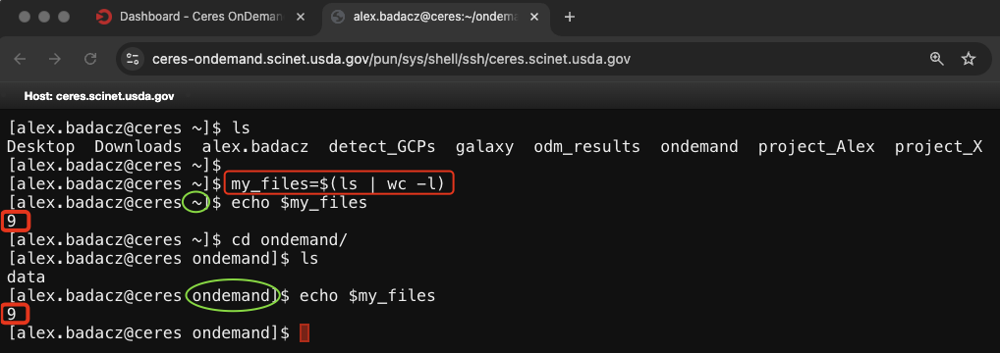
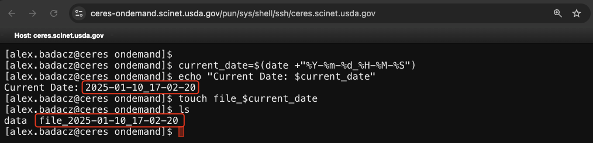
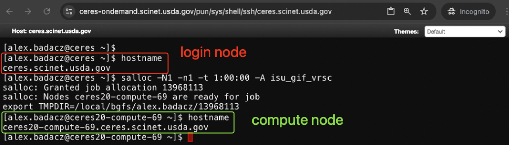
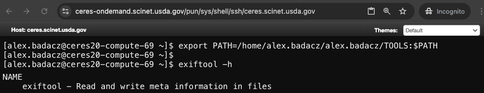
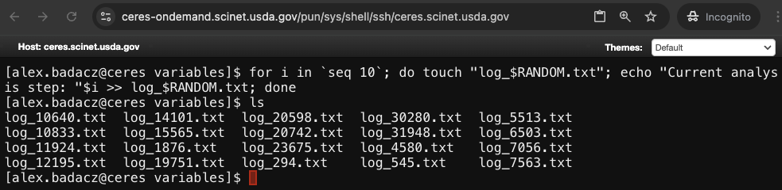
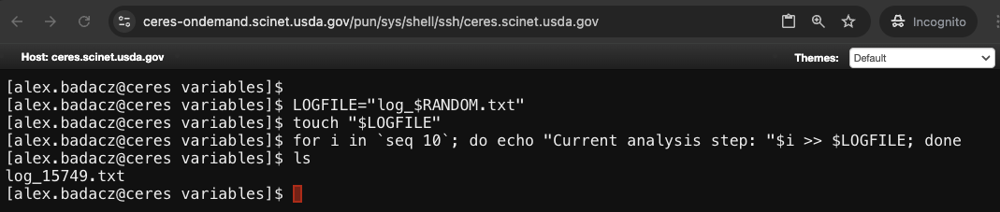

---

title: Using environment and shell variables
description: "Key principles of defining, accessing and usage scenarios of environment and shell variables in SCINet CLI"
type: interactive tutorial
order: 2
tags: [UNIX, shell, environment, variables, $PATH, $LD_LIBRARY_PATH, $HOME, $USER, JOBID, .bashrc]
packages: 
level: 
author: Aleksandra Badaczewska 

---


## Overview

This interactive tutorial focuses on teaching you how to distinguish and effectively use the built-in environment and shell variables in command-line environments. 
You will also learn how to declare, modify and persist new variables to customize the behavior of your shell and applications when working on SCINet HPC clusters.
<br>

<div id="info-alerts-1" class="highlighted highlighted--info ">
<div class="highlighted__body" markdown="1">
<h4 class="highlighted__heading">Main Objectives</h4>
* Understand the difference between environment and shell variables and their roles in shell configuration.
* Provide the reference list with built-in variables on SCINet HPC.
* Demonstrate how to define, export and persist variables across sessions, including practical applications.
* Explore debugging techniques to diagnose and resolve issues related to environment variables.
</div>
</div>

<div id="success-alerts-1" class="highlighted highlighted--success ">
<div class="highlighted__body" markdown="1">
<h4 class="highlighted__heading">Goals</h4>
<p>By the end of this tutorial, you will:</p>
* Acquire knowledge of how to access and manipulate variables in Bash shell.
* Gain confidence in using effectively the built-in variables cross-platform, including HPC systems.
* Get started with setting project-specific custom variables for optimal performance on SCINet clusters.
</div>
</div>


### Tutorial scope

This user guide offers a reference list of built-in environment and shell variables available on Atlas and Ceres HPC clusters, 
essential for maximizing the effective use of SCINet computing resources. The interactive tutorial component demonstrates how to modify existing variables 
and define custom ones, enabling you to establish a robust configuration for job submissions and optimize computational efficiency in your projects.

<div class="usa-accordion">


<div id="scope-concepts" class="accordion_content" markdown="1">
* **Environment variables:** Key-value pairs that define system-wide settings and influence the behavior of processes.
* **Shell variables:** Local variables used within the shell session for temporary configurations and scripting purposes.
* **Variable persistence:** Techniques to save variables across sessions by editing configuration files like `.bashrc`.
</div>

 
<div id="scope-tools" class="accordion_content" markdown="1">
* **Bash shell:** A popular shell environment (command interpreter) available on most Unix-like and HPC systems.
* **Configuration file:** Text file like `.bashrc` or `.bash_profile` that define environment variables and other shell settings.
</div>

 
<div id="scope-apps" class="accordion_content" markdown="1">    
* **Using built-in variables:** Understanding and utilizing global pre-defined variables such as `PATH`, `HOME`, `USER` and SCINet-specific variables.
* **Customization:** Setting custom variables (local or global) to configure project-specific settings, such as tool versions or data paths.
* **Troubleshooting:** Identifying and resolving job errors caused by dependencies conflicts due to misconfigured or undefined variables.
</div>
</div>


----

## CLI environment

<div id="note-alerts-1" class="highlighted highlighted--note ">
<div class="highlighted__body" markdown="1">
CLI environment refers to the broader system where users interact with the operating system or software through text-based commands.
It consists of:
- The [terminal](/glossary/#terminal) emulator or console window where commands are typed in. *(<a href="/computing-skills/command-line/cli-interface/terminal/" target="_blank">see tutorial</a>)*
- The [shell](/glossary/#unix-shell) (command interpreter) like `Bash`, that takes input commands from the user, interprets them and executes the corresponding actions. *(<a href="/computing-skills/command-line/cli-interface/shell/" target="_blank">see tutorial</a>)*
  - The **Shell environment**, which sets the context for command execution and allows customization through configurations to improve usability.
- Additional tools and utilities accessible within the CLI interface, such as `grep`, `awk` or custom installations.
</div>
</div>

### Shell environment (components)

The **shell environment** serves as the foundational context for running commands, determining how processes are executed and how the system interacts with your inputs. 
Its primary purpose is to manage operational settings, such as `paths` to executable files and default behavior for commands. 
However, it also offers powerful customization options, allowing users to tailor their experience with tools like `environment variables`, `aliases` and startup scripts (e.g., `.bashrc`). 
On HPC systems, configuring the shell environment is particularly crucial, as it directly impacts the efficiency and correctness of settings for jobs submitted to computing nodes. 
By understanding the environment components and customizing these settings, you can create a streamlined and robust environment for high-performance computing tasks on SCINet clusters.

<div id="note-alerts-1" class="highlighted highlighted--tip ">
<div class="highlighted__body" markdown="1">
Understanding the **components** and **configuration options** of the shell environment is essential for ensuring efficient and error-free workflows in the command-line interface, particularly in high-performance computing (HPC) environments where setting additional variables is often required to successfully submit tasks to compute nodes.
</div>
</div>

Here is a table outlining the significant components of a shell environment.

| component                 | description | example | is customizable? | where to set/find it? |
|---------------------------|-------------|---------|------------------|------------------|
| shell prompt              | The command line interface displayed for user interaction, which can be customized. | `PS1="[\u@\h \W]\$ "` | yes | in a startup script, e.g., `.bashrc` |
| history                   | A record of previously executed commands for reuse or reference. | `history` command or `.bash_history` file | N/A | `history` command or `.bash_history` file |
| startup scripts           | Configuration files executed when a shell session starts, defining default settings. | `.bashrc`, `.bash_profile`, `.zshrc` | yes | in a Home directory: `cd ~` |
| **environment variables** | Global variables that store **system-wide** settings, paths and configurations. | `PATH`, `HOME`, `USER`, `LD_LIBRARY_PATH` | some | in a startup script, e.g., `.bashrc` |
| **shell variables**       | Local variables specific to the **current shell**, often used in shell scripts or interactive sessions. | `my_variable=anything` | yes | in a shell or in a script file |
| aliases                   | Shortcuts or alternative names for longer or more complex commands. | `alias ll='ls -la'` | yes | in a startup script, e.g., `.bashrc` |
| functions                 | User-defined scripts or commands stored in memory for quick execution. | `function greet() { echo "Hello"; }` | yes | in a startup script, e.g., `.bashrc` |
| modules (on HPC)          | Dynamic adjustment of environment settings for software management on HPC systems. | `module load python` | no | on SCINet: `/apps/spack-managed/modulefiles/` |

### Examples of practical applications

By actively utilizing these components, work in the CLI, particularly on HPC systems, becomes more efficient and streamlined 
because they allow you to save time and reduce errors by reusing commands, automating routine setups and simplifying access to essential tools and configurations.

<div class="usa-accordion">

 
<div id="shell_env-1" class="accordion_content" markdown="1">
Quickly rerun or adapt previously executed complex command pipelines using the command history, saving time and effort instead of retyping them.

*Instead of retyping a long command like:*
```
grep -r 'error' /var/logs/ | sort | uniq > error_report.txt
```
*You can press the up arrow to select it from history or click `Ctrl+R` followed by a keyword (e.g., grep) to browse only relevant commands.*
</div>


<div id="shell_env-2" class="accordion_content" markdown="1">
Set and use environment variables to store often-used paths or configurations, allowing them to be accessed with a single word rather than typing long, repetitive paths.

*Instead of typing a full directory path each time:*
```
cd /project/$USER/myproject/data/analysis/
```
*You can set it as a variable:*
```
DATA_PATH="/project/$USER/myproject/data/analysis/"
cd $DATA_PATH
```
</div>


<div id="shell_env-3" class="accordion_content" markdown="1">
Use aliases to simplify frequently used commands, such as turning `ls -la` into `ll`, improving speed and reducing typing errors.

*Replace repetitive typing:*
```
ls -la --color=auto
```
*With an alias:*
```
alias ll='ls -la --color=auto'
```
*Now, simply type:*
```
ll
```
</div>


<div id="shell_env-4" class="accordion_content" markdown="1">
Load necessary software and libraries in seconds using HPC modules (`module load python`), avoiding the lengthy process of manual installation or compilation.

*Instead of manually installing software, quickly load it with a module command:*
```
module load python
```
*This provides immediate access to preinstalled python programming language, saving time and avoiding installation errors.*
</div>


<div id="shell_env-5" class="accordion_content" markdown="1">
Adjust the shell prompt to display useful information, such as the current directory or HPC node name:
```
PS1="[\u@\h \W]\$ "
```
Results in a prompt like: `[user@hpc-node ~]$`, keeping you aware of your context.
</div>

</div>


## **Configuration**

Shell configuration involves managing the behavior and settings of a command-line session. In practice, it involves defining and managing environment variables, setting aliases and adjusting shell settings to control how the command-line interface behaves. 
This section will guide you through hands-on steps for configuring shell components to effectively control and personalize your command-line environment.

<div id="note-alerts-1" class="highlighted highlighted--tip ">
<div class="highlighted__body" markdown="1">
**Shell environment is managed using variables**, which can be categorized mainly into `environment variables` and `shell variables`. 
The primary difference lies in scope and persistence. Environment variables affect both the current shell and its child processes, while shell variables are limited to the current shell unless exported. Understanding the distinction between them is essential for effective system configuration, scripting and working on high-performance computing (HPC) systems.
</div>
</div>


|              | Environment Variables | Shell Variables |
|--------------|-----------------------|-----------------|
| definition   | Variables that store **system-wide** or user-specific settings and configurations. | Variables specific to the **current shell**, often used in shell scripts or interactive sessions. |
| scope        | **Global** to the shell and inherited by child processes. | **Local** to the current shell session and not automatically passed to child processes. |
| purpose      | Used to control the behavior of the operating system or applications. | Useful for temporary data storage or shell scripting logic. |
| usage        | system-wide or app settings | shell-specific purposes |
| examples     | `PATH`, `HOME`, `USER`, `LANG` | `PS1` (the shell prompt) and custom variables defined by the user. |
| registration | Declared with `export` to make them available to child processes. <br>`export MY_VAR="Hello"` | No Export: If not exported, shell variables are not accessible by child processes. <br>`my_var="Hello"` |
| retrival     | `echo $PATH` *(returns something like: `/usr/bin:/bin:/usr/local/bin`)* <br>*`PATH` variable shows directories where the shell searches for executable files.* | `echo $my_var` *(returns a value assigned to the variable)* |
| persistence  | Added in `~/.bashrc` or `~/.bash_profile`. | Added in the same config files but not exported. |


Configuring the shell environment effectively involves managing various variables that control the behavior of your shell session and the system. The process revolves around defining, modifying and exporting variables that influence both the user experience and the behavior of applications and system utilities.

*In the following sections, we will explore how to work with environment variables, shell variables and HPC-specific configurations to optimize your shell experience.*


### Shell Variables

<div id="note-alerts-1" class="highlighted highlighted--tip ">
<div class="highlighted__body" markdown="1">
Shell variables are created and used only in the current shell session, meaning they **exist independently in each shell instance**. When you open a new terminal window or start a new shell session, a fresh set of built-in shell variables is created. They are not shared between different shells unless explicitly exported as [environment variables](#environment-variables).
</div>
</div>

| variable            | definition | notes |
|---------------------|------------|-------|
| `PWD`               | Current working directory. | Automatically set by the shell; used in scripts for referencing relative paths. |
| `BASH_VERSION`      | Version of Bash shell. | Useful in scripts to check for compatibility. |
| `SECONDS`           | Counts seconds since shell started. | Handy for timing tasks (e.g., `echo $SECONDS`). |
| `RANDOM`            | Generates a random number. | Use in scripts for simple randomness (e.g., `echo $RANDOM`). |
| `HISTFILE`          | File where command history is stored. | Typically `.bash_history`; useful for long-term recall of commands. |
| `HISTSIZE`          | Number of commands stored in history. | Increase for better command recall, e.g., export `HISTSIZE=1000`. |
| `PS1`               | Primary command prompt string. | Customize your shell prompt (e.g., `export PS1="[\u@\h \W]$ "` for a detailed prompt). |
| `PS2`               | Secondary prompt string (for multiline commands). | Default is `>`. Can be customized for clarity in complex scripts. |
| `_`                 | Last command's last argument. | Useful for quick re-usage (e.g., `ls somefile && cat $_`). |

Shell variables are local, session-specific variables used within a shell instance to store information such as **system state**, **user preferences** and **temporary data**. Some built-in variables hold values like the current working directory (`PWD`), the name and version of the shell (`BASH_VERSION`) or the number of seconds since the shell started (`SECONDS`).
* Variables can hold a fixed value, a command result or reflect system changes automatically.
* Some variables are static (like `USER`) while others are dynamic (like `SECONDS` or `PWD`).
  * Dynamic values change automatically, while static ones require manual reassignment.
  * Built-in dynamic variables are often used for unique tags when creating temporary files or logs, e.g., `touch "log_$RANDOM.txt"`.

**Users can create their own variables to store custom data**, such as `filenames`, commonly used `paths`, `counters` or configuration options for scripts, making it easier to automate tasks and customize the shell experience. These variables help control how commands run, manage data flow and simplify repetitive tasks.
* Custom shell variables themselves do not auto-refresh after creation.
* To achieve dynamic behavior, user-defined variables can include commands like `date` or inherently dynamic variables like `$SECONDS` and `$RANDOM` that generate a different value each time.


<div class="usa-accordion">
<h4>Examples of practical applications</h4>


<div id="shell-var1" class="accordion_content" markdown="1">
**Login to the SCINet HPC cluster** using the [Open OnDemand (OOD)](/computing-skills/command-line/cli-interface/concepts/cli-scinet-hpc#web-based-access-to-hpc-cli) service through your web browser. This provides a terminal interface for easy access to the shell environment. <br>
**Check built-in Shell Variables:** Use the `echo` command followed by the variable name with a `$` prefix to display its current value (e.g., `echo $PWD`). 

* *How do the values of built-in variables like `$USER` or `$PWD` differ between your session and example results?*
* *Did you tried a few times variables that change over time or with user activity, such as `$SECONDS` or `$RANDOM`?*
* *What happens if you try to display a variable that hasn't been set? (`echo $UNDEFINED_VAR`)?*
</div>

 
<div id="shell-var2" class="accordion_content" markdown="1">    
Shell variables can be categorized as either static or dynamic based on how their values behave.

**Static Shell Variables** - Hold a fixed value assigned by the user or the system until explicitly changed.
```bash
USER="john_doe"          # (built-in)  The current username, typically static for the session.
my_lucky_number=5        # (custom)    A user defined variable with a custom name and constant value.   
```
**Dynamic Shell Variables** - Automatically update based on system activity or commands, without manual reassignment.
Some dynamic variables can monitor the system state (like `SECONDS`) or track user behavior (like `PWD` reflecting the current working directory).
```bash
echo $SECONDS            # (built-in)  Continuously increases as the shell session progresses.
echo $PWD                # (built-in)  Updates whenever you change directories using cd.
```
Dynamic values update automatically in real-time, showing a different value each time they are accessed, making them useful for continuous monitoring:
```bash
while true; do echo "Uptime: $SECONDS seconds"; sleep 1; done
```

</div>

 
<div id="shell-var3" class="accordion_content" markdown="1">
Assigning a **simple text or numeric value** for basic/temporary information storage:
```bash
my_name="Alice"          # Stores a static string value (any temporary data)
my_age=30                # Stores a numeric value (no quotes needed)
echo $my_name $my_age
```
*Use simple variables to store user data, counters or status messages for easy reference in scripts and commands.*

---

Storing a **File Path** for quick access to directories and tools:
```bash
project_dir="/home/user/projects"  # Stores a custom path in a file system
echo $project_dir
cd $project_dir
```
*Save commonly used paths to simplify navigation and file management in the shell.*

---

Command Substitution, i.e., capturing and storing **command result** for later use:
```bash
my_files=$(ls | wc -l)   # (custom)    Counts the number of files in the current directory; value assigned once
echo "Number of files: $my_files"
```
*Assign the output of a command to a variable for use in calculations, summaries or conditional logic.*

<div id="note-alerts-1" class="highlighted highlighted--warning ">
<div class="highlighted__body" markdown="1">
Note that shell variables themselves do not update continuously. The value assigned reflects the result of the command at the moment the variable was defined and will not change unless the variable is reassigned.

</div>
</div>

---

Capturing Date and Time for creating unique **timestamps** for file naming and logging:
```bash
current_date=$(date +"%Y-%m-%d_%H-%M-%S")  # Stores the current date and time
echo "Current Date: $current_date"
touch file_$current_date
```
*Use timestamps to create unique identifiers for files, logs, or backups, preventing overwrites.*


---

Creating **custom dynamic variables** (unique tag) that have a different value each time it is used:
```bash
for i in {1..5}; do
    unique_tag="sample_$RANDOM"  # Random number as part of the variable; reassigned in every loop iteration
    echo $unique_tag             # Displays a new value each time
done    
```
*Combine static variables with dynamic components like `date`, `$RANDOM` or `$SECONDS` to create dynamic tags for temporary files or random identifiers.*


<div id="note-alerts-1" class="highlighted highlighted--warning ">
<div class="highlighted__body" markdown="1">
Note that shell variables store a value at the time they are defined. To generate a new value on each use, the variable must be re-evaluated using a reassigned dynamic component like `$RANDOM` or `date`. A `for` loop is useful for iterative updates.
</div>
</div>

</div>
</div>


### Environment Variables

<div id="note-alerts-1" class="highlighted highlighted--tip ">
<div class="highlighted__body" markdown="1">
Environment variables are a special type of shell variables that are globally accessible for any processes and **shared across different shell instances**.
They are used to pass configuration information from the shell to applications or scripts that are executed within that environment. 
These variables are created by exporting shell variables using the `export` command, and their values persist as long as the shell session (or its child processes) 
remains active. Adding an export statement to a config file (e.g., `.bashrc`) persists an environment variable for all future shell sessions. 
Common environment variables include `PATH`, `HOME` and `USER`.
</div>
</div>

| variable            | definition | notes |
|---------------------|------------|-------|
| `USER`                | Current logged-in username. | Useful in scripts to personalize behavior or logs. | 
| `HOME`                | Path to the user's home directory. | Use for referencing user files and configurations (`cd $HOME`). |
| `PATH`                | List of directories to search for executables. | Ensure it includes critical paths like `/usr/bin` and `/bin`. Add custom paths using <br>`export PATH=$PATH:/new/path`. |
| `FPATH`               | Path for shell function lookup | Useful when adding custom shell functions for specialized tools. |
| `LANG`                | System locale setting. | Modify for language or encoding needs (e.g., `LANG=en_US.UTF-8`). |
| `SHELL`               | Path to the user's default shell. | Example: `/bin/bash` or `/bin/zsh`. <span class="warning">Avoid overriding this variable.</span> |
| `TERM`                | Type of terminal in use. | Important for determining terminal capabilities (e.g., `xterm`, `screen`). |
| `MAIL`                | Path to user's mail spool. | Can be used for job notifications if configured properly. |
| `EDITOR`              | Default text editor for command-line programs. | Common values: `vim`, `nano` or `emacs`. Set it to your preferred editor. |
| `DISPLAY`             | Used for GUI programs to connect to the X server. | Common on systems with graphical interfaces (e.g., `DISPLAY=:0`). |
| `SSH_CONNECTION`      | IP and port of the current SSH session. | Useful for logging and tracking SSH activity. |

Environment variables are global, system-wide variables, storing information such as **system settings, user preferences and executable file paths**. 
There are many built-in variables. For example, `HOME` defines the user's home directory, `LANG` specifies language settings and 
`PATH` lists directories for command lookups. Other commonly used variables configure tools and manage system behavior, 
like setting `EDITOR` for a preferred text editor or `LD_LIBRARY_PATH` for dynamic library loading. 
These variables **simplify automation, ensure consistent behavior across sessions** and help control program execution.
* Environment variables persist across subshells but not between sessions unless defined in startup files like `.bashrc` or `.bash_profile`.
* Environment variables can differ between `login` and `compute` nodes, with login nodes typically focusing on user interaction and job submission, while compute nodes are optimized for running jobs and may have a more restricted or customized environment.
* **Users can modify** some built-in environment variables (e.g., extend `PATH` variable) **or create custom environment variables** by adding `export` statment to configuration files.  

<div class="usa-accordion">
<h4>Examples of practical applications</h4>


<div id="environment-var1" class="accordion_content" markdown="1">
**Login to the SCINet HPC cluster** using the [Open OnDemand (OOD)](/computing-skills/command-line/cli-interface/concepts/cli-scinet-hpc#accessing-the-cli-on-the-scinet-hpc) service through your web browser. This provides a terminal interface for easy access to the shell environment. <br>
**Check built-in Environment Variables on a login node:** Use the `printenv` command to display all variables along with their values available on SCINet cluster. 
```bash
printenv
```

**Check built-in Environment Variables on a compute node:** Start an interactive session on a compute node and print environment variables again:
```bash
salloc -N1 -n1 -t 1:00:00 -A <scinet-account>           # request an interactive session
```
* *Are there differences in the values for variables such as `PATH`, `LD_LIBRARY_PATH` or `MODULEPATH`?*
* *Do you notice variables set for temporary directories (`TMPDIR`) or cache directories (`CACHEDIR`) that are commonly used for job isolation on compute nodes?*
* *Are there any SLURM-specific variables present, such as `SLURM_JOBID` or `SLURM_NTASKS` that indicate a job is running on a compute node?*
</div>

 
<div id="environment-var2" class="accordion_content" markdown="1">
Navigate to your home directory quickly:
```bash
cd $HOME
```
*Shortcut for moving to your home space from any location in the cluster's file system without typing the full path.*

---

Edit or source your `.bashrc` configuration file:
```bash
nano $HOME/.bashrc          # to make changes
source $HOME/.bashrc        # to apply recent changes
```
*Quickly access and modify your shell configuration for persistent changes. Then, reload your shell settings without logging out and back in.*

---

Check your running jobs in the queue (for SLURM-based systems):
```bash
squeue -u $USER
```
*Lists only your jobs in the current job queue.*

---

Find files in your home directory:
```bash
find $HOME -name "*.log"
```
*Search for specific files in your home space.*

---

Copy or soft-link files to or from your home directory:
```bash
cp $HOME/myscript.sh /project/<your-scinet-project>/$USER/
ln -s /project/<your-scinet-project>/$USER/my_script.sh $HOME/
```
*Useful for collaboration or to physically store large files in a project while having them accessible directly from home.*
</div>

 
<div id="environment-var3" class="accordion_content" markdown="1">    
You can add a custom software directory to your `PATH` using the `export` statement, ensuring executables in that directory can be run directly from any location in the file system.
* Temporary for the current session (expires when the session ends):
```bash
export PATH="/custom/software/bin:$PATH"
```
* Persisted for all future sessions (by adding it to a configuration file):
```bash
echo "export PATH="/custom/software/bin:$PATH" >> ~/.bashrc
source ~/.bashrc
```
*This ensures the change is permanent across future shell sessions. The use of `echo` combined with appending (`>>`) and immediately sourcing the `.bashrc` is a common and effective approach.*
</div>

 
<div id="environment-var4" class="accordion_content" markdown="1">    
First, check which shells are available on an HPC system before changing the default:
```bash
cat /etc/shells
```
*On Ceres you should see:* `/bin/sh`, `/bin/bash`, `/usr/bin/sh`, `/usr/bin/bash`, `/usr/bin/tmux`, `/bin/tmux`, `/usr/bin/zsh`, `/bin/zsh`, `/bin/csh`, `/bin/tcsh`, `/usr/bin/csh`, `/usr/bin/tcsh`, `/bin/ksh`, `/bin/rksh`, `/usr/bin/ksh`, `/usr/bin/rksh`

Verify your current shell using:
```bash
echo $SHELL             # current shell
echo $0                 # active shell
```

Run a desired shell interactively to test it:
```bash
/bin/sh                 # Exit with `exit` to return to your default shell.
```
</div>
</div>


### HPC-specific Env Variables

*(Environment variables for optimized resource management and job scheduling on multi-user computing infrastructure.)*

In High-Performance Computing (HPC) environments, specialized environment variables are essential for efficient resource management and job scheduling on shared, multi-user systems. These variables help the job scheduler (e.g., **SLURM**) and system software coordinate how resources like CPU cores, memory and nodes are allocated to different users' jobs.

There are many HPC-specific environment variables available outside the job scheduler that can be useful for regular users in the interactive shell **on a computing node**. These variables help manage software environments, resource paths and session state, even when not running a job. Specifically, these variables can be useful for **module management, software execution, temporary file storage and system information in HPC environments**.


<div class="usa-accordion">


<div id="hpc-variables-1" class="accordion_content" markdown="1">

| variable              | definition | notes |
|-----------------------|------------|-------|
| `SLURM_JOB_ID` , `SLURM_JOBID` |  Unique identifier for the job assigned by SLURM. | Used for tracking jobs in SLURM-managed systems. |
| `SLURM_JOB_NAME`      | Name of the submitted job. | Helpful for identifying jobs in job queues. |
| `SLURM_JOB_GID`       | Group (numerical) ID associated with the job. | Useful for permission management and job accounting. |
| `SLURM_JOB_UID`       | User (numerical) ID associated with the job. | Useful for permission management and logging. |
| `SLURM_JOB_USER`      | Username associated with the job submission. | Identifies the user who submitted the job (e.g., `alex.badacz`), helpful for shared environments. |
| `SLURM_JOB_ACCOUNT`   | Account charged for the job. | Important for billing and resource usage tracking. |
| `SLURM_JOB_PARTITION` | Partition where the job was submitted. | Important for resource selection and job scheduling policies, e.g., `short`. |
| `SLURM_JOB_NODELIST`  | List of nodes allocated to the job. | Useful for multi-node jobs and task distribution. |
| `SLURM_JOB_CPUS_PER_NODE` | Number of CPUs requested per node. | Essential for defining CPU resources per node. |
| `SLURM_JOB_START_TIME`| Job start time (epoch format). | Useful for performance analysis and logging job durations. |
| `SLURM_JOB_END_TIME`  | Job end time (epoch format). | Helps in tracking resource usage and calculating job duration. |
| `SLURM_CPUS_ON_NODE`  | Number of CPUs available on a node. | Important for CPU-based job configuration. |
| `SLURM_CPUS_PER_TASK` | Number of CPUs per task. | Optimize parallel jobs by setting this appropriately. |
| `SLURM_STEP_NUM_TASKS`| Number of tasks in the current step. | Helpful for multi-step jobs. |
| `SLURM_NTASKS`        | Total number of tasks requested. | Critical for defining parallelism.  |
| `SLURM_PROCID`        | MPI process ID for the current task. | Useful for MPI-based parallel jobs. |
| `SLURM_TASK_PID`      | Process ID for the task . | Useful for process management and debugging within a job. |
| `SLURM_CLUSTER_NAME`  | Name of the SLURM cluster. | Helps identify the cluster in multi-cluster environments, e.g., `ceres`. |
| `SLURM_SUBMIT_HOST`   | Hostname of the system where the job was submitted, e.g., `ceres.scinet.usda.gov`. | Useful for identifying where the job originated, especially in multi-cluster environments. |
| `SLURM_SUBMIT_DIR`    | Directory where the job was submitted. | Use to ensure output is directed to the right place. |
| `SLURMD_NODENAME`     | Node name in the SLURM setup. | Indicates the compute node where the job is running, e.g., `ceres19-compute-85`. |

**SLURM-specific variables are typically available only during job execution on the compute nodes.** <br>

Knowing `JOBID` you can monitor live resource consumption for optimization and troubleshooting.
```bash
sstat -j <SLURM_JOB_ID> --format=JobID   # Running Jobs Only
sacct -j <SLURM_JOB_ID> --format=JobID   # After Job Completion
```
where the avaialable fields include: <br>
`JobID` `MaxVMSize` `MaxVMSizeNode` `MaxVMSizeTask` `AveVMSize` `MaxRSS MaxRSSNode MaxRSSTask`     `AveRSS` `MaxPages` `MaxPagesNode`   `MaxPagesTask`   `AvePages`     `MinCPU` `MinCPUNode` `MinCPUTask`     `AveCPU`   `NTasks` `AveCPUFreq` `ReqCPUFreqMin` `ReqCPUFreqMax` `ReqCPUFreqGov` `ConsumedEnergy`  `MaxDiskRead` `MaxDiskReadNode` `MaxDiskReadTask`  `AveDiskRead` `MaxDiskWrite` `MaxDiskWriteNode` `MaxDiskWriteTask` `AveDiskWrite` `TRESUsageInAve` `TRESUsageInMax` `TRESUsageInMaxNode` `TRESUsageInMaxTask` `TRESUsageInMin` `TRESUsageInMinNode` `TRESUsageInMinTask` `TRESUsageInTot` `TRESUsageOutAve` `TRESUsageOutMax` `TRESUsageOutMaxNode` `TRESUsageOutMaxTask` `TRESUsageOutMin` `TRESUsageOutMinNode` `TRESUsageOutMinTask` `TRESUsageOutTot`

</div>

 
<div id="hpc-variables-2" class="accordion_content" markdown="1">

| variable           | definition | notes |
|--------------------|------------|-------|
| `MODULEPATH`       | Directories where software modules are stored.   | Navigate to this path to check the most up-to-date list of available modules. |
| `LMOD_CMD`         | Path to the `lmod` command for managing modules. | Run `echo $LMOD_CMD` to verify the location of the `lmod` binary.     |
| `MODULESHOME`      | Base directory where the module system is installed. | Useful for debugging if modules fail to load.                      |
| `MODULEPATH_ROOT`  | Root directory for module paths.                 | Helpful for locating core software modules available on the system.  |
| `LD_LIBRARY_PATH`  | Directories where the system searches for shared libraries. | Modify when using custom software with non-standard library locations. Extend this path carefully when working with custom libraries to avoid conflicts with system libraries. |

These variables control how software modules are managed and loaded on the HPC system. They are essential for accessing pre-installed software packages using the `module` or `lmod` system. **Regular users typically do not need to modify these variables** as they are predefined by system administrators to ensure a standardized software environment.

The `LD_LIBRARY_PATH` variable specifies directories where the dynamic linker searches for shared libraries when running executables. It ensures the system can locate necessary libraries for both pre-installed and user-compiled software. This variable is often predefined by system administrators for standard software libraries but can be modified by regular users when working with custom software builds or locally installed libraries.

<div id="note-alerts-1" class="highlighted highlighted--tip ">
<div class="highlighted__body" markdown="1">
Avoid overwriting the entire path (`LD_LIBRARY_PATH=/path/to/lib`) and instead extend it using `LD_LIBRARY_PATH=/custom/path:$LD_LIBRARY_PATH`. This prevents breaking essential system tools while ensuring your custom libraries are available.
</div>
</div>

</div>

 
<div id="hpc-variables-3" class="accordion_content" markdown="1">    

| variable             | definition | notes |
|----------------------|------------|-------|
| `TMPDIR`             | Temporary directory for job-specific data.  | Critical for managing temporary job files. Can be modified for large data jobs. Default: `/local/bgfs/$USER/`|
| `SINGULARITY_TMPDIR` | Temporary directory for Singularity images. | Adjust for container usage with large datasets. |
| `APPTAINER_TMPDIR`   | Directory for temporary files used by Apptainer containers. | Customize to prevent temporary storage issues during large container runs. |
| `APPTAINER_CACHEDIR` | Directory where Apptainer caches container images.  | Clear this directory periodically to free up disk space if needed.    |

These variables manage storage for Apptainer (formerly Singularity) containers, which are often used for reproducible, portable environments on HPC systems. Adjusting `APPTAINER_TMPDIR` or `APPTAINER_CACHEDIR` can be useful when working with large datasets or if the default locations run out of space. **Regular users can modify these variables if they need to direct temporary storage to another location.** *([review SCINet User Guide](https://scinet.usda.gov/guides/software/singularity#docker-images))*

</div>

 
<div id="hpc-variables-4" class="accordion_content" markdown="1">    

| variable       | definition | notes |
|----------------|------------|-------|
| `HOSTNAME`     | Name of the remote system in use, e.g., `ceres.scinet.usda.gov`. | Useful for SSH login or documenting SCINet clusters usage. |
| `LMOD_sys`     | Identifies the system architecture for optimized software. | Useful for verifying compatibility with architecture-specific modules. |
| `SSH_CLIENT`   | IP and port information of the current SSH connection. | Useful for auditing and identifying remote connections. |
| `SSH_TTY`      | Current SSH terminal. | Useful for determining if the session is remote. |
| `LOGNAME`      | Current user's login name. | Often used for personalizing job scripts or identifying user-specific processes. |
| `BASH_ENV`     | Path to a script sourced in non-interactive shells. | Useful for loading environment settings in batch jobs. |
| `TMOUT`        | Timeout for shell inactivity (in seconds). | Can be used to auto-logout inactive sessions for security purposes. |
| `OLDPWD`       | Previous working directory. | Allows easy navigation back to the last directory with `cd -`. |

These variables provide details about the platform architecture, current session, such as the cluster you're connected to and user information. **These variables are automatically set by the system and cannot be modified by regular users**, but they can be `echo`ed or logged for session tracking purposes.

</div>

 
<div id="hpc-variables-5" class="accordion_content" markdown="1">    

| variable           | definition | notes |
|--------------------|------------|-------|
| `MANPATH`  | Directories where manual pages are stored. | Run `man <command>` to check the manual for any installed software.  |

`$MANPATH` defines where manual pages for installed tools and commands are stored. It ensures you can access documentation using man <command>. **This variable is predefined by system administrators.**

</div>
</div>


##  Viewing variables

Variables are defined as `name=value` pairs, where the value can be retrieved by referencing the variable name with a `$` prefix (e.g., `$HOME`). This applies to both shell and environment variables across most Unix-based shells.

**Display a value of the selected variable:**
```bash
echo $HOME              # (built-in) Environment variable
echo $my_var            # (custom)   User-defined shell variable
```

**List all variables accessible in current session:**
```
set
printenv
```
*Note that `set` lists all shell variables, including local ones, while `printenv` specifically lists environment variables.*

**Unset a custom variable** (remove it from the environment)**:**
```
unset my_var
```
*Note that `unset` only affects the current session.*


## Exporting variables for subprocesses

Shell variables normally exist only within the current shell session where they are defined, and they do not carry over to scripts or subprocesses started from that shell. 

<div id="note-alerts-1" class="highlighted highlighted--info">
<div class="highlighted__body" markdown="1">
<h4 class="highlighted__heading">How scripts and subprocesses are related to the current Shell?</h4>
* A **script** is a file containing a sequence of shell commands that can be executed in a shell session. When you run a script (e.g., `bash my_script.sh`), a new subshell is created, separate from the current shell.
* A **subprocess** is any command or program started from the current shell, including scripts. Running a command like `ls | grep "file"`, both `ls` and `grep` run in their own subprocesses created from the current shell.

**Subprocesses and scripts** start as separate shells from the parent shell (the one you are working in), and they **do not inherit variables** from the parent unless explicitly exported.
</div>
</div>

To make a variable available in child processes, it must be registered as an environment variable using the `export` command. Exporting a variable to environment (`export VAR="value"`) makes it accessible to subprocesses but **still limited to the lifetime of the current shell session** — once the session ends, the variable is cleared unless [persisted in a shell configuration file](#persisting-variables-in-config-files).

If you want a custom variable to persist in scripts or subprocesses executed in current shell session, it must be exported to the environment *(run it in a terminal)*:
```bash
my_var="Hello World"
export my_var
```
or
```bash
export my_var="Hello World"
```

Then you can use it in any script file (e.g., `my_script.sh`) like this:
```bash
#!/bin/bash
echo "The variable is: $my_var"
```

### Passing variables to SLURM jobs

In **job schedulers like SLURM**, when you submit a job (e.g., `sbatch my_job.sh`), the job runs in a completely separate shell environment on a compute node. Variables from your interactive shell will not be available inside the SLURM job unless explicitly exported:
```bash
export my_var="Hello SLURM"
sbatch --export=ALL my_job.sh
```
**WARNING:** *This exports all variables from the current environment, which may lead to unintended behavior if irrelevant or conflicting variables are included.*

**Export specific variables only:**
```bash
sbatch --export=VAR1=value1,VAR2=value2 my_job.sh
```

<div id="note-alerts-1" class="highlighted highlighted--highlighted">
<div class="highlighted__body" markdown="1">
<h4 class="highlighted__heading">Define or Export variable directly within the script <i>(recommended)</i></h4> 
To ensure a variable is always set when the script runs (even if not defined in the submitting shell), you can define it inside the script itself:
```bash
#!/bin/bash
VAR1="default_value"                # Ensuring the variable is defined
echo "Running with VAR1=$VAR1"
```
<br>
If the variable needs to be available to subprocesses within the script, you should export it inside the script:
```bash
#!/bin/bash
export VAR2="passed_value"          # Exporting ensures availability to child processes
echo "Running with VAR2=$VAR2"
```
</div>
</div>


## Persisting variables (in Config Files)

To make variable definitions permanent across sessions, they need to be added to shell configuration files. These files are read and executed when a shell starts.

| Bash Shell        | Zsh Shell | description |
| --                | --        | --          |
| `~/.bashrc`       | `~/.zshrc`| For interactive non-login shells and customizing the prompt or aliases. |
| `~/.bash_profile` | `~/.zprofile` | For login shells (e.g., SSH sessions). |

Example: 
To permanently add a custom path for executables, add an `export` statemnt to a selected configuraion file and save changes:
```bash
# (write it at the end of your .bashrc file)
export PATH=$PATH:/path-to/my-custom-tool/bin
```
or write it down directly to a file from the command line:
```bash
echo 'export PATH=$PATH:/path-to/my-custom-tool/bin' >> ~/.bashrc
```
and refresh the current shell session by applying changes from the configuration file:
```
source ~/.bashrc
```

## **Troubleshooting common issues**

When working on HPC clusters, issues related to environment variables can lead to software errors, missing executables or misconfigured jobs. This section explores common problems reported by users on SCINet clusters and provides practical debugging techniques to diagnose and resolve them effectively.

<div class="usa-accordion">


<div id="var-debug-1" class="accordion_content" markdown="1">
**SYMPTOMS:** Running a command or referencing a variable results in errors like `command not found` or an empty output when using `echo $VAR`.
```bash
echo $TMPDIR        # outputs an empty line
```


**SOLUTIONS:** <br>
**A.** Some variables (e.g., `TMPDIR`) are set on a **compute node** but not on a **login node**. Check the hostname to confirm your working environment. Also, review the list of [HPC-specific environment variables](#hpc-specific-env-variables).
```bash
hostname
```


**B.** Ensure your custom variable is defined and exported:
```bash
export MY_VAR="my_value"
echo $MY_VAR        # should return 'my_value'
```
</div>

 
<div id="var-debug-2" class="accordion_content" markdown="1">
**SYMPTOMS:** Custom commands or software fail with `command not found` error.
```bash
my_executable
#ERROR: bash: command not found
```
First, ensure that your executable file exist and find its location in the file system.

**Common Cause:** If the executable file exists, the `PATH` variable may not include the directory where the executable resides.
```bash
echo $PATH        # tool's path not present among listed locations
```


**SOLUTIONS:** <br>
Extend the `PATH` variable by adding a path to a directory with your executable:
```bash
export PATH=/custom-path/bin:$PATH      # replace /custom-path/bin with an absolute path to your tool
```

<div id="note-alerts-1" class="highlighted highlighted--tip ">
<div class="highlighted__body" markdown="1">
By adding a tool's directory to the `PATH` variable, the shell automatically searches that location when a command is called, allowing the tool to be launched without specifying its full path. This provides a convenient way to run executables by its name from any working directory.
</div>
</div>

</div>

 
<div id="var-debug-3" class="accordion_content" markdown="1">    
**SYMPTOMS:** Errors such as `error while loading shared libraries` or `unable to load shared object` often indicate 
library path issues caused by missing (or not linked) required libraries in the specified search paths. 
Typically, the concern is a missing `.so` (shared object) file, which should first be located on the system, 
and its directory path checked for inclusion in the `LD_LIBRARY_PATH` variable.


**SOLUTIONS:** <br>
Locate the missing library:
```bash
find /usr -name "lib_my_lib.so"
```
Verify the current `LD_LIBRARY_PATH`:
```bash
echo $LD_LIBRARY_PATH
```
Fix the issue *(for the session only)* by adding library path to a `LD_LIBRARY_PATH` variable:
```bash
export LD_LIBRARY_PATH=/path/to/lib:$LD_LIBRARY_PATH        # replace /path/to/lib with an absolute path of missing library
```
</div>

 
<div id="var-debug-4" class="accordion_content" markdown="1">    
**SYMPTOMS:** Multiple log files being generated unintentionally when using dynamic variables like `$SECONDS` and `$RANDOM` to create temporary files. 
The typical cause is that built-in dynamic variables generate a new value each time they are referenced, resulting in different filenames on every call. As a result, when log file creation is misplaced (e.g., inside a loop where logs should be written continuously), a new file is generated on each iteration.


**SOLUTIONS:** <br>
Capture the dynamic value once and store it in a static variable before using it repeatedly:
```bash
LOGFILE="log_$RANDOM.txt"
touch "$LOGFILE"
for i in `seq 10`; do
  echo "Current analysis step: "$i >> $LOGFILE; 
done
```

</div>

 
<div id="var-debug-5" class="accordion_content" markdown="1">    
**SYMPTOMS:** A variable works correctly when defined in an interactive session in the command line but fails to persist in batch jobs or scripts, 
often leading to errors like `variable not defined` or unexpected empty values during execution. <br>
**CAUSE:** This occurs when the variable is defined locally in the shell but not exported to the environment, 
preventing it from being inherited by subshells or child processes.

**SOLUTIONS:** <br>
Use `export` to make a variable available to child processes:

**A.** Passed to all subshells, including scripts executed in a current shell: *(learn more: [Exporting variables for subprocesses](#exporting-variables-for-subprocesses))*
```bash
MY_VAR="my_value"             # only visible in the current shell
export MY_VAR="my_value"      # available to all subshells, including child processes and scripts executed from a current shell
```

**B.** Persisted for all future shell sessions and scheduled SLURM jobs: *(learn more: [Persisting variables in Config Files](#persisting-variables-in-config-files))*
```bash
echo "export MY_VAR='my_value' >> ~/.bashrc"
source ~/.bashrc
```
</div>

 
<div id="var-debug-6" class="accordion_content" markdown="1">    
**SYMPTOMS:** Custom variables work as expected during a shell session but need to be redefined after logging out or 
starting a new terminal session, causing repeated manual configuration. <br>
**CAUSE:** This happens because variables set in the current shell are temporary and not saved in the user's startup files, 
preventing them from being automatically available in new sessions.

**SOLUTIONS:** <br>
Add the `export` statement to your shell startup file (`~/.bashrc`) to perist a variable for future shell sessions:
```bash
echo "export MY_VAR='my_value' >> ~/.bashrc"
source ~/.bashrc
```
*(learn more: [Persisting variables in Config Files](#persisting-variables-in-config-files))*
</div>

 
<div id="var-debug-7" class="accordion_content" markdown="1">    
**SYMPTOMS:** Standard commands like `ls`, `grep` or `python` fail with errors such as `command not found` or 
behave unexpectedly after modifying the `PATH` or `LD_LIBRARY_PATH` variables. This issue occurs when the original system paths 
are overwritten instead of extended, causing essential system directories to be excluded from the search path.

| <span style="color: red">Incorrect Example</span> | Correct Approach |
| --                | --               |
| overwriting the value | extending the value | 
| `export PATH=/custom/bin` | `export PATH=/custom/bin:$PATH` |
| `export LD_LIBRARY_PATH=/custom/lib` | `export LD_LIBRARY_PATH=/custom/lib:$LD_LIBRARY_PATH` |

**SOLUTIONS:** <br>
**A.** Restore defaults manually: Reset the variables to standard defaults typical for HPC clusters.
```bash
export PATH=/usr/local/bin:/usr/bin:/usr/local/sbin:/usr/sbin
export LD_LIBRARY_PATH=/usr/local/lib:/usr/lib
```
**B.** Contact VRSC: If unsure about the standard paths or if the issue persists, contact SCINet support team (**scinet_vrsc@usda.gov**) 
to reset the affected built-in variables to their default state.

</div>


 
<div id="var-debug-8" class="accordion_content" markdown="1">    
**SYMPTOMS:** Jobs fail with disk space errors, warnings about insufficient storage or unexpected job terminations when handling large datasets or temporary files. This issue commonly occurs when your job writes temorary files to a wrong location or the selected location is either full or too small for job data.
```bash
# ERROR: No space left on device
# ERROR: Job 12345 exceeded disk quota on /tmp
# ERROR: cannot create tempfile '/tmp/Rtmp12345', reason 'No space left on device'
```

**SOLUTIONS:** <br>
On SCINet clusters, all compute nodes have 1.5 TB of fast local temporary data file storage space. A scheduled job or interactive session on a compute node sets up automatically a unique local space (e.g., `/local/bgfs/alex.badacz/13968447`) accessible only with the job script via the environmental `$TMPDIR` variable. You can use this for any scratch space disk space you need. You must copy any output data you need to keep back to permanent storage before the job ends, since `$TMPDIR` will be erased upon job exit. 


<div id="note-alerts-1" class="highlighted highlighted--tip ">
<div class="highlighted__body" markdown="1">
If you plan to compute on an existing large data set (such as a sequence assembly job) it might be beneficial to copy all your input data to scratch space at the beginning of your job, and then do all your computation on `$TMPDIR`. Follow instructions provided in the [SCINet User Guide: Scratch Space](https://scinet.usda.gov/guides/use/scratch#scratch-space).
</div>
</div>

</div>


 
<div id="var-debug-10" class="accordion_content" markdown="1">    
- Check a variable's Value: `echo $VAR`
- List all environment variables: `printenv`
- List all (local) shell variables: `set`
- Identify where a variable was set: `grep VAR ~/.bashrc ~/.bash_profile`
- Check current modules loaded: `module list`
- Start a clean shell
</div>
</div>