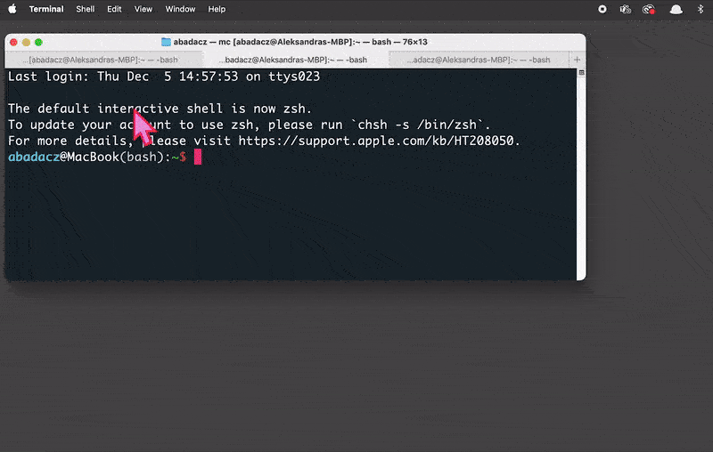
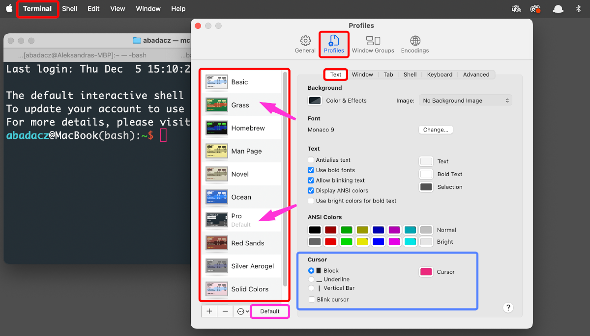
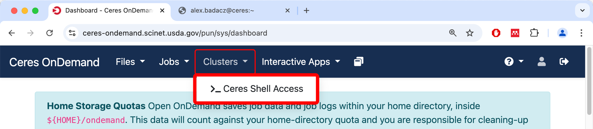

---

title: Terminal customization
description: "Cross-platform terminal settings for visual comfort and enhanced usability."
type: interactive tutorial
order: 1
tags: 
packages: 
level: 
author: Aleksandra Badaczewska

---

## Overview

This interactive tutorial focuses on guiding you through the process of customizing terminal applications across different platforms 
with practical instructions for adjusting your terminal window on SCINet clusters.  By understanding how to adjust themes, 
configure tabs and panes, and modify appearance settings, you will create a tailored and efficient terminal environment to enhance your productivity and user experience. 

    

        <h4 class="highlighted__heading">Main Objectives</h4>
        <ul>
            <li>Learn the methods and tools required to customize terminal applications across platforms.</li>
            <li>Understand the key interface elements and settings available in popular terminal (emulators).</li>
            <li>Demonstrate how to modify themes, adjust fonts, configure tabs and panes and create custom profiles.</li>
        </ul>

    

    

        <h4 class="highlighted__heading">Goals</h4>
        
By the end of this tutorial, you will:

        <ul>
            <li>Gain the confidence to navigate and configure terminal settings to improve usability and efficiency.</li>
            <li>Acquire general knowledge of cross-platform customization options in GNOME Terminal, Terminal.app, and Windows Terminal.</li>
            <li>Successfully personalize the appearance and layout of a terminal window when working on SCINet HPC.</li>
        </ul>
    

### Tutorial scope

This tutorial provides a guide to personalize terminal applications across platforms to enhance usability and comfort of your daily work on a SCINet HPC. 
Experiment with these settings to create a terminal environment tailored to your preferences.

    
    

        <ul>
            <li><b>Terminal:</b> A text-based interface tool for interacting with an operating system.</li>
            <li><b>Customization:</b> Techniques to personalize terminal appearance, layout and settings independent of shell configuration.</li>
            <li><b>Cross-Platform Support:</b> Understanding customization features across popular terminal applications (GNOME Terminal, Terminal.app and Windows Terminal).</li>
        </ul>
    

     
    

        <ul>
            <li><b>GNOME Terminal:</b> A widely-used terminal application for Linux environments.</li>
            <li><b>Terminal.app:</b> The built-in terminal application for macOS users.</li>
            <li><b>Windows Terminal:</b> A modern terminal application for Windows with support for multiple profiles and themes.</li>
        </ul>
    

     
    
    
        <ul>
            <li><b>Appearance Customization:</b> Changing themes, fonts and backgrounds to personalize the terminal experience.</li>
            <li><b>Efficient Workflow:</b> Using multiple tabs, panes and shortcuts to streamline multitasking.</li>
            <li><b>Platform Consistency:</b> Adapting terminal settings across operating systems for a cohesive working environment.</li>
        </ul>
    

----

## Multiple tabs or panes

Organizing your terminal workflow by using multiple tabs or panes allows you to run and monitor different tasks simultaneously. 
**Tabs** help separate sessions, while **panes** split the terminal into sections for side-by-side operations.

 

1. Open a new tab with `Ctrl` + `Shift` + `T`.
2. Switch tabs with `Ctrl` + `Tab` or use the mouse.
3. Split panes:
  - Use `Alt` + `Shift` `+ -` for horizontal or `Alt` + `Shift` `+ +` for vertical.
  - Navigate between panes using `Alt` + Arrow Key.



1. Open a new tab with `⌘` + `T`.
2. Switch between tabs with `⌘` + left/right arrow or click the tab bar.
3. Split panes:
  - Click the top-right edge of the terminal to horizontally split a Pane.
  - Click a lower icon to merge back the panes.



1. Open a new tab with `Ctrl` + `Shift` + `T` or from the **File** menu.
2. Switch between tabs using `Ctrl` + `PgUp/PgDn`.
3. Open a new pane:
  - Install `tmux` or use a terminal multiplexer to split panes inside the terminal.

----

## Setting Up Profiles

Profiles store unique settings for terminal sessions, enabling you to switch quickly between different configurations tailored to specific tasks or preferences. 
Each profile can have distinct themes, fonts or startup commands.

 

1. In **Settings**, under **Profiles**, click `Add a new profile`.
2. Customize its appearance and commands.



1. In **Terminal** > **Settings** > **Profiles**, duplicate an existing profile or create a new one.
2. Customize and save it with a new name.



1. Go to **Preferences** > **Profiles** > **New Profile**.
2. Customize it and set it as default.

### Changing themes

Themes control the overall appearance of the terminal, including color schemes for text, backgrounds and interface elements. 
Customizing themes enhances visual clarity and comfort during extended usage.

 

1. Open **Settings** (click the down-arrow next to tabs or press `Ctrl` + `,`).
2. Under **Profiles**, select the terminal profile (e.g., PowerShell, Command Prompt).
3. Modify the **Appearance** section:
  - Change the color scheme by selecting a pre-defined one (e.g., *One Half Dark*, *Solarized Dark*).
  - Adjust the background image or opacity if desired.
4. Save your changes.



1. Open Preferences (`⌘` + `,`).
2. Navigate to the **Profiles** tab.
3. Select a pre-installed theme (e.g., *Basic*, *Grass*, *Novel*).
4. Click `Default` to set it as the default profile.
5. For more customization:
  - Adjust colors, text styles, and background transparency under **Text and Colors**.
  - Save your changes as a new profile.



1. Open **Preferences** from the menu or right-click in the terminal and select **Preferences**.
2. Select the profile you want to customize.
3. Go to the **Colors** tab:
  - Choose a built-in theme (e.g., *Tango*, *Solarized*).
  - Enable or disable `Use dark theme`.
  - Create a custom theme by toggling `Use colors from system theme` and selecting your own palette.
4. Save your changes.

### Background colors

Adjusting background colors or transparency helps reduce eye strain and improve focus. 
You can select from predefined colors or set custom options to match your preferences.

 

1. In **Settings** > **Profiles** > **Appearance**, choose a `Background image path`.
2. Adjust transparency with the `Background image opacity` slider.



1. In **Terminal** > **Settings** > **Profiles** > **Text**, in `Background` section adjust `Color & Effects`.
2. Set `Opacity` and `Blur` levels for semi-transparent effects.



1. In **Preferences** > **Profiles** > **Colors**, toggle `Use transparent background`.
2. Adjust the transparency slider to your preference.

### Font type, size and weight

Modifying font type, size and weight ensures text is readable and visually appealing. 
Choosing a suitable font can significantly improve coding or command-line productivity.

 

1. Open **Settings** > **Profiles** > **Appearance**.
2. Scroll to **Font face** and select a font from the dropdown.
3. Adjust font size and weight as needed.



1. In **Terminal** > **Settings** > **Profiles** > **Text**, in `Font` section click `Change` and adjust font features.
2. Choose a font from the list or adjust the size and line spacing.
3. Fonts like *Menlo* and *Monaco* are popular choices.



1. Open **Preferences** and select your profile.
2. Under the **Text** tab:
  - Toggle `Custom font` and choose a font and size.
  - Preview the changes live in the terminal.

----

## Shortcut configuration

Configuring keyboard shortcuts allows you to execute common terminal actions quickly, such as opening new tabs, switching panes 
or running specific commands. Custom shortcuts streamline workflows and enhance efficiency.

 

1. In **Settings**, navigate to **Actions**.
2. Edit existing key bindings or add custom shortcuts using JSON syntax.



1. Open **Terminal** > **Settings** > **Profiles** > **Keyboard**.
2. Add or modify shortcuts for profile switching, tabs or split panes.
  - **Action:** Choose the action you want the shortcut to perform (e.g., send text, run a command, etc.).
  - **Key Combination:** Press the desired key combination to assign it as a shortcut.
  - Save the new shortcut.
3. *Example:*  
You could create a shortcut to quickly clear the screen by assigning the action `"Send Text"` with the command `clear` and binding it to `Control` + `L`. 
*Return to the Terminal window and use the shortcut to ensure it performs the desired action.*



1. Go to **Preferences** > **Shortcuts**.
2. Customize key bindings for common actions like opening tabs or switching profiles.

----

## **SCINet terminal via OOD Shell Access in a web browser**

The X HPC offers shell access via Open OnDemand (OOD), providing a straightforward interface with a few pre-defined theme options to choose from. 
While advanced customization is not available compared to local terminals, selecting an optimal theme can enhance comfort and usability, 
offering a more tailored experience that accommodates diverse visual preferences and needs.

<h4 class="highlighted__heading">Learn more</h4>

If you're unsure how to access the shell via the OOD web-based interface, follow the step-by-step instructions provided in the <a href="/computing-skills/command-line/cli-interface/concepts/cli-scinet-hpc#web-based-access-to-hpc-cli" target="_blank">Web-based access to SCINet CLI</a> tutorial. It will guide you through the process of logging in and launching the shell efficiently.

<li><a href="/computing-skills/command-line/cli-interface/concepts/cli-scinet-hpc#access-ceres-cli-via-ood" target="_blank">Access Ceres CLI via OOD</a></li>
<li><a href="/computing-skills/command-line/cli-interface/concepts/cli-scinet-hpc#access-atlas-cli-via-ood" target="_blank">Access Atlas CLI via OOD</a></li> 

