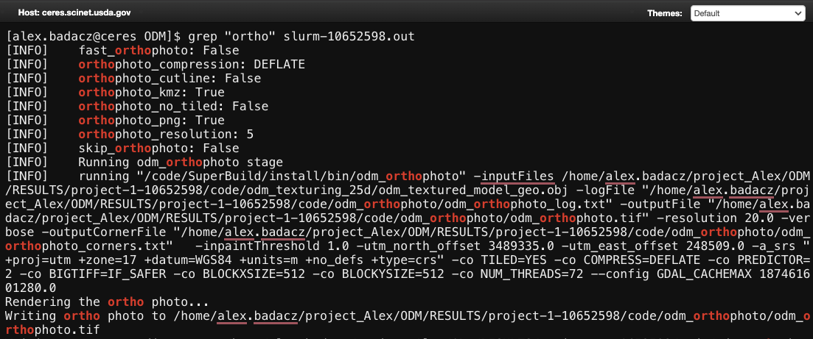
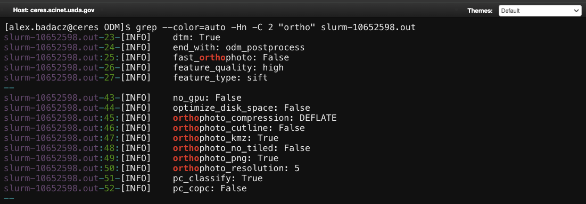
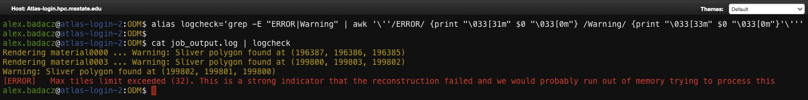
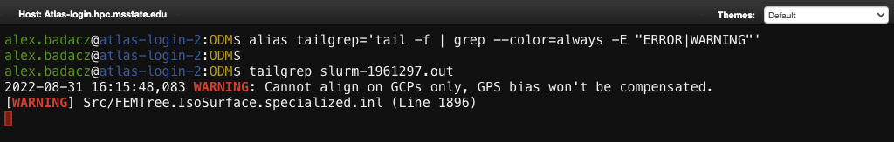
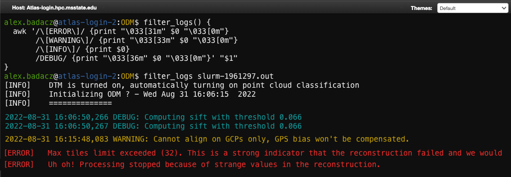

---

title: "Text coloring: <code>LS_COLORS</code>, <code>GREP_COLORS</code>"
description: "Color-based highlighting of command outputs, including file types in listings and matched patterns in search results."
type: interactive tutorial
order: 2
tags: [UNIX, ANSI codes, shell text coloring, text output styling, shell customization, LS_COLORS, GREP_COLORS, bashrc]
packages: 
level:
author: Aleksandra Badaczewska

---

## Overview

This interactive tutorial covers techniques to customize shell output for improved readability and organization by applying ANSI color codes and environment variables such as `LS_COLORS` and `GREP_COLORS`. You will learn how to colorize and highlight important information and enhance the visibility of different types of text output, such as differentiating file types, emphasizing matched patterns and distinguishing standard output from errors. All instructions are fully compatible with the SCINet HPC environment, making your cluster experience more intuitive and efficient in no time.
<br>

<div id="info-alerts-1" class="highlighted highlighted--info ">
<div class="highlighted__body"  markdown="1">
<h4 class="highlighted__heading">Main Objectives</h4>
* Understand how ANSI escape codes work and how they can be used for text styling in the shell.
* Gain practical skills for colorizing terminal output, such as enhancing `ls` and `grep` readability.
* Persist your customizations across sessions and ensure compatibility with different shells.
</div>
</div>

<div id="success-alerts-1" class="highlighted highlighted--success ">
<div class="highlighted__body"  markdown="1">
<h4 class="highlighted__heading">Goals</h4>
<p>By the end of this tutorial, you will:</p>
* Acquire knowledge of how to apply ANSI escape codes for effective text coloring in Bash shell.
* Develop confidence in setting the `LS_COLORS` and `GREP_COLORS` for improved text output readability on SCINet clusters.
* Learn how to save your configurations permanently in `.bashrc` or `.zshrc`.
* Understand how to troubleshoot common issues when working with shell customizations.
</div>
</div>


### Tutorial scope

This tutorial offers a comprehensive, hands-on guide to customizing shell environments using text output coloring and styling techniques. The focus is on practical, real-world applications of shell customization, including persistent configurations and troubleshooting for productivity and improved convenience on SCINet computing clusters.

<div class="usa-accordion">


<div id="scope-concepts" class="accordion_content" markdown="1">
* **ANSI escape codes:** Special sequences used in the terminal to control text appearance (color, bold, underline).
* **CLI text styling:** Adjusting terminal text with colors, effects (like bold or underline), and symbols to highlight important information.
* **LS_COLORS** and **GREP_COLORS**: Setting shell variables to differentiate file types in listings and matched patterns in search results.
* **Variable Persistence:** Techniques for storing customizations across sessions using configuration files like `.bashrc` or `.zshrc`.
</div>

 
<div id="scope-tools" class="accordion_content" markdown="1">
* **Bash shell:** A popular shell environment (command interpreter) available on most Unix-like and HPC systems.
* **Configuration file:** Text file like `.bashrc` or `.bash_profile` that define environment variables and other shell settings, including text coloring and prompt styles.
</div>

 
<div id="scope-apps" class="accordion_content" markdown="1">    
* **Text styling for readability:** Enhance terminal output with colored text for better visibility of errors and key results.
* **Persistent customization:** Apply long-term shell modifications by editing shell configuration files.
* **Troubleshooting in shell setups:** Resolve common HPC issues like unexpected color resets across login and compute nodes.
</div>
</div>


### Prerequisites 

[Pre-setup for shell customization on SCINet HPC](/computing-skills/command-line/cli-interface/shell/customization/index#prerequisites)

----

## **Text coloring for shell output**

In command-line environments, especially when working on High-Performance Computing (HPC) systems without a graphical interface, text coloring plays a crucial role in **enhancing the readability and processing efficiency of terminal output**. The visual distinction reduces the chances of missing critical information, improves productivity and enhances user comfort by making it easier to read, navigate and focus on essential details.

<div id="success-alerts-0" class="highlighted highlighted--success ">
<div class="highlighted__body" markdown="1">
Text coloring will enhance your command-line experience, helping you stay organized and efficient in an otherwise overwhelming text-heavy environment. 
Here’s how it can be particularly useful:

| tutorial section | brief explanation |
| --               | --                |
| [Enhancing command output clarity](#coloring-any-text-with-echo) | Use `echo -e` or `awk` with colored text to visually differentiate key outputs for better readability and faster navigation. |
| [Listing files and directories](#coloring-ls-output-with-ls_colors)    | Use colors to distinguish between file types (e.g., directories, executables, symbolic links), making navigation faster and more intuitive. |
| [Searching through results ](#coloring-grep-with-grep_colors)       | Highlight matching patterns when using tools like `grep` to quickly spot relevant lines in massive datasets. |
| [Highlighting errors and warnings](#highlighting-errors-and-warnings) | Easily differentiate between error messages, warnings and regular logs to quickly identify critical information. |
| [Monitoring system performance](#monitoring-system-performance)    | Enhance readability of real-time metrics by using color-coded output for resource utilization, completion statuses or performance metrics. |
| [Debugging and troubleshooting](#debugging-and-troubleshooting)    | Visually separate successful and failed operations to streamline the debugging process. |

</div>
</div>

Most of text coloring features are not enabled by default on HPC clusters, so to take advantage of them, you’ll need to customize your settings. All of them require using **[ANSI Escape Codes](#ansi-escape-codes)**. Once you're familiar with the basics, you can jump to the section that interests you the most and start customizing your shell environment.


### ANSI escape codes *(reference)*

<div id="note-alerts-1" class="highlighted highlighted--note ">
<div class="highlighted__body" markdown="1">
ANSI escape codes are special sequences of characters (e.g., `\e[1m]`) used to **control text formatting, color and other display attributes** in the command-line interface. When processed by the terminal, these codes alter the appearance of the text output by:
- changing text colors (red, green, yellow, etc.),
- changing background colors,
- effects like making text bold or adding underline

*ANSI codes are widely supported across various terminal emulators, making them a universal and portable tool for improving command-line interaction.*
</div>
</div>

#### Syntax of ANSI codes 

ANSI escape codes follow a standardized syntax that consists of a special escape character, followed by a sequence of characters that instruct the terminal to perform specific formatting actions.

The general syntax for an ANSI escape code in Bash is:
```bash
\e[<code>m                # or using an alternative format:   \033[<code>m
```

* `\e` or `\033` is the escape character (`ESC`), which signals the terminal to interpret the following sequence as an ANSI code.
* `[` indicates the start of the control sequence.
* `<code>` is one or more numeric codes specifying the desired text attribute (e.g., colors or styles).
* `m` marks the end of the sequence, signaling that the specified styles should be applied.

<div id="note-alerts-1" class="highlighted highlighted--highlighted ">
<div class="highlighted__body" markdown="1">
The specified color and formatting are applied to all text following the ANSI escape code until a reset code (`\e[0m`) is included, which restores the default terminal settings.

*Example usage in Bash:*
```bash
echo -e "\e[33mThis text is yellow\e[0m"
```

</div>
</div>


#### Common ANSI code categories

| text decoration    | text color            | background color        | example syntax | expected output |
|--------------------|-----------------------|-------------------------|----------------|-----------------|
|`0` - normal text /reset all attributes |`30` - <span style="background-color: white; color: black;"> black </span> | `40` - <span style="background-color: black; color: white;"> black </span> |
|`1` - **bold text** |`31` - <span style="background-color: white; color: red;"> red </span>     | `41` - <span style="background-color: red; color: white;"> red </span>     |
|`2` - dim text      |`32` - <span style="background-color: white; color: green;"> green </span> | `42` - <span style="background-color: green; color: white;"> green </span> |
|`3` - <i>italic</i>|`33` - <span style="background-color: black; color: yellow;"> yellow </span> | `43` - <span style="background-color: yellow; color: black;"> yellow </span> |
|`4` - <u>underlined text</u> |`34` - <span style="background-color: white; color: blue;"> blue </span>   | `44` - <span style="background-color: blue; color: white;"> blue </span>   |
|`5` - blinking text |`35` - <span style="background-color: white; color: purple;"> purple </span> | `45` - <span style="background-color: purple; color: white;"> purple </span> |
|`7` - reverse text color with a background |`36` - <span style="background-color: black; color: cyan;"> cyan </span>   | `46` - <span style="background-color: cyan; color: black;"> cyan </span>   |
|`9` - <del>strikethrough</del>   |`37` - <span style="background-color: black; color: lightgray;"> light-gray </span> | `47` - <span style="background-color: lightgray; color: black;"> light-gray </span> |


#### Combining multiple attributes is possible

Multiple formatting codes can be combined by separating them with semicolons (`;`), like this:
```bash
echo -e '\e[1;32;44mBold green text on a blue background\e[0m'
```
*This command applies bold (1), green text (32) and a blue background (44).*


### Coloring any text with `echo`

The `echo` command, combined with [ANSI escape codes](#ansi-escape-codes-reference), allows you to colorize and style text output directly in the terminal 
by embedding formatting instructions within the printed text.

The [general format](#syntax-of-ansi-codes) for colored text requires using `echo` command with `-e` flag:
```bash
echo -e '\e[<attribute>;<color_code>mCustom text\e[0m'
```

| \e[ | \<attribute\> | \<color_code\> | \e[0m |
| --  | --          | --           | --    |
| escape sequence to start the formatting | controls style like bold, underline, etc. | sets the text color | resets formatting to default after the text | 

*You can [combine any color and attribute](#combining-multiple-attributes-is-possible) for custom formatting!*


*Example 1:* **Bold red text**
```bash
echo -e '\e[1;31mThis is bold red text\e[0m'
```

*Example 2:* **Highlighted fragment of blue text**
```bash
echo -e " This is regular text \e[34mwith blue fragment highlighted\e[0m just in the middle."
```

*Example 3:* **Multicolored text**
```bash
echo -e '\e[31mRed \e[32mGreen \e[33mYellow \e[34mBlue \e[35mMagenta \e[36mCyan \e[0m Regular Text'
```

### Coloring text output with `awk`

The `awk` command is a versatile text-processing tool in Unix/Linux that allows you to manipulate and analyze text line by line. It can search patterns, perform actions and even colorize specific lines in command outputs when combined with [ANSI escape codes](#ansi-escape-codes-reference).

<div id="success-alerts-0" class="highlighted highlighted--success ">
<div class="highlighted__body" markdown="1">
By combining awk with ANSI escape codes, you can dynamically color parts of the output in the shell, making it easier to visually distinguish important sections, like headers, errors or summaries.
</div>
</div>

<div id="success-alerts-0" class="highlighted highlighted--warning ">
<div class="highlighted__body" markdown="1">
Use `\033` with **awk** or **sed** commands for reliable ANSI escape sequences, while `\e` can be used in shell scripts (bash) and commands like **echo**.
- `\033` is the octal representation of the ASCII escape character; it is equal to 27 (decimal), which is the escape code that signals terminal commands for color or formatting; **universally recognized**
- `\e` is the named escape sequence that represents the same ASCII escape character. 
</div>
</div>

In `awk` command, the ANSI codes are included inside the `{}` action block using `print` statements.
```bash
awk '{print "\033[1;34m" $0 "\033[0m"}'       # with awk always use \033 and not \e escape code
```
*where:* `\e[1;31m` turns on <b style="color: red;">bold red</b> text; `$0` prints the entire text line; `\e[0m` resets the color to normal

*Example 1:* **Distinguishing headers in command results**
```bash
ls --color=always -l | awk 'NR==1 {print "\033[1;31m" $0 "\033[0m"; next} {print $0}'
```
- `ls -l`: Lists files in long format, showing details like permissions, owner, size and modification date.
- `awk` logic:
  - `NR==1`: Refers to the first row of the output (the header row showing column names like `total`, `permissions`, etc.).
  - `{print "\033[1;34m" $0 "\033[0m"}`: awk print statement *(as explained above)*
  - `next`: Moves to the next line, so only the header is colored.
- `{print $0}`: Prints all subsequent rows with default colors.


## Coloring `ls` output with `LS_COLORS`

The `ls` command can display directory listings in color to differentiate file types, permissions and more. 


If your `ls` command shows plain, uncolored and unformatted text in the shell, enhance it by adding the `--color=auto` argument. 
```bash
ls --color=auto 
```

While this works as a quick fix, typing it daily and repeatedly can become tedious. A better long-term solution is to create an alias 
that overwrites the default behavior of `ls` command or define a new one.

#### Create an alias

**To create an alias that overwrites the default `ls` behavior**, add the following line to your shell configuration file (i.e., `~/.bashrc`):
```bash
alias ls='ls --color=auto'
```
**For a new command alias use:**
```bash
alias lsc='ls --color=auto'         # use lsc or a customized name for the alias
```
Then, apply the changes and try an updated command:
```bash
source ~/.bashrc
ls                      # or lsc
```

<div id="note-alerts-1" class="highlighted highlighted--note ">
<div class="highlighted__body" markdown="1">
The `ls --color=auto` command highlights file types and attributes using default colors (e.g., blue for directories, green for executables) 
and can be customized via the **LS_COLORS** environment variable.
</div>
</div>

#### View current LS_COLORS

The customized coloring is controlled by the **LS_COLORS** environment variable. `LS_COLORS` variable defines how file types, 
extensions and other attributes are displayed (formatted) in a shell.

To see your current color settings:
```bash
echo $LS_COLORS
```

<div id="note-alerts-1" class="highlighted highlighted--highlighted ">
<div class="highlighted__body" markdown="1">
By default, on both clusters, the `LS_COLORS` variable is empty, meaning no custom color settings are applied. 

On Ceres, the default `ls` coloring is also switched off, so file listings will appear without any color unless explicitly enabled. 
To enable coloring, you should:
- [Create an alias](#create-an-alias) for `ls --color=auto`
- [Customize LS_COLORS](#customize-ls_colors) variable
</div>
</div>


#### Syntax and keys

The format is a colon-separated (`:`) list of key-value pairs: `KEY=VALUE:KEY=VALUE`, where:
- `KEY` specifies the type of file or file extension.
- `VALUE` specifies the color and attributes (e.g., bold, underline) using [ANSI codes](#ansi-escape-codes-reference).

*For example:*
```bash
LS_COLORS='di=34:fi=0:ln=36'               # di=34:
```
*sets `di` - directories to <span style="color: blue;">blue</span>, `fi` - regular files to the default color and `ln` - symbolic links to cyan.*

The `VALUE` can include **multiple attributes** for a single element by combining ANSI codes using semicolons (`;`). 

*For example:*
```bash
LS_COLORS='di=1;34:fi=0:ln=36'              # di=1;34:
```
<i>to set directories (`di`) to display as <span style="color: blue;"><b>bold blue</b></span>, 
you would combine the color code for blue (`34`) with the code for bold (`1`).</i>

Here's the reference list with the most commonly useful keys for LS_COLORS:

| key  | description                  | setting   | expected formatting | comment |
|------|------------------------------|-----------|---------------------|---------|
| `di` | Directory                    | `di=1;34` | <b style="color: blue">bold blue</b> | Directories are highlighted in bold blue, making them easy to distinguish in large file lists.|
| `fi` | Regular file                 | `fi=1;37` | <b style="color: white; background-color: black;">bold white</b> | Regular files are shown in bold white, useful for highlighting important data files. |
| `ln` | Symbolic link                | `ln=3;36` | <i style="color: cyan; background-color: black;">italic cyan</i> | Symbolic links are displayed in italic cyan for visibility when linking files or directories.      |
| `ex` | Executable file              | `ex=1;32` | <b style="color: green">bold green</b> | Executables are displayed in bold green, making them stand out among scripts or binaries. |
| `or` | Orphaned symbolic link       | `or=3;31` | <i style="color: red;">italic red</i> | Broken links are shown in italic red, helping to identify and fix missing references. |
| `mi` | Missing file (broken link)   | `mi=5;31` | <span style="color:red;">blinking red</span> | Similar to orphaned links, broken symbolic links are highlighted in blinking red. |
| `pi` | Named pipe (FIFO)            | `pi=33`   | <span style="color: yellow; background-color: black;">yellow</span> | Pipes are displayed in yellow, indicating intermediate processing components in workflows. |
| `ow` | Other writable directory     | `ow=1;33` | <b style="color: yellow; background-color: black;">bold yellow</b> | Writable directories are shown in bold yellow, alerting users to shared or risky access. |
| `tw` | Sticky, other writable dir   | `tw=1;33` | <b style="color: yellow; background-color: black;">bold yellow</b> | Sticky writable directories are shown in bold yellow to identify them for permission management. |
| `ca` | File with capability set     | `ca=1;35` | <b style="color: purple;">bold purple</b> | Files with special privileges are highlighted in bold purple, indicating extra caution is needed. |

<div id="note-alerts-1" class="highlighted highlighted--tip ">
<div class="highlighted__body" markdown="1">
Besides the built-in keys like `di` or `fi`, you can define custom keys to apply specific colors and attributes to **any file format** based on its extension. 
To do this, use the file extension as the key in the `LS_COLORS` variable. 

*For example:*
```bash
LS_COLORS='*.log=1;31:*.png=1;35'
```
- `*.log=1;31` - highlights log files in <b style="color: red;">bold red</b>
- `*.png=1;35` - highlights PNG image files in <b style="color: purple;">bold purple</b>

*This allows you to easily distinguish between different file types and prioritize them visually in directory listings.*
</div>
</div>


#### Customize LS_COLORS

To customize colors, you can define them directly by modifying the `LS_COLORS` variable in your startup script (`~/.bashrc`).

<div id="note-alerts-1" class="highlighted highlighted--warning ">
<div class="highlighted__body" markdown="1">
Before assigning/exporting a new value to the `LS_COLORS` variable, check if it is already defined in your `~/.bashrc` to avoid duplicated definitions.
```bash
grep "LS_COLORS" ~/.bashrc
``` 
</div>
</div>

- edit your config file using nano (`nano ~/.bashrc`)
- assign a new settings to `LS_COLORS` variable and export it:
```bash
export LS_COLORS='di=01;34:ln=01;36:so=01;35:*.sh=01;32:*.log=01;33'
```
- reload the shell configuration *(to apply changes also in a current shell)*:
```bash
source ~/.bashrc
```


## Coloring `grep` with `GREP_COLORS`

<div id="note-alerts-1" class="highlighted highlighted--note ">
<div class="highlighted__body" markdown="1">
Global Regular Expression Print, i.e., `grep` command is a powerful command-line utility used for searching text patterns in files or output streams, 
commonly used on high-performance computing (HPC) systems to find relevant information within massive log files, scripts or command outputs.
```bash
grep "Text" file
```
</div>
</div>

Unformatted text output from `grep` can be hard to parse visually when dealing with large data sets, especially on HPC systems where log files are enormous. 
Coloring the output helps you quickly distinguish matches, filenames, line numbers and contextual information.

<div id="note-alerts-1" class="highlighted highlighted--highlighted ">
<div class="highlighted__body" markdown="1">
**On both SCINet clusters**, `grep` coloring by default highlights **matched words** in <b style="color: red;">bold red</b>, 
making it easier to spot search results quickly. This indicates that `grep` on Atlas and Ceres is by default an alias to `grep --color=auto`, 
automatically enabling color when outputting to a terminal.


</div>
</div>

### Useful grep flags for coloring

<div id="note-alerts-1" class="highlighted highlighted--note ">
<div class="highlighted__body" markdown="1">
The `--color` flag is the main option in `grep` that controls whether matched text is highlighted using colors. <br>It has three variants:
- `--color=auto`: (**default**) text coloring only when the output is directed to a terminal
- `--color=always`: colorized, even when piping or redirecting *(useful with commands like `less -R`)*
- `--color=never`: disables coloring entirely, useful for plain-text output

***The `--color` flag works in combination with `GREP_COLORS` to customize the color scheme.*** <br><br>

<div class="usa-accordion">


<div id="grep-coloring-1" class="accordion_content" markdown="1">

| flag           | description                                                      | example                                    |
|----------------|------------------------------------------------------------------|--------------------------------------------|
| `-H`           | Shows the filename before each match.                            | `grep -H "pattern" file1.txt file2.txt`    |
| `-n`           | Displays the line number of each match.                          | `grep -n "pattern" file.txt`               |
| `-C`           | Displays lines of context before and after each match.           | `grep -C 2 "pattern" file.txt`             |
| `-A`           | Displays lines after each match.                                 | `grep -A 3 "pattern" file.txt`             |
| `-B`           | Displays lines before each match.                                | `grep -B 3 "pattern" file.txt`             |
| `-e`           | Searches for multiple patterns.                                  | `grep -e "error" -e "warning" file.txt`    |
| `-r` / `-R`    | Searches directories recursively.                                | `grep -r "pattern" /path/to/logs/`         |
| `-i`           | Performs a case-insensitive search.                              | `grep -i "pattern" file.txt`               |
| `-o`           | Displays only the matched part of a line, not the entire line.   | `grep -o "error" file.log`                 |

</div>
</div>

</div>
</div>


The environment variable **GREP_COLORS** allows you to customize the color scheme of various parts of the `grep` output. <br>
Here's how specific `grep` flags link directly to customizable components in `GREP_COLORS`:

| GREP_COLORS(key)    | example_settings_         | grep_option      | *What it affects?*                                                    |
|---------------------|-------------------------|------------------|-----------------------------------------------------------------------|
| `mt` (matched_text) | `mt=1;31` <b style="color: red;">bold_red</b> | `--color` | Colors the matching portion of the line. |
|                     |                         | `-o`             | Displays and colors only the matched part of a line. |
| `fn` (file_name)    | `fn=35` <span style="color: purple;">purple</span>    | `-H` | Colors the filename when searching through multiple files. |
|                     |                         | `-r` / `-R`      | Colors the filenames for matches across directories. |
| `ln` (line_number)  | `ln=32` <span style="color: green;">green</span>      | `-n` | Colors the line number in the output. |
| `se` (separator)    | `se=36` <span style="color: cyan; background-color: black;">cyan</span> | `-C`, `-A`, `-B` | Colors the `--` separator when showing lines <br>around the match. |


**SYNTAX:**
```bash
GREP_COLORS='mt=<codes>:fn=<codes>:ln=<codes>:se=<codes>'       #keys: mt, fn, ln, se
```

**DEFAULT:**
```bash
GREP_COLORS='mt=1;31:fn=35:ln=32:se=36'
```
*This setting customizes grep output by highlighting matched text in <b style="color:red;">bold red</b> (`mt=1;31`), filenames in <span style="color: purple;">purple</span> (`fn=35`), line numbers in <span style="color:green;">green</span> (`ln=32`) and context separators (--) in <span style="color: cyan; background-color: black;">cyan</span> (`se=36`).*

Test the default settings:
```bash
grep --color=auto -Hn -C 2 "pattern" slurm-logfile.out 
```
*This command is looking for occurrences of "pattern" in the log file, showing 2 lines of context before and after any match.*

- On the far left, you can see the `filename` repeated in every output line *(<span style="color:purple;">slurm-10652598.out</span>)*. 
  - *This is because the `-H` option is being used, and filenames are color-coded in purple due to `fn` setting in GREP_COLORS.*
- Next to the filename, you see `line numbers` in green (<span style="color: green;">24, 44</span>, etc.). 
  - *This is enabled by the `-n` flag and colored using the `ln` setting in GREP_COLORS.*
- The `matching pattern`/keyword <b style="color: red;">ortho</b> is highlighted in bold red. 
  - *This is the default coloring for matches using the `mt` setting in GREP_COLORS.*
- The `-C 2` option displays 2 lines before and after each match, giving you context about the log entries.
  - *The <span style="color:cyan; background-color: black;">- -</span> seen between sections (colored cyan by default with using `se`) marks the break between different matches.*
  - *The `-C N` option in grep is particularly useful when you want to extract `N` lines that are positionally related to the matched lines but don’t contain the shared pattern themselves.*


#### Customize GREP_COLORS

To take full control of the colors, set the `GREP_COLORS` variable.

**1.** Define it in your terminal for a current session only: *([explore more ANSI color codes](#ansi-escape-codes-reference))*
```bash
export GREP_COLORS='mt=1;33:fn=3;31:ln=46:se=36'
```
*This setting customizes grep output by highlighting matched text in <b style="color: yellow; background-color: black;">bold yellow</b> (`mt=1;33`), filenames in <i style="color: red;">italic red</i> (`fn=3;31`), line numbers in <span style="background-color: cyan;">cyan background</span> (`ln=46`) and context separators (--) in <span style="color: cyan; background-color: black;">cyan</span> text (se=36).*

**2.** Test it with `grep` command:
```bash
grep --color=always "pattern" filename
```
*The `--color=always` forces colors even when the output is piped.*


**3.** Make it permanent by adding the variable to your shell config (`~/.bashrc`):

<div id="note-alerts-1" class="highlighted highlighted--warning ">
<div class="highlighted__body" markdown="1">
Before assigning/exporting a new value to the `GREP_COLORS` variable, check if it is already defined in your `~/.bashrc` to avoid duplicated definitions.
```bash
grep "GREP_COLORS" ~/.bashrc
``` 
</div>
</div>

- edit your config file using nano (`nano ~/.bashrc`)
- assign a new settings to `GREP_COLORS` variable and export it:
```bash
export GREP_COLORS='mt=1;33:fn=3;31:ln=46:se=36'
```
- reload the shell configuration *(to apply changes also in a current shell)*:
```bash
source ~/.bashrc
``` 

## Highlighting errors and warnings 

<div id="note-alerts-1" class="highlighted highlighted--note ">
<div class="highlighted__body" markdown="1">
By using colors to distinguish between different types of messages such as `errors`, `warnings` and `informational logs`, users can quickly interpret results, debug issues and monitor the progress of their jobs more effectively. 
</div>
</div>

In HPC environments, where job logs and outputs can be extensive, visually distinguishing errors from warnings and regular messages is critical. 

**Use color to highlight severity levels:**
```bash
grep -nE "ERROR|Warning" job_output.log | awk '/ERROR/ {print "\033[31m" $0 "\033[0m"} /Warning/ {print "\033[33m" $0 "\033[0m"}'
```
*This command searches for ERROR and WARNING and color-codes them (<span style="color: red">red for errors</span>, <span style="color: yellow; background-color: black;">yellow for warnings</span>), helping you quickly spot critical issues without manually filtering large log files.*


#### <span style="font-size:1.34rem">Set permanent solutions</span>

**A) Create persistent aliases for log highlighting**

You can create shell aliases to quickly filter and colorize logs.
```bash
# Add this to your .bashrc file to make settings persistent
alias logcheck='grep -E "ERROR|Warning" | awk '\''/ERROR/ {print "\033[31m" $0 "\033[0m"} /Warning/ {print "\033[33m" $0 "\033[0m"}'\'''
```
***How to use it?***
```bash
cat job_output.log | logcheck
```
*Your custom `logcheck` command will instantly highlight errors (red) and warnings (yellow) without retyping the full command.*



**B) Alternatively, create a more general-purpose log scanner function**

```bash
# Add this to your .bashrc file to make settings persistent
logscan() {
  A=$(echo "$1" | awk -F"|" '{print $1}')
  B=$(echo "$1" | awk -F"|" '{print $2}')
  grep -E "$1" "$2" | awk -v A="$A" -v B="$B" '$0 ~ A {print "\033[31m" $0 "\033[0m"} $0 ~ B {print "\033[33m" $0 "\033[0m"}'
}
```
***How to use it?***
```bash
logscan "ERROR|WARNING" job_output.log            # test other search patterns, e.g., "False|True"
```
*Your custom `logscan` command will instantly highlight first pattern (*ERROR*) in red and the second pattern (*Warning*) in yellow.*


## Monitoring system performance 

Real-time system monitoring on HPC clusters involves tracking resource usage (CPU, memory, disk, network) to detect bottlenecks, 
optimize job performance and ensure efficient resource allocation. By using color-coded indicators, 
critical metrics such as high CPU or memory usage can be highlighted, making it easier to identify potential issues at a glance. 
This allows you to monitor resource usage in real time while testing and refining your pipeline in an interactive session on a compute node. Based on the observed metrics, **you can accurately assess the resources needed to submit optimized production jobs to the cluster's queue**.

**A) Highlighting tasks with high CPU usage**

```bash
top -b -n 1 | awk 'NR <= 7 {print} NR > 7 && $9 > 10 { if ($9 > 80) printf "\033[31m%s\033[0m\n", $0; else print $0 }'
```
*This command runs `top` in batch mode and use `awk`-based filtering to:* 
- *keep the headers:* `NR <= 7 {print}`
- *hides processes using 10% or less CPU:* `NR > 7 && $9 > 10`
- *highlights those using over 80% in red:* `{ if ($9 > 80) printf "\033[31m%s\033[0m\n", $0; else print $0 }`

**Real-time monitoring of CPU usage**

Using `top` combined with `awk` displays a one-time snapshot of resource usage, while embedding it in `watch` continuously updates the output at regular intervals, providing real-time monitoring.

```bash
watch -c "top -b -n 1 | awk 'NR <= 7 {print} NR > 7 && \$9 > 10 { if (\$9 > 80) printf \"\033[31m%s\033[0m\n\", \$0; else print \$0 }'"
```
*This monitors CPU usage every 2 seconds, filters jobs with CPU usage >10% and highlights processes with CPU >80% in red.* 
- *The `-c` option in `watch` enables the display of ANSI colors in the output.*


<div id="note-alerts-1" class="highlighted highlighted--tip ">
<div class="highlighted__body" markdown="1">
Customize thresholds or add memory checks to gain deeper insights into potential resource bottlenecks during job execution.
</div>
</div>

**B) Monitor the status of your submitted jobs**

Monitoring your jobs in the SLURM queue with color-coded output helps you quickly identify their status at a glance, saving time when managing multiple jobs.

For example, you can highlight running, pending and failed jobs in different colors to efficiently track the progress and prioritize troubleshooting.

```bash
squeue -u $USER | awk 'NR == 1 {print} 
    / R / {print "\033[32m" $0 "\033[0m"}             
    / PD / {print "\033[33m" $0 "\033[0m"}            
    / F / {print "\033[31m" $0 "\033[0m"}'

# Green (\033[32m) for running jobs # Yellow (\033[33m) for jobs waiting in the queue # Red (\033[31m) for jobs that have failed
```


**C) Monitor resource usage of your jobs**

You can extend the `squeue` command to check resource requests like CPU time or memory limits and color-code them.

```bash
squeue -u $USER -o "%.18i %.8j %.8u %.10M %.6D %.6C %.10L %.6t" | awk 'NR == 1 {print} 
    $6 > 8 {print "\033[31m" $0 "\033[0m"} 
    $6 >= 4 && $6 <= 8 {print "\033[33m" $0 "\033[0m"} 
    $6 < 4 {print "\033[32m" $0 "\033[0m"}'

# Green (\033[32m) for running jobs # Yellow (\033[33m) for jobs waiting in the queue # Red (\033[31m) for jobs that have failed
```
- *The `-o` flag customizes the output to display columns like `job ID`, `name`, `user`, `memory` and `CPU usage`.*
- *The coloring logic is based on CPUs used (`$6`):*
    - *more than 8 CPUs: <span style="color: red;">Red for high usage</span>*
    - *between 4 and 8 CPUs: <span style="color: yellow;background-color: black;">Yellow for medium usage</span>*
    - *less than 4 CPUs: <span style="color: green">Green for low usage</span>*


<div id="note-alerts-1" class="highlighted highlighted--tip ">
<div class="highlighted__body" markdown="1">
You can use an awk-based coloring approach to easily analyze **resource usage and job statuses in your completed jobs** by combining it with the `sacct` command, helping you quickly spot high memory usage, long runtimes or failed jobs.
```bash
sacct -j JOBID --format=JobID,JobName,Elapsed,State,MaxRSS,CPUTime,ExitCode | awk 'NR == 1 {print} 
    /FAILED|CANCELLED/ {print "\033[31m" $0 "\033[0m"} 
    /COMPLETED/ && $5 ~ /[0-9]+G/ {print "\033[33m" $0 "\033[0m"} 
    /COMPLETED/ && $5 ~ /[0-9]+M/ {print "\033[32m" $0 "\033[0m"}'
```
In this example:
- *Red: Failed or canceled jobs.*
- *Yellow: Completed jobs that consumed large memory (in GB).*
- *Green: Jobs with moderate memory usage (in MB).*

***NOTE:*** *To use this method, you need to know the `JOBID` of the completed or running job.*
</div>
</div>


## Debugging and troubleshooting

<div id="note-alerts-1" class="highlighted highlighted--warning ">
<div class="highlighted__body" markdown="1">
**Search patterns in aliases are not case-sensitive by default** unless specified, so they will only match exact cases (e.g., "ERROR" vs. "error"). Be sure to customize these patterns to match the specific messages or keywords relevant to your applications for effective filtering and debugging.
</div>
</div>

**A) Catch errors in log files in real time**

While running test job in the interactive session on a compute node, you can use `tail -f` to monitor the job’s progress and detect errors or warnings early.

<div id="note-alerts-1" class="highlighted highlighted--note ">
<div class="highlighted__body" markdown="1">
By default, `tail` displays the last few lines of a file (typically the last 10 lines). The `-f` stands for follow, meaning it will keep running and **display new lines as they are appended to the file**. You might use this to monitor logs in real time, especially in SCINet HPC environment.
```bash
tail -f slurm-16364729.out 
```
</div>
</div>

You can create a custom alias like `taildebug` to filter and highlight only errors and warnings in real time from a log file, allowing you to skip all irrelevant lines and focus on critical debug information.
```bash
# Add this to your .bashrc file to make settings persistent
alias tailgrep='tail -f | grep --color=always -E "ERROR|WARNING"'
```
***How to use it?*** <br>
*For best results, run your job in one shell window and monitor the filtered log output in the other one (e.g., [launched via OOD](/computing-skills/command-line/cli-interface/concepts/cli-scinet-hpc#web-based-access-to-hpc-cli)).*
```bash
tailgrep slurm-16364729.out 
```


**B) Separate successful steps in real time**

Efficient debugging in HPC requires clear identification of success and failure states, especially in complex multi-node jobs. <br>
Separate successful operations from errors:
```bash
# Add this to your .bashrc file to make settings persistent
alias tailawk='tail -f | awk '\''/SUCCESS/ {print "\033[32m" $0 "\033[0m"} /FAILED/ {print "\033[31m" $0 "\033[0m"}'\'''
# Other useful keywords include: DONE, FINISHED, DEBUG; 
```
***How to use it?*** <br>
*For best results, run your job in one shell window and monitor the filtered log output in the other one (e.g., [launched via OOD](/computing-skills/command-line/cli-interface/concepts/cli-scinet-hpc#web-based-access-to-hpc-cli)).*
```bash
tailawk slurm-16364729.out 
```
*As job outputs are appended to logs in real time, this command highlights successful messages in green and failures in red, making it easy to spot problems while the job is still running.*


**C) Advanced highlighting with multicolor debug**

If you want to highlight more categories (e.g., `INFO`, `DEBUG`, `CRITICAL`) with distinct colors, you can define functions:
```bash
filter_logs() {
  awk '/\[ERROR\]/ {print "\033[31m" $0 "\033[0m"} 
       /WARNING/ {print "\033[33m" $0 "\033[0m"} 
       /\[INFO\]/ {print $0} 
       /DEBUG/ {print "\033[36m" $0 "\033[0m"}' "$1"
}
```



## **Troubleshooting common issues**

<div class="usa-accordion">


<div id="coloring-custom-1" class="accordion_content" markdown="1">
**SYMPTOMS:** No color in grep output.

**SOLUTIONS:** Ensure your terminal supports [ANSI color codes](#ansi-escape-codes-reference).
```bash
# test with echo -e 
echo -e "\033[31mRed Text\033[0m"
```

**SYMPTOMS:** Color disappears when grep output is piped.

**SOLUTIONS:** Use `--color=always` when you pipe grep:
```bash
grep --color=always "pattern" file.txt | less -R
```
*The `-R` option in `less` preserves color codes.*

<div id="note-alerts-1" class="highlighted highlighted--tip ">
<div class="highlighted__body" markdown="1">
Avoid conflicting grep settings, for example, ensure no existing aliases like <br>`alias grep="grep --color=never"` are disabling color.
</div>
</div>

</div>

</div>
