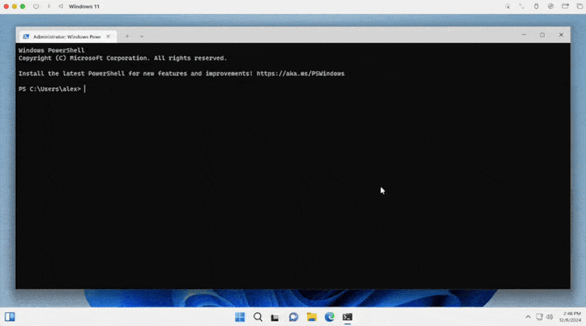
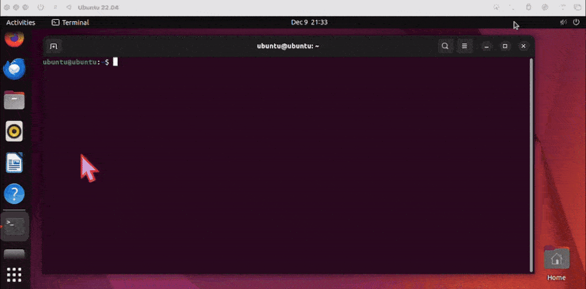
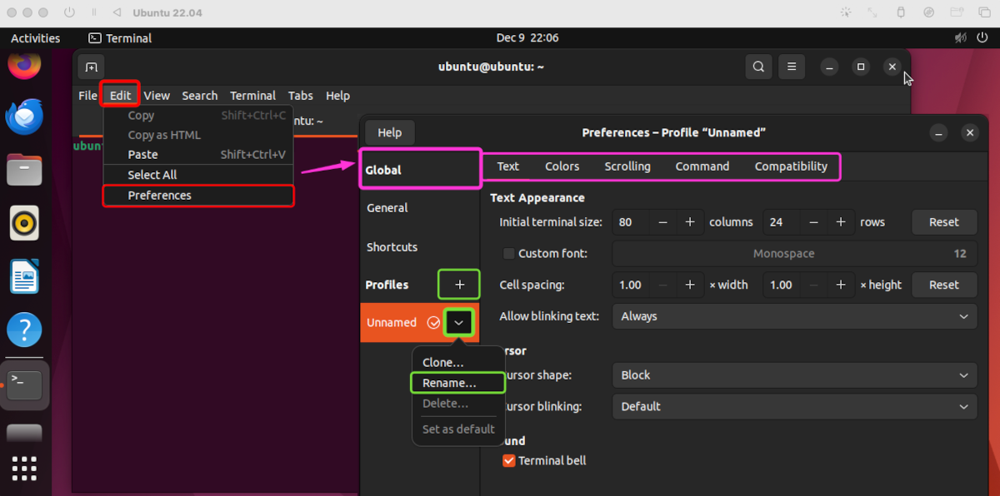
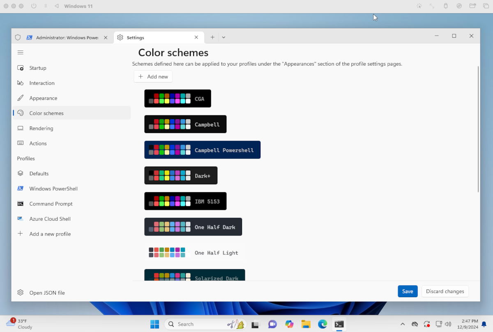
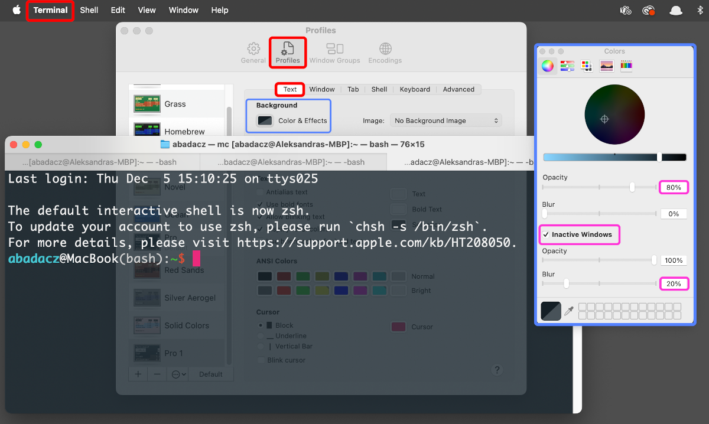
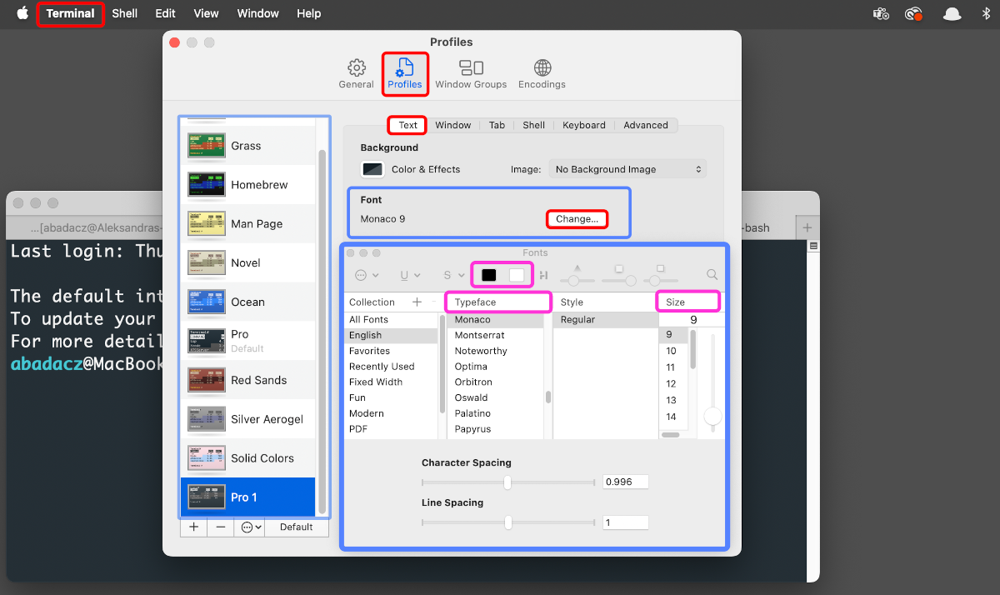
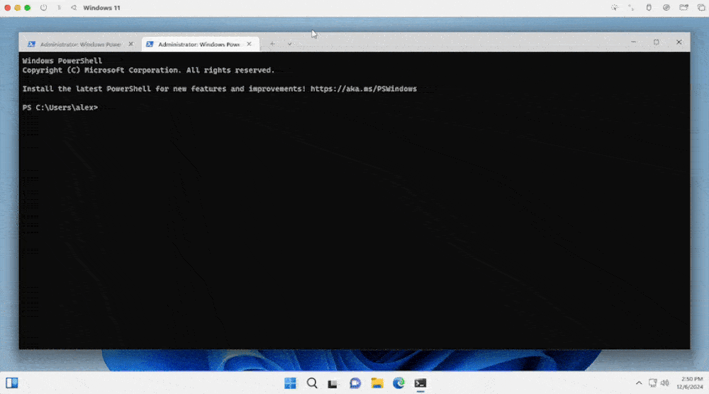
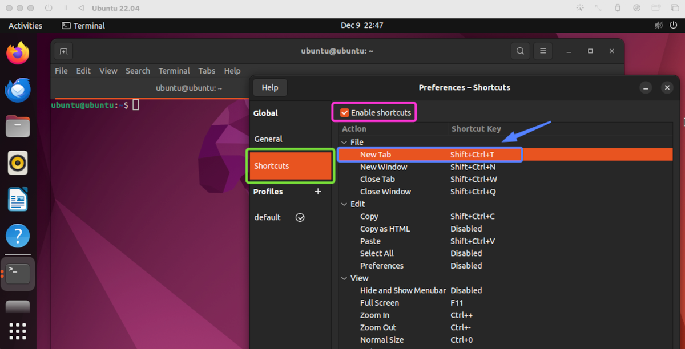
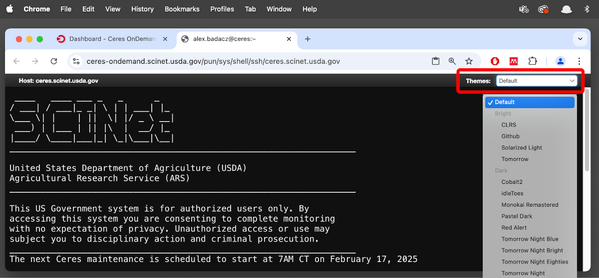
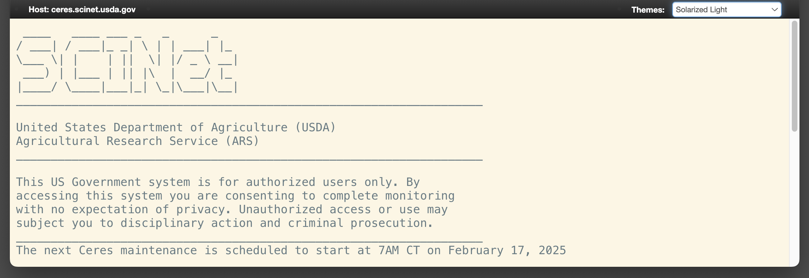

---

title: Terminal customization
description: "Cross-platform terminal settings for visual comfort and enhanced usability."
type: interactive tutorial
order: 1
tags: [terminal, CLI, text-based interface, customization]
packages: 
level: 
author: Aleksandra Badaczewska

---

## Overview

This interactive tutorial focuses on guiding you through the process of customizing terminal applications across different platforms 
with practical instructions for adjusting your terminal window on SCINet clusters.  By understanding how to adjust themes, 
configure tabs and panes and modify appearance settings, you will create a tailored and efficient terminal environment to enhance your productivity and user experience. 

<h4 class="highlighted__heading">Main Objectives</h4>
* Learn the methods and tools required to customize terminal applications across platforms.
* Understand the key interface elements and settings available in popular terminal (emulators).
* Demonstrate how to modify themes, adjust fonts, configure tabs and panes and create custom profiles.

<h4 class="highlighted__heading">Goals</h4>
By the end of this tutorial, you will:
* Gain the confidence to navigate and configure terminal settings to improve usability and efficiency.
* Acquire general knowledge of cross-platform customization options in GNOME Terminal, Terminal.app, and Windows Terminal.
* Successfully personalize the appearance and layout of a terminal window when working on SCINet HPC.

### Tutorial scope

This tutorial provides a guide to personalize terminal applications across platforms to enhance usability and comfort of your daily work on a SCINet HPC. 
Experiment with these settings to create a terminal environment tailored to your preferences.



* **Terminal:** A text-based interface tool for interacting with an operating system.
* **Customization:** Techniques to personalize terminal appearance, layout and settings independent of shell configuration.
* **Cross-Platform Support:** Understanding customization features across popular terminal applications (GNOME Terminal, Terminal.app and Windows Terminal).

 

* **GNOME Terminal:** A widely-used terminal application for Linux environments.
* **Terminal.app:** The built-in terminal application for macOS users.
* **Windows Terminal:** A modern terminal application for Windows with support for multiple profiles and themes.

 

    
* **Appearance Customization:** Changing themes, fonts and backgrounds to personalize the terminal experience.
* **Efficient Workflow:** Using multiple tabs, panes and shortcuts to streamline multitasking.
* **Platform Consistency:** Adapting terminal settings across operating systems for a cohesive working environment.

----

## Multiple tabs or panes

Organizing your terminal workflow by using multiple tabs or panes allows you to run and monitor different tasks simultaneously. 
**Tabs** help separate sessions, while **panes** split the terminal into sections for side-by-side operations.

 

1. Open a new tab with `Ctrl` + `Shift` + `T`.
2. Switch tabs with `Ctrl` + `Tab` or use the mouse.
3. Split panes:
  - Use `Alt` + `Shift` + `-` for horizontal split.
  - Use `Alt` + `Shift` + `+` for vertical.
  - Navigate between panes using `Alt` + Arrow Key or use a mouse to point-and-click.
4. Merge/close panes:
  - Click on the pane you want to close to bring it into focus.
  - Press `Ctrl` + `Shift` + `W` to close the pane.
  - The remaining panes will automatically adjust to fill the space.
5. Resize panes:
  - Hold down `Alt` + `Shift`, then use the arrow keys to resize the focused pane.



1. Open a new tab with `⌘` + `T`.
2. Switch between tabs with `⌘` + left/right arrow or click the tab bar.
3. Split panes:
  - Click the top-right edge of the terminal to horizontally split a Pane.
  - Click a lower icon to merge back the panes.



1. Open a new tab with `Ctrl` + `Shift` + `T` or by clicking the `+` button at the top bar or select `new Tab` from **File** menu.
2. Switch between tabs using `Alt` + tab number, e.g., `1` or `2`.
  
3. Open a new pane:
  - Install `tmux` or use a terminal multiplexer to split panes inside the terminal.
4. If **Menubar** is not visible by default, right-click inside terminal window and check `Show Menubar`. 
  
  - The Menubar includes the following tabs: `File`, `Edit`, `View`, `Search`, `Terminal`, `Tabs` and `Help`.

----

## Setting Up Profiles

Profiles store unique settings for terminal sessions, enabling you to switch quickly between different configurations tailored to specific tasks or preferences. 
Each profile can have distinct themes, fonts or startup commands.

 

1. **Add a new Profile**
  - Open `Settings` and navigate to the `Profiles` section.
    - Click the `Add a new profile` button *(located at the bottom of the options menu on the left)*.
    - Customize the profile's appearance and commands as desired.
2. **Set up startup preferences**
  - In `Settings`, click on `Startup` to configure basic terminal settings:
    - **Default profile:** Choose the profile to load by default (e.g., PowerShell, Command Prompt, Azure Cloud Shell or any custom profile).
    - **Default terminal application:** Select between `Windows Console` and `Windows Terminal`.
    - Enable `Launch on machine startup` to automatically open the terminal when your machine starts.
    - Adjust the `Launch (window) size` to set the terminal's initial dimensions.
3. **Customize interaction settings**
  - In `Settings`, navigate to `Interaction` to configure in-terminal behaviors:
    - Enable `Automatically copy selection to clipboard` to copy text to the clipboard by default.
    - Turn on `Remove trailing white-space` when copying and pasting.
    - Enable `Automatically detect URLs` to make links clickable.
    - Set warnings for closing multiple tabs, and configure additional interaction options.
4. **Apply general settings to all profiles**
  - In `Settings`, under `Defaults`, customize settings that apply to all profiles:
    - Specify a   Starting directory` for new terminal sessions.
    - Set a `Tab title` to pass to the shell on startup.
    - Enable opening the terminal in an `Administrator Window` by default.
    - Use the **Additional settings** section to fine-tune `Appearance` and other `Advanced` options.



1. In **Terminal** > **Settings** > **Profiles**, duplicate an existing profile or create a new one.
2. Customize and save it with a new name.



1. Go to **Edit** > **Preferences** > **Profiles** > `+`.
2. Rename a new prfile, customize it and set it as default.

### Changing themes

Themes control the overall appearance of the terminal, including color schemes for text, backgrounds and interface elements. 
Customizing themes enhances visual clarity and comfort during extended usage.

 

1. Open **Settings** (click the down-arrow next to tabs or press `Ctrl` + `,`).
2. Customize the theme for the default profile:
  - Under `Appearance`, elect `Application Theme` to work in dark or light mode.
  - Under `Color schemes`, customize terminal background color.
3. Under **Profiles**, select a specific profile to modify its appearance (e.g., PowerShell, Command Prompt).
  - Under `Additional settings` modify the **Appearance** section:
  - Change the `Color scheme` by selecting a pre-defined one (e.g., *One Half Dark*, *Solarized Dark*).
  - Adjust the `Cursor`, `Background image`,  `text formatting` and `Transparency`, if desired.
4. Save your changes.



1. Open Preferences (`⌘` + `,`).
2. Navigate to the **Profiles** tab.
3. Select a pre-installed theme (e.g., *Basic*, *Grass*, *Novel*).
4. Click `Default` to set it as the default profile.
5. For more customization:
  - Adjust colors, text styles, and background transparency under **Text and Colors**.
  - Save your changes as a new profile.



1. Open **Preferences** from the `Edit` menu or right-click in the terminal and select **Preferences**.
2. Select **General** tab in the left-sidebar.
3. Select the **Theme variant**: `Default`, `Light` or `Dark`.
4. Decide to open new terminal instances in a new window or as a tab.

### Background colors

Adjusting background colors or transparency helps reduce eye strain and improve focus. 
You can select from predefined colors or set custom options to match your preferences.

 

1. In **Settings** > **Profiles** > **Color schemes**, choose a built-in color scheme or create a ne one.
  

2. Adjust transparency with the `Background opacity` slider.
  



1. In **Terminal** > **Settings** > **Profiles** > **Text**, in `Background` section adjust `Color & Effects`.
2. Set `Opacity` and `Blur` levels for semi-transparent effects.



1. In **Preferences** > **Profiles** > `<selected Profile>`
2. Go to the **Colors** tab:
  - Choose a built-in schemes (e.g., `GNOME dark`).
  - Select default color for `Text` and `Background`, also adjuct `Cursor` and `Highlight`.
  - Or, create a custom theme by toggling `Use colors from system theme` and selecting your own palette.
3. Toggle `Use transparent background` and adjust slider to your preference or `Use transparency from system theme`

### Font type, size and weight

Modifying font type, size and weight ensures text is readable and visually appealing. 
Choosing a suitable font can significantly improve coding or command-line productivity.

 

1. Open **Settings** > **Defaults** > **Additional settings** > **Appearance**.
2. Scroll to `Font face` and select a font from the dropdown.
3. Adjust font size and weight as needed.



1. In **Terminal** > **Settings** > **Profiles** > **Text**, in `Font` section click `Change` and adjust font features.
2. Choose a font from the list or adjust the size and line spacing.
3. Fonts like *Menlo* and *Monaco* are popular choices.



1. Open **Edit** > **Preferences** and select your profile.
2. Under the **Text** tab:
  
  - Toggle `Custom font` and choose a font type and size.
  - Adjuct `Cursor` features such as shape and blinking. 
3. Under the **Colors** tab:
  - Adjuct `Text` colors across categories (e.g., default text, cursor, highlight).

----

## Shortcut configuration

Configuring keyboard shortcuts allows you to execute common terminal actions quickly, such as opening new tabs, switching panes 
or running specific commands. Custom shortcuts streamline workflows and enhance efficiency.

 

1. In **Settings**, navigate to **Actions**.
2. Edit existing key bindings or add custom shortcuts using `Add new` button.



1. Open **Terminal** > **Settings** > **Profiles** > **Keyboard**.
2. Add or modify shortcuts for profile switching, tabs or split panes.
  - **Action:** Choose the action you want the shortcut to perform (e.g., send text, run a command, etc.).
  - **Key Combination:** Press the desired key combination to assign it as a shortcut.
  - Save the new shortcut.
3. *Example:*  
You could create a shortcut to quickly clear the screen by assigning the action `"Send Text"` with the command `clear` and binding it to `Control` + `L`. 
*Return to the Terminal and use the shortcut to ensure it performs the desired action.*



1. Go to **Edit** > **Preferences** > **Shortcuts**.
2. Customize key bindings for common actions like opening tabs or switching profiles.
  - Double-click the `Shortcut Key` field corresponding to a selected `Action`. Press a new combination of keys on your keyboard.

----

## **SCINet terminal settings**

### OOD Shell Access in a web browser

The SCINet HPC offers <a href="/computing-skills/command-line/cli-interface/concepts/cli-scinet-hpc#web-based-access-to-hpc-cli" target="_blank">shell access to Atlas and Ceres via Open OnDemand (OOD)</a>, providing a straightforward interface with a few pre-defined theme options to choose from. 
While advanced customization is not available compared to terminals launched on a local machine, selecting an optimal theme can enhance comfort and usability, 
offering a more tailored experience that accommodates diverse visual preferences and needs.

<h4 class="highlighted__heading">Learn more</h4>
If you're unsure how to access the shell via the OOD web-based interface, follow the step-by-step instructions provided in the <a href="/computing-skills/command-line/cli-interface/concepts/cli-scinet-hpc#web-based-access-to-hpc-cli" target="_blank">Web-based access to SCINet CLI</a> tutorial. It will guide you through the process of logging in and launching the shell quickly.
* <a href="/computing-skills/command-line/cli-interface/concepts/cli-scinet-hpc#access-ceres-cli-via-ood" target="_blank">Access Ceres CLI via OOD</a>
* <a href="/computing-skills/command-line/cli-interface/concepts/cli-scinet-hpc#access-atlas-cli-via-ood" target="_blank">Access Atlas CLI via OOD</a>

### SSH login in a local terminal 

When you customize general settings (such as themes, fonts and transparency) for your terminal on a local machine, 
these settings remain intact even when you <a href="/computing-skills/command-line/cli-interface/concepts/cli-scinet-hpc#command-line-access-to-hpc-cli" target="_blank">SSH into a SCINet HPC cluster (Ceres or Atlas)</a>. 
However, certain visual elements like prompt coloring and file listing styles may not carry over, as these are shell-specific settings controlled by configurations on the cluster.

<h4 class="highlighted__heading">Learn more</h4>
To restore or customize these shell-specific settings on the cluster, you can modify your .bashrc (or equivalent shell configuration file).
For detailed guidance on configuring your shell environment, refer to the tutorials: *<a href="/computing-skills/command-line/cli-interface/shell/customization/index" target="_blank">Shell customization</a>* and *<a href="/computing-skills/command-line/cli-interface/shell/customization/coloring" target="_blank">Text coloring: LS_COLORS, GREP_COLORS</a>*.

